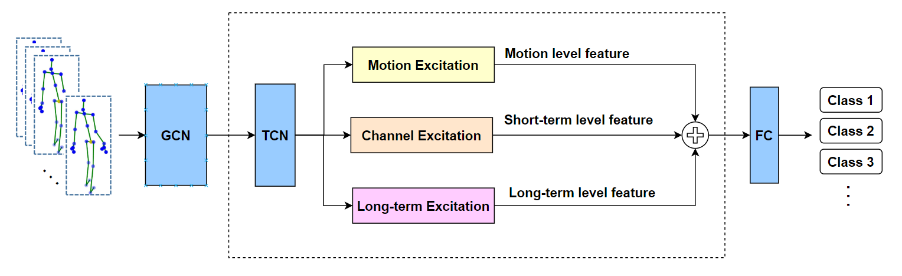
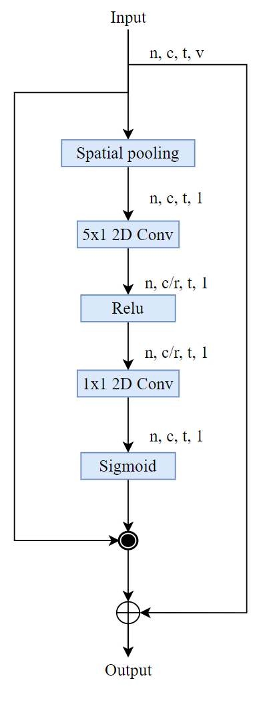
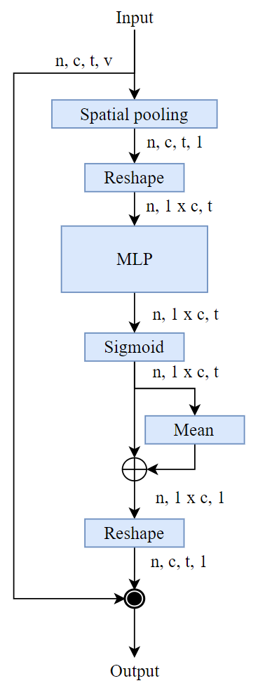
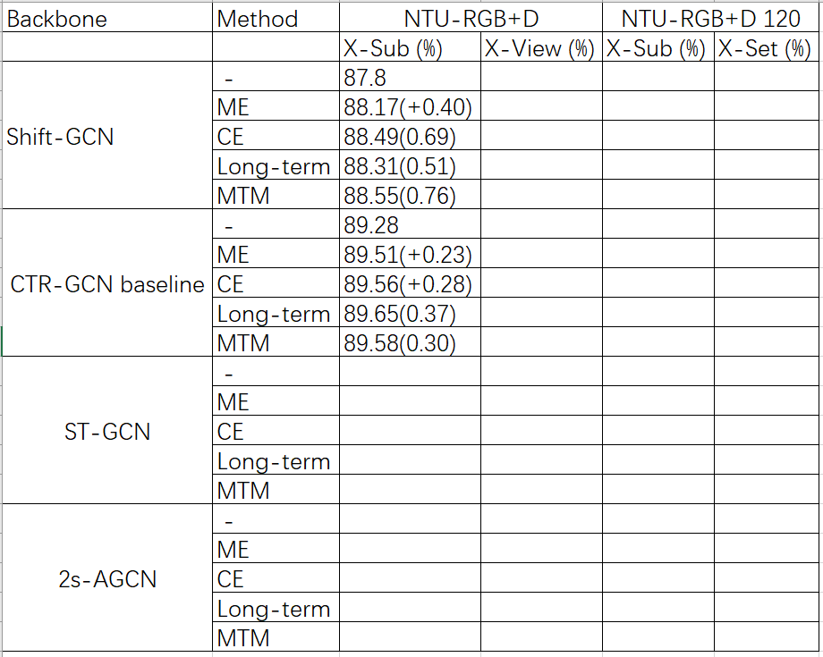

# MTM: Multi-scale Temporal Module for Skeleton-Based Action Recognition

(基于多尺度时间域特征的骨架动作识别)

# Abstract

## 1. Introduction

## 2. Related Work

## 3. Method
### 3.1 Design of MTM

ME temporal feature between two adjacent frame

CE temporal  

### 3.1 Motion Excitation (ME)

- [ ] ME is metioned by witch papers?
- [ ] What's your difference?
- [ ] What's its function in your work?
- [ ] How you did?
- [ ] math description
- [ ] network description

Paragraph 1:

Motion is ......参考文献
motion information
two adjacent frames
feature-level motion patterns between adjacent frames
reflects the actual actions

Motion Excitation (ME) aims to extract feature-level motion patterns between only two adjacent skeletons which modeled motion information and reflects the shortest temporal actual actions. # 说明ME的作用 

Different from all of previous works ( action_net, tea, STM) that applied to the image sequence as well as video aciton recognition,  and we use the ME for skeleton-based action recognition,  and make it in parallel with outher two temporal modules by different temporal scale. # 加入前人引用并说明自己用法的不同

The architecture of the ME module is illustrated in Fig. X.

> The shape of input spatiotemporal feature X is [N, T, C, H, W ], where N is the batch size. T and C denote temporal dimension and feature channels, respectively. H and W correspond to spatial shape.
>
> Given the input feature maps F 2 RN×T ×C×H×W , we will first leverage a 1x1 convolution layer to reduce the spatial channels by a factor of r to ease the computing cost, which is setting to 16 in our experiments.
>
> Given the feature Fr ∈ RN×T × Cr ×H×W processed by the squeeze operation, motion feature is modeled
> following the similar operation presented in [13, 21], which
> can be represented as

Given the input feature maps

Different from this, in our work...... 

$\(xyz\)$

### 3.2  Channel Excitation (CE)

### 3.3 Long-term Excitation (LE)

## 4. Experiments

### 4.1. Datasets
NTU RGB+D
NTU RGB+D 120
### 4.2. Implementation Details
### 4.3. Ablation Study

ME
CE
Long-term
MTM

ST-GCN
Shift-GCN
2s-AGCN
### Comparison with the State-of-the-Art

## 5. Conclusion

### stgcn_tcn
图形的时间方面是通过在连续帧之间连接相同的关节来构造的
这使我们能够定义一个非常简单的策略，将空间图CNN扩展到时空域，扩展了邻域的概念，以包括时间连接的关节，
参数Γ控制要包含在相邻图中的时间范围，因此可以称为时态核大小。
通过这种方式，我们在构造的空间时间图上有一个定义良好的卷积运算。

### frame short long

在这种观察的激励下，我们提出了一种用于步态识别的上下文敏感时间特征学习（CSTL）网络。该方法的核心思想是根据时间维度的上下文信息整合多尺度时间特征，从而实现不同尺度之间的信息通信。这里，通过评估多尺度时间特征之间的关系来获得上下文信息，这反映了上下文特征中存在的各种运动信息。CSTL在三个时间尺度上产生时间特征，即框架级，短期和长期，它们是相互补充的。帧级功能在每个时刻都保留帧特征。短期特征捕获局部时间上下文线索，这些线索对时间位置敏感，有利于对微动模式进行建模。代表所有帧的运动特征的长期特征揭示了不同身体部位的全局动作周期，这些周期对于时间位置是不变的。然后，这些时间特征之间的关系建模引导网络自适应地增强或抑制具有不同尺度的时间特征，然后生成适当的时间描述，用于不同身体部位的运动学习。这种方法提供了对复杂运动进行建模的可能性，这使得它非常适合步态识别。

## intro

ST-GCN定义了一个时间卷积策略，通过在相邻连续帧之间连接相同的关节点来构造卷积运算，因此相邻连续帧就构成了一个时间邻域，领域范围大小是由时间卷积核的大小决定。后续大部分基于ST-GCN的改进工作，主要专注于如何更好地提取空间域特征，而对于提取时间域信息依旧延续着ST-GCN的策略，例如AS-GCN, 2s-AGCN, CTR-GCN 等等。

我们认为这种时间卷积策略有待改进的地方，之前的时间卷积策略的时间感受野范围是固定的，由时间卷积的卷积核大小决定，例如ST-GCN，AS-GCN等每次时间卷积考虑相邻9帧关节点信息，2s-AGCN等考虑相邻5帧信息，时间感受野大小是固定的。CTR-GCN也提出了的多尺度时间建模的概念，但是只是同时考虑了相邻5帧信息和相邻3帧信息的局部信息。（Shift-GCN 的adaptive temporal shift 怎么写还不知道，TSM论文中有提到In-place shift  缺点是空间特征学习能力的丧失，时移后，存储在移位通道中的部分信息将丢失给当前帧。具体需要再看看）

我们认为，人类可以通过适应性地关注具有不同时间尺度的时间片段来区分不同动作，所以在动作序列中不同的时间尺度动作序列反映出不同侧重点的运动信息，甚至是不同的动作类型，他们相互补充，更有利于进行动作识别。（论文：Grouped Spatial-Temporal Aggregation for Efficient Action Recognition，Learning multi-temporal-scale deep information for action recognition，Context-Sensitive Temporal Feature Learning for Gait Recognition）

因此本文将从帧间差，短时，长时，三个时间尺度提取时间域特征。
帧间差通过建立相邻两帧特征图之间的点对点差值图，能够将动态关节点和静态关节点区分开来，从而更加关注帧间的动态特征。（AAI2021 paper "Learning Comprehensive Motion Representation for Action Recognition"）

短时特征捕获局部时间上下文线索，这些线索对时间位置敏感，包含了重要的局部细粒度时间信息，有利于对微动模式进行建模。

长期特征代表所有帧的运动特征，揭示了全局动作周期，这些周期对于时间位置是不变的。

