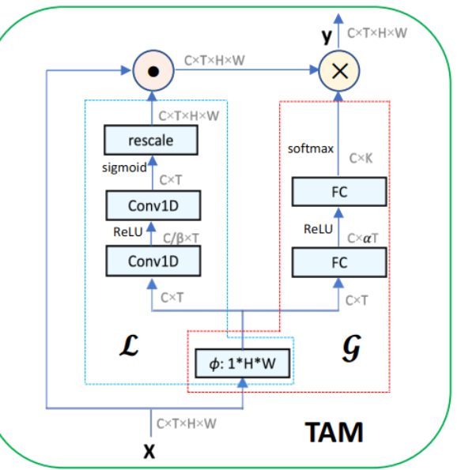
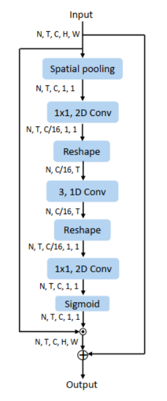
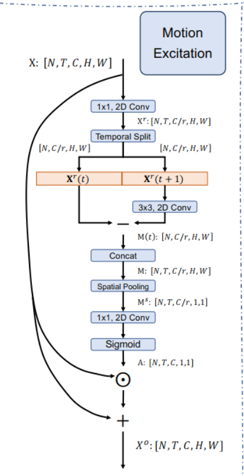

## Temporal  Attention

### TAM local branch 
(Temporal  Attention local temporal receptive field)

As discussed above, the local branch is location sensitive and aims to leverage short-term temporal dynamics to perform video specific operation. Given that the short-term
information varies slowly along the temporal dimension, it
is thus required to learn a location sensitive importance map
to discriminate the local temporal semantics.  

As shown in Figure 2, the local branch is built by a sequence of temporal convolutional layers with ReLU nonlinearity. Since the goal of local branch is to capture short term information, we set the kernel size K as 3 to learn importance map solely based on a local temporal window. To
control the model complexity, the first Conv1D followed
by BN [14] reduces the number of channels from C to Cβ .
Then, the second Conv1D with a sigmoid activation yields
the importance weights V ∈ RC×T which are sensitive to
temporal location. Finally, the temporal excitation is formulated as follows

## Channel Attetion

### ActionNet  CE
(Channel Attention with temporal info)

CE is designed similarly to SE block [10] as shown in
Fig. 2(b). The main difference between CE and SE is that
we insert a 1D convolutional layer between two FC layers
to characterize temporal information for channel-wise features.  

### TEA  ME
(Channel Atteton with motion info)

The
intuition of the proposed ME module is that, among all
feature channels, different channels would capture distinct
information. A portion of channels tends to model the static
information related to background scenes; other channels
mainly focus on dynamic motion patterns describing the
temporal difference. For action recognition, it is beneficial
to enable the model to discover and then enhance these
motion-sensitive channels  

Motion measures the content displacements of the two
successive frames and mainly reflects the actual actions.  

in the proposed motion excitation (ME) module, the motion modeling is extended
from the raw pixel-level to a largely scoped feature-level  

Discussion with SENet
The excitation scheme is firstly proposed by SENet [18, 17]
for image recognition tasks. We want to highlight our
differences with SENet. 1) SENet is designed for imagebased tasks. When SENet is applied to spatiotemporal
features, it processes each frame of videos independently
without considering temporal information. 2) SENet is
a kind of self-gating mechanism [40], and the obtained
modulation weights are utilized to enhance the informative
channels of feature X. While our module aims to enhance
the motion-sensitive ingredients of the feature. 3) The
useless channels will be completely suppressed in SENet,
but the static background information can be preserved in
our module by introducing a residual connection

## TCN

### short-term of CSTL 
(TCN)

In order to capture short-term temporal features, we apply two serial 1D convolutions with kernel size of 3, and
add the features after each 1D convolution as Ts. Obtaining
short-term features enables the network to focus on short
period temporal motion patterns and subtle changes with
perceptive fields of 3 and 5

STE aims to utilize temporal dynamics to discriminate and excite the temporal-sensitive channels of feature X. As discussed previously, a portion of channels tends to model temporal information related to dynamic motion patterns. it is significant to enable the model to discriminate and excite these temporal-sensitive channels.

As shown in Figure 2, the local branch is built by a sequence of temporal convolutional layers with ReLU nonlinearity.

CE is inspired by SENet, 

obtained modulation weights along the channel dimension,