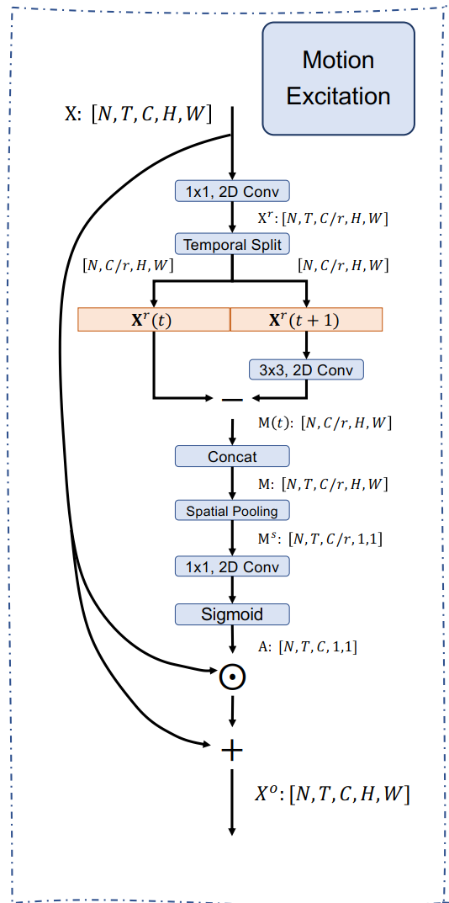

```
import torch.nn as nn
import math
import torch
import torch.nn.functional as F

class MEModule(nn.Module):
    """ Motion exciation module

    :param reduction=16
    :param n_segment=8/16
    """

    def __init__(self, channel, reduction=16, n_segment=16):
        super(MEModule, self).__init__()
        self.channel = channel
        self.reduction = reduction
        self.n_segment = n_segment
        self.conv1 = nn.Conv2d(
            in_channels=self.channel,
            out_channels=self.channel // self.reduction,
            kernel_size=1,
            bias=False)
        self.bn1 = nn.BatchNorm2d(num_features=self.channel // self.reduction)

        self.conv2 = nn.Conv2d(
            in_channels=self.channel // self.reduction,
            out_channels=self.channel // self.reduction,
            kernel_size=3,
            padding=1,
            groups=channel // self.reduction,
            bias=False)

        self.avg_pool = nn.AdaptiveAvgPool2d(1)
        self.sigmoid = nn.Sigmoid()

        self.pad = (0, 0, 0, 0, 0, 0, 0, 1)

        self.conv3 = nn.Conv2d(
            in_channels=self.channel // self.reduction,
            out_channels=self.channel,
            kernel_size=1,
            bias=False)
        self.bn3 = nn.BatchNorm2d(num_features=self.channel)

        self.identity = nn.Identity()

    def forward(self, x):
        nt, c, h, w = x.size()
        bottleneck = self.conv1(x)  # nt, c//r, h, w
        bottleneck = self.bn1(bottleneck)  # nt, c//r, h, w

        # t feature
        reshape_bottleneck = bottleneck.view((-1, self.n_segment) + bottleneck.size()[1:])  # n, t, c//r, h, w
        t_fea, __ = reshape_bottleneck.split([self.n_segment - 1, 1], dim=1)  # n, t-1, c//r, h, w

        # apply transformation conv to t+1 feature
        conv_bottleneck = self.conv2(bottleneck)  # nt, c//r, h, w
        # reshape fea: n, t, c//r, h, w
        reshape_conv_bottleneck = conv_bottleneck.view((-1, self.n_segment) + conv_bottleneck.size()[1:])
        __, tPlusone_fea = reshape_conv_bottleneck.split([1, self.n_segment - 1], dim=1)  # n, t-1, c//r, h, w

        # motion fea = t+1_fea - t_fea
        # pad the last timestamp
        diff_fea = tPlusone_fea - t_fea  # n, t-1, c//r, h, w
        # pad = (0,0,0,0,0,0,0,1)
        diff_fea_pluszero = F.pad(diff_fea, self.pad, mode="constant", value=0)  # n, t, c//r, h, w
        diff_fea_pluszero = diff_fea_pluszero.view((-1,) + diff_fea_pluszero.size()[2:])  # nt, c//r, h, w
        y = self.avg_pool(diff_fea_pluszero)  # nt, c//r, 1, 1
        y = self.conv3(y)  # nt, c, 1, 1
        y = self.bn3(y)  # nt, c, 1, 1
        y = self.sigmoid(y)  # nt, c, 1, 1
        y = y - 0.5
        output = x + x * y.expand_as(x)
        return output
```


```
import numpy as np
import torch
from motion_excitation import MEModule

def main():
    sample_input = torch.zeros([2, 64, 32, 10, 10], dtype=torch.float32)
    n,c,t,h,w = sample_input.size()
    sample_input = sample_input.permute(0, 2, 1, 3, 4).contiguous().view(n*t, c, h, w)
    me = MEModule(channel=c)
    sample_output = me(sample_input)


    return 0

if __name__ == '__main__':
    main()
```