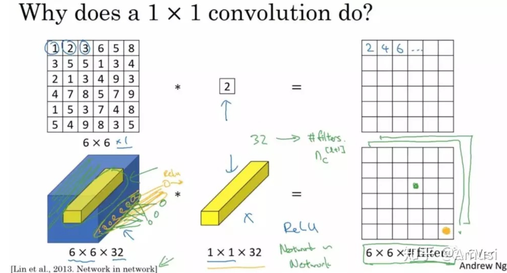
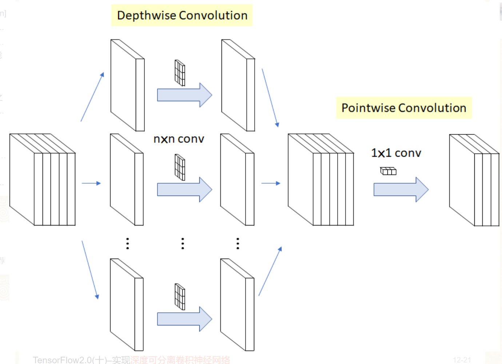

## 1x1 卷积
https://zhuanlan.zhihu.com/p/40050371

改变通道数，与多少个1x1 filters 通道数就会变成多少，以此实现升维和降维

也可以达到全连接的效果。

**深度可分离卷积**(Depthwise Separable Convolution) = **深度卷积**(Depthwise Convolution) + 逐点卷积(Pointwise Convolution)。

