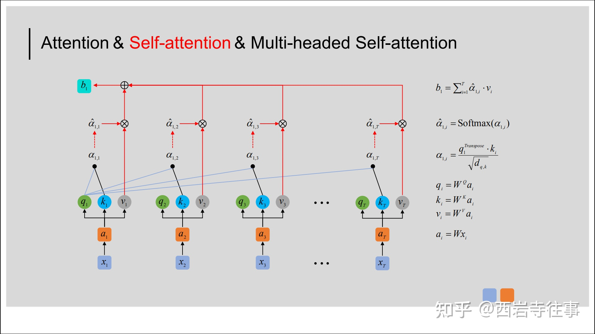
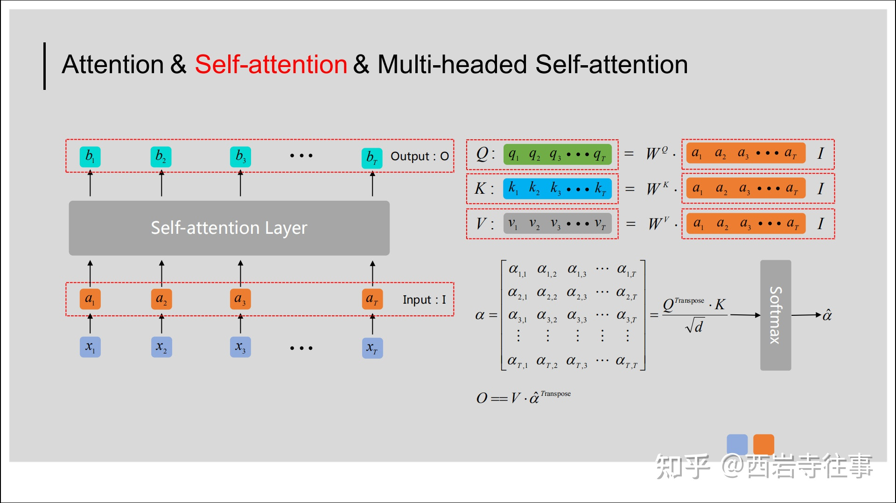
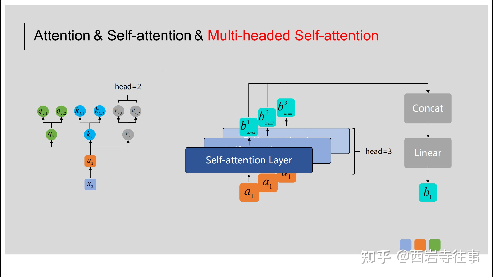
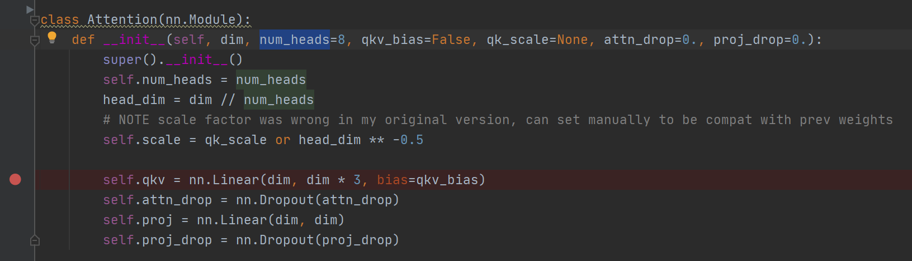

## self-attention

### normal self-attention

如上图所示，最底层的输入 ![[公式]](https://www.zhihu.com/equation?tex=x_%7B1%7D%EF%BC%8Cx_%7B2%7D%EF%BC%8Cx_%7B3%7D%E2%80%A6%EF%BC%8Cx_%7BT%7D) 表示输入的序列数据，比如， ![[公式]](https://www.zhihu.com/equation?tex=x_%7B1%7D) 可以代表某个句子的第一个词所对应的向量。

首先，通过嵌入层（可选）将它们进行初步的embedding，得到 ![[公式]](https://www.zhihu.com/equation?tex=a_%7B1%7D%2Ca_%7B2%7D%2Ca_%7B3%7D%E2%80%A6%2Ca_%7BT%7D) ；

然后，使用三个矩阵 ![[公式]](https://www.zhihu.com/equation?tex=W%5E%7BQ%7D%2CW%5E%7BK%7D%2CW%5E%7BV%7D) 分别与之相乘，得到 ![[公式]](https://www.zhihu.com/equation?tex=q_%7Bi%7D%2Ck_%7Bi%7D%2Cv_%7Bi%7D%2C+i%5Cin%281%2C2%2C3%E2%80%A6T%29) 。

上图显示了与输入的 ![[公式]](https://www.zhihu.com/equation?tex=x_%7B1%7D) 所对应的输出 ![[公式]](https://www.zhihu.com/equation?tex=b_%7B1%7D) 是如何得到的。即：

- 利用 ![[公式]](https://www.zhihu.com/equation?tex=q_%7B1%7D) 分别与 ![[公式]](https://www.zhihu.com/equation?tex=k_%7B1%7D%2Ck_%7B2%7D%2Ck_%7B3%7D%E2%80%A6k_%7BT%7D) 计算向量点积，得到 ![[公式]](https://www.zhihu.com/equation?tex=%5Calpha_%7B1%2C1%7D%2C%5Calpha_%7B1%2C2%7D%2C%5Calpha_%7B1%2C3%7D%E2%80%A6%5Calpha_%7B1%2CT%7D) （从数值上看， ![[公式]](https://www.zhihu.com/equation?tex=%5Calpha_%7B1%2Ci%7D) 还不一定是0-1之间的数，还需经过softmax处理）；
- 将 ![[公式]](https://www.zhihu.com/equation?tex=%5Calpha_%7B1%2C1%7D%2C%5Calpha_%7B1%2C2%7D%2C%5Calpha_%7B1%2C3%7D%E2%80%A6%5Calpha_%7B1%2CT%7D) 输入softmax层，从而得到均在0-1之间的注意力权重值： ![[公式]](https://www.zhihu.com/equation?tex=%5Chat%7B%5Calpha_%7B1%2C1%7D%7D%2C%5Chat%7B%5Calpha_%7B1%2C2%7D%7D%2C%5Chat%7B%5Calpha_%7B1%2C3%7D%7D%E2%80%A6%5Chat%7B%5Calpha_%7B1%2CT%7D%7D) ；
- 将上一步得到的 ![[公式]](https://www.zhihu.com/equation?tex=%5Chat%7B%5Calpha_%7B1%2C1%7D%7D%2C%5Chat%7B%5Calpha_%7B1%2C2%7D%7D%2C%5Chat%7B%5Calpha_%7B1%2C3%7D%7D%E2%80%A6%5Chat%7B%5Calpha_%7B1%2CT%7D%7D) 分别与对应位置的 ![[公式]](https://www.zhihu.com/equation?tex=v_%7B1%7D%2Cv_%7B2%7D%2Cv_%7B3%7D%E2%80%A6v_%7BT%7D) 相乘，然后求和，这样便得到了与输入的 ![[公式]](https://www.zhihu.com/equation?tex=x_%7B1%7D) 所对应的输出 ![[公式]](https://www.zhihu.com/equation?tex=b_%7B1%7D)。

### 并行计算

对于输入的序列 ![[公式]](https://www.zhihu.com/equation?tex=x_%7B1%7D%EF%BC%8Cx_%7B2%7D%EF%BC%8Cx_%7B3%7D%E2%80%A6%EF%BC%8Cx_%7BT%7D)来说，与RNN/LSTM的处理过程不同，Self-attention机制能够并行对![[公式]](https://www.zhihu.com/equation?tex=x_%7B1%7D%EF%BC%8Cx_%7B2%7D%EF%BC%8Cx_%7B3%7D%E2%80%A6%EF%BC%8Cx_%7BT%7D)进行计算，这大大提高了对![[公式]](https://www.zhihu.com/equation?tex=x_%7B1%7D%EF%BC%8Cx_%7B2%7D%EF%BC%8Cx_%7B3%7D%E2%80%A6%EF%BC%8Cx_%7BT%7D)特征进行提取（即获得![[公式]](https://www.zhihu.com/equation?tex=b_%7B1%7D%EF%BC%8Cb_%7B2%7D%EF%BC%8Cb_%7B3%7D%E2%80%A6%EF%BC%8Cb_%7BT%7D)）的速度。结合上述Self-attention的计算过程，并行计算的原理如下图所示：

由上图可以看到，通过对输入 ![[公式]](https://www.zhihu.com/equation?tex=I) 分别乘以矩阵![[公式]](https://www.zhihu.com/equation?tex=W%5E%7BQ%7D%2CW%5E%7BK%7D%2CW%5E%7BV%7D)，我们便得到了三个矩阵![[公式]](https://www.zhihu.com/equation?tex=Q%2CK%2CW)，然后通过后续计算得到注意力矩阵 ![[公式]](https://www.zhihu.com/equation?tex=%5Chat%7B%5Calpha%7D) ，进而得到输出 ![[公式]](https://www.zhihu.com/equation?tex=O) 。

### multi-head self-attention

在Transformer及BERT模型中用到的Multi-headed Self-attention结构与之略有差异，具体体现在：==如果将前文中得到的![[公式]](https://www.zhihu.com/equation?tex=q_%7Bi%7D%2Ck_%7Bi%7D%2Cv_%7Bi%7D)整体看做一个“头”，则“多头”即指对于特定的 ![[公式]](https://www.zhihu.com/equation?tex=x_%7Bi%7D) 来说，需要用多组![[公式]](https://www.zhihu.com/equation?tex=W%5E%7BQ%7D%2CW%5E%7BK%7D%2CW%5E%7BV%7D)与之相乘，进而得到多组![[公式]](https://www.zhihu.com/equation?tex=q_%7Bi%7D%2Ck_%7Bi%7D%2Cv_%7Bi%7D)==。如下图所示：

如图所示，以右侧示意图中输入的 ![[公式]](https://www.zhihu.com/equation?tex=a_%7B1%7D) 为例，通过多头（这里取head=3）机制得到了三个输出 ![[公式]](https://www.zhihu.com/equation?tex=b_%7Bhead%7D%5E%7B1%7D%2Cb_%7Bhead%7D%5E%7B2%7D%2Cb_%7Bhead%7D%5E%7B3%7D) ,为了获得与![[公式]](https://www.zhihu.com/equation?tex=a_%7B1%7D)对应的输出![[公式]](https://www.zhihu.com/equation?tex=b_%7B1%7D)，在Multi-headed Self-attention中，我们会将这里得到的![[公式]](https://www.zhihu.com/equation?tex=b_%7Bhead%7D%5E%7B1%7D%2Cb_%7Bhead%7D%5E%7B2%7D%2Cb_%7Bhead%7D%5E%7B3%7D) 进行拼接（向量首尾相连），然后通过线性转换（即不含非线性激活层的单层全连接神经网络）得到![[公式]](https://www.zhihu.com/equation?tex=b_%7B1%7D)。对于序列中的其他输入也是同样的处理过程，且它们共享这些网络的参数。

### 为什么需要进行 Multi-head Attention？

论文中是这么说的：

> Multi-head attention allows the model to jointly attend to information from **different \*representation subspaces\*** at different positions.	

可以类比CNN中同时使用**多个滤波器**的作用，直观上讲，多头的注意力**有助于网络捕捉到更丰富的特征/信息。**

在同一 `multi-head attention` 层中，输入均为 `KQV` ，**同时**进行注意力的计算，彼此之前**参数不共享**，最终将结果**拼接**起来，这样可以允许模型在**不同的表示子空间里学习到相关的信息**。简而言之，就是希望每个注意力头，只关注最终输出序列中一个子空间，互相**独立**。其核心思想在于，抽取到更加丰富的**特征信息**。

### 代码

实践的PoseFormer项目中多头数num_head为8

> 我还想问的是你实现的那篇文章里，多头能提取到什么信息，比如平治的那篇文章多头对应的是多个尺度的块（patch），那你这篇文章的多头对应啥？

