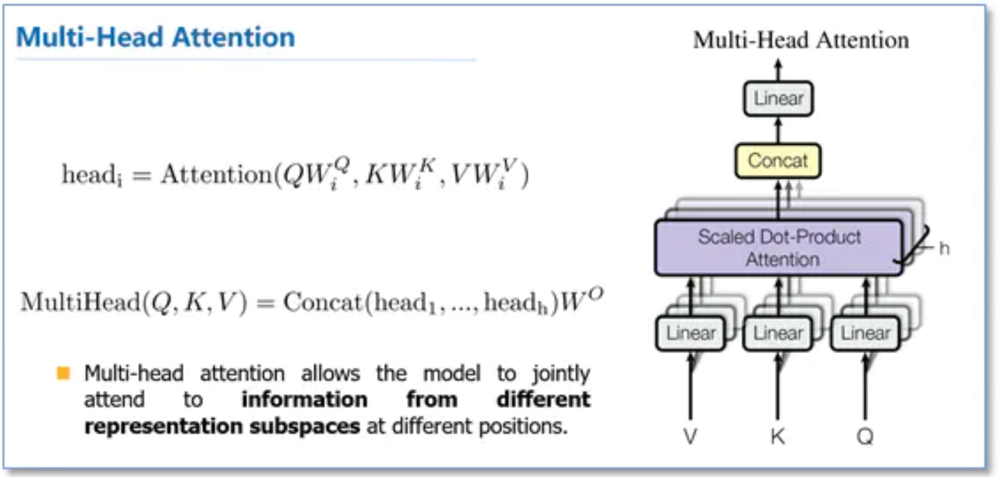
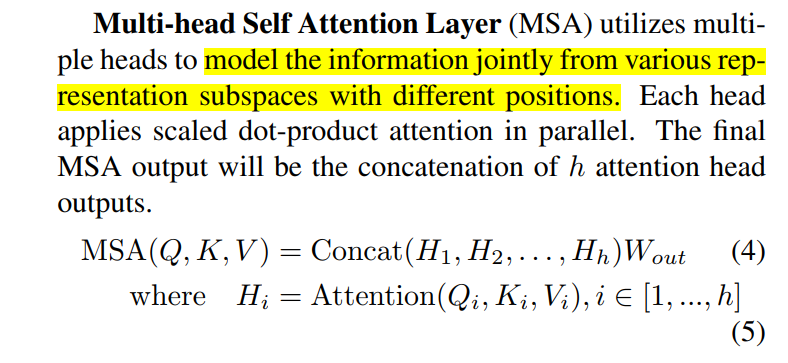
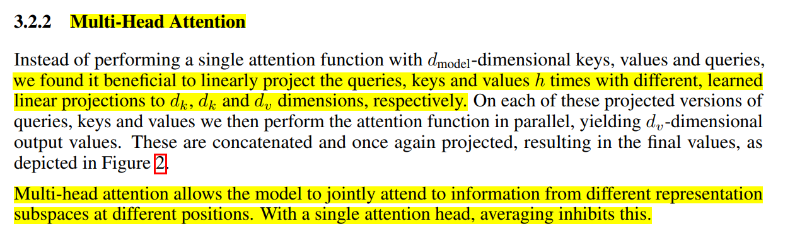

## self-attention


### normal self-attention


如上图所示，最底层的输入 ![[公式]](https://www.zhihu.com/equation?tex=x_%7B1%7D%EF%BC%8Cx_%7B2%7D%EF%BC%8Cx_%7B3%7D%E2%80%A6%EF%BC%8Cx_%7BT%7D) 表示输入的序列数据，比如， ![[公式]](https://www.zhihu.com/equation?tex=x_%7B1%7D) 可以代表某个句子的第一个词所对应的向量。

首先，通过嵌入层（可选）将它们进行初步的embedding，得到 ![[公式]](https://www.zhihu.com/equation?tex=a_%7B1%7D%2Ca_%7B2%7D%2Ca_%7B3%7D%E2%80%A6%2Ca_%7BT%7D) ；

然后，使用三个矩阵 ![[公式]](https://www.zhihu.com/equation?tex=W%5E%7BQ%7D%2CW%5E%7BK%7D%2CW%5E%7BV%7D) 分别与之相乘，得到 ![[公式]](https://www.zhihu.com/equation?tex=q_%7Bi%7D%2Ck_%7Bi%7D%2Cv_%7Bi%7D%2C+i%5Cin%281%2C2%2C3%E2%80%A6T%29) 。

上图显示了与输入的 ![[公式]](https://www.zhihu.com/equation?tex=x_%7B1%7D) 所对应的输出 ![[公式]](https://www.zhihu.com/equation?tex=b_%7B1%7D) 是如何得到的。即：

- 利用 ![[公式]](https://www.zhihu.com/equation?tex=q_%7B1%7D) 分别与 ![[公式]](https://www.zhihu.com/equation?tex=k_%7B1%7D%2Ck_%7B2%7D%2Ck_%7B3%7D%E2%80%A6k_%7BT%7D) 计算向量点积，得到 ![[公式]](https://www.zhihu.com/equation?tex=%5Calpha_%7B1%2C1%7D%2C%5Calpha_%7B1%2C2%7D%2C%5Calpha_%7B1%2C3%7D%E2%80%A6%5Calpha_%7B1%2CT%7D) （从数值上看， ![[公式]](https://www.zhihu.com/equation?tex=%5Calpha_%7B1%2Ci%7D) 还不一定是0-1之间的数，还需经过softmax处理）；
- 将 ![[公式]](https://www.zhihu.com/equation?tex=%5Calpha_%7B1%2C1%7D%2C%5Calpha_%7B1%2C2%7D%2C%5Calpha_%7B1%2C3%7D%E2%80%A6%5Calpha_%7B1%2CT%7D) 输入softmax层，从而得到均在0-1之间的注意力权重值： ![[公式]](https://www.zhihu.com/equation?tex=%5Chat%7B%5Calpha_%7B1%2C1%7D%7D%2C%5Chat%7B%5Calpha_%7B1%2C2%7D%7D%2C%5Chat%7B%5Calpha_%7B1%2C3%7D%7D%E2%80%A6%5Chat%7B%5Calpha_%7B1%2CT%7D%7D) ；
- 将上一步得到的 ![[公式]](https://www.zhihu.com/equation?tex=%5Chat%7B%5Calpha_%7B1%2C1%7D%7D%2C%5Chat%7B%5Calpha_%7B1%2C2%7D%7D%2C%5Chat%7B%5Calpha_%7B1%2C3%7D%7D%E2%80%A6%5Chat%7B%5Calpha_%7B1%2CT%7D%7D) 分别与对应位置的 ![[公式]](https://www.zhihu.com/equation?tex=v_%7B1%7D%2Cv_%7B2%7D%2Cv_%7B3%7D%E2%80%A6v_%7BT%7D) 相乘，然后求和，这样便得到了与输入的 ![[公式]](https://www.zhihu.com/equation?tex=x_%7B1%7D) 所对应的输出 ![[公式]](https://www.zhihu.com/equation?tex=b_%7B1%7D)。


### 并行计算

对于输入的序列 ![[公式]](https://www.zhihu.com/equation?tex=x_%7B1%7D%EF%BC%8Cx_%7B2%7D%EF%BC%8Cx_%7B3%7D%E2%80%A6%EF%BC%8Cx_%7BT%7D)来说，与RNN/LSTM的处理过程不同，Self-attention机制能够并行对![[公式]](https://www.zhihu.com/equation?tex=x_%7B1%7D%EF%BC%8Cx_%7B2%7D%EF%BC%8Cx_%7B3%7D%E2%80%A6%EF%BC%8Cx_%7BT%7D)进行计算，这大大提高了对![[公式]](https://www.zhihu.com/equation?tex=x_%7B1%7D%EF%BC%8Cx_%7B2%7D%EF%BC%8Cx_%7B3%7D%E2%80%A6%EF%BC%8Cx_%7BT%7D)特征进行提取（即获得![[公式]](https://www.zhihu.com/equation?tex=b_%7B1%7D%EF%BC%8Cb_%7B2%7D%EF%BC%8Cb_%7B3%7D%E2%80%A6%EF%BC%8Cb_%7BT%7D)）的速度。结合上述Self-attention的计算过程，并行计算的原理如下图所示：

由上图可以看到，通过对输入 ![[公式]](https://www.zhihu.com/equation?tex=I) 分别乘以矩阵![[公式]](https://www.zhihu.com/equation?tex=W%5E%7BQ%7D%2CW%5E%7BK%7D%2CW%5E%7BV%7D)，我们便得到了三个矩阵![[公式]](https://www.zhihu.com/equation?tex=Q%2CK%2CW)，然后通过后续计算得到注意力矩阵 ![[公式]](https://www.zhihu.com/equation?tex=%5Chat%7B%5Calpha%7D) ，进而得到输出 ![[公式]](https://www.zhihu.com/equation?tex=O) 。


### multi-head self-attention

在Transformer及BERT模型中用到的Multi-headed Self-attention结构与之略有差异，具体体现在：==如果将前文中得到的![[公式]](https://www.zhihu.com/equation?tex=q_%7Bi%7D%2Ck_%7Bi%7D%2Cv_%7Bi%7D)整体看做一个“头”，则“多头”即指对于特定的 ![[公式]](https://www.zhihu.com/equation?tex=x_%7Bi%7D) 来说，需要用多组![[公式]](https://www.zhihu.com/equation?tex=W%5E%7BQ%7D%2CW%5E%7BK%7D%2CW%5E%7BV%7D)与之相乘，进而得到多组![[公式]](https://www.zhihu.com/equation?tex=q_%7Bi%7D%2Ck_%7Bi%7D%2Cv_%7Bi%7D)==。如下图所示：

如图所示，以右侧示意图中输入的 ![[公式]](https://www.zhihu.com/equation?tex=a_%7B1%7D) 为例，通过多头（这里取head=3）机制得到了三个输出 ![[公式]](https://www.zhihu.com/equation?tex=b_%7Bhead%7D%5E%7B1%7D%2Cb_%7Bhead%7D%5E%7B2%7D%2Cb_%7Bhead%7D%5E%7B3%7D) ,为了获得与![[公式]](https://www.zhihu.com/equation?tex=a_%7B1%7D)对应的输出![[公式]](https://www.zhihu.com/equation?tex=b_%7B1%7D)，在Multi-headed Self-attention中，我们会将这里得到的![[公式]](https://www.zhihu.com/equation?tex=b_%7Bhead%7D%5E%7B1%7D%2Cb_%7Bhead%7D%5E%7B2%7D%2Cb_%7Bhead%7D%5E%7B3%7D) 进行拼接（向量首尾相连），然后通过线性转换（即不含非线性激活层的单层全连接神经网络）得到![[公式]](https://www.zhihu.com/equation?tex=b_%7B1%7D)。对于序列中的其他输入也是同样的处理过程，且它们共享这些网络的参数。


### 为什么需要进行 Multi-head Attention？


论文中是这么说的：

> Multi-head attention allows the model to jointly attend to information from **different \*representation subspaces\*** at different positions.	

可以类比CNN中同时使用**多个滤波器**的作用，直观上讲，多头的注意力**有助于网络捕捉到更丰富的特征/信息。**

在同一 `multi-head attention` 层中，输入均为 `KQV` ，**同时**进行注意力的计算，彼此之前**参数不共享**，最终将结果**拼接**起来，这样可以允许模型在**不同的表示子空间里学习到相关的信息**。简而言之，就是希望每个注意力头，只关注最终输出序列中一个子空间，互相**独立**。其核心思想在于，抽取到更加丰富的**特征信息**。


多头注意力：**多头注意力（multi-head attention）是利用多个查询Q = [q1, · · · , qM]，来平行地计算从输入信息中选取多个信息。每个注意力关注输入信息的不同部分，然后再进行拼接.

多头attention（Multi-head attention）结构如上图，==Query，Key，Value首先进过一个线性变换，然后输入到放缩点积attention，注意这里要做h次，也就是所谓的多头，每一次算一个头，**头之间参数不共享，**每次Q，K，V进行线性变换的参数是不一样的。== 然后将h次的放缩点积attention结果进行拼接，再进行一次线性变换得到的值作为多头attention的结果。




## 其他讲解

### 单头分割变多头
https://zhuanlan.zhihu.com/p/387373100

**Attention is all you need 论文解读**

可以看到所谓的多头注意力机制其实就是将原始的输入序列进行多组的自注意力处理过程；然后再将每一组自注意力的结果拼接起来进行一次线性变换得到最终的输出结果。

![[公式]](https://www.zhihu.com/equation?tex=%5Ctext%7BMultiHead%7D%28Q%2CK%2CV%29%3D%5Ctext%7BConcat%7D%28%5Ctext%7Bhead%7D_1%2C...%2C%5Ctext%7Bhead%7D_h%29W%5EO%5C%5C+%5C%3B%5C%3B%5C%3B%5C%3B%5C%3B%5C%3B%5C%3B%5Ctext%7Bwhere%7D%5C%3B%5C%3B%5Ctext%7Bhead%7D_i%3D%5Ctext%7BAttention%7D%28QW_i%5EQ%2CKW_i%5EK%2CVW_i%5EV%29+%5C%5C)


同时，在论文中，作者使用了![[公式]](https://www.zhihu.com/equation?tex=h%3D8)个并行的自注意力模块（8个头）来构建一个注意力层，并且对于每个自注意力模块都限定了![[公式]](https://www.zhihu.com/equation?tex=d_k%3Dd_v%3Dd_%7Bmodel%7D%2Fh%3D64)。**从这里其实可以发现，论文中所使用的多头注意力机制其实就是将一个大的高维单头拆分成了![[公式]](https://www.zhihu.com/equation?tex=h)个多头**。


根据输入序列X和![[公式]](https://www.zhihu.com/equation?tex=W%5EQ_1%2CW%5EK_1%2CW%5EV_1) 我们就计算得到了![[公式]](https://www.zhihu.com/equation?tex=Q_1%2CK_1%2CV_1)，进一步根据公式![[公式]](https://www.zhihu.com/equation?tex=%281%29)就得到了单个自注意力模块的输出![[公式]](https://www.zhihu.com/equation?tex=Z_1)；同理，根据X和![[公式]](https://www.zhihu.com/equation?tex=W%5EQ_2%2CW%5EK_2%2CW%5EV_2)就得到了另外一个自注意力模块输出![[公式]](https://www.zhihu.com/equation?tex=Z_2)。最后，将![[公式]](https://www.zhihu.com/equation?tex=Z_1%2CZ_2)水平堆叠形成![[公式]](https://www.zhihu.com/equation?tex=Z)，然后再用![[公式]](https://www.zhihu.com/equation?tex=Z)乘以![[公式]](https://www.zhihu.com/equation?tex=W%5EO)便得到了整个多头注意力层的输出。同时，根据图8中的计算过程，还可以得到![[公式]](https://www.zhihu.com/equation?tex=d_q%3Dd_k%3Dd_v)。


### 单头复制变多头

https://zhuanlan.zhihu.com/p/366592542

```
class MultiHeadAttention(nn.Module):
    """ Multi-Head Attention """

    def __init__(self, n_head, d_k_, d_v_, d_k, d_v, d_o):
        super().__init__()

        self.n_head = n_head
        self.d_k = d_k
        self.d_v = d_v

        self.fc_q = nn.Linear(d_k_, n_head * d_k)
        self.fc_k = nn.Linear(d_k_, n_head * d_k)
        self.fc_v = nn.Linear(d_v_, n_head * d_v)

        self.attention = ScaledDotProductAttention(scale=np.power(d_k, 0.5))

        self.fc_o = nn.Linear(n_head * d_v, d_o)

    def forward(self, q, k, v, mask=None):

        n_head, d_q, d_k, d_v = self.n_head, self.d_k, self.d_k, self.d_v

        batch, n_q, d_q_ = q.size()
        batch, n_k, d_k_ = k.size()
        batch, n_v, d_v_ = v.size()

        q = self.fc_q(q) # 1.单头变多头
        k = self.fc_k(k)
        v = self.fc_v(v)
        q = q.view(batch, n_q, n_head, d_q).permute(2, 0, 1, 3).contiguous().view(-1, n_q, d_q)
        k = k.view(batch, n_k, n_head, d_k).permute(2, 0, 1, 3).contiguous().view(-1, n_k, d_k)
        v = v.view(batch, n_v, n_head, d_v).permute(2, 0, 1, 3).contiguous().view(-1, n_v, d_v)

        if mask is not None:
            mask = mask.repeat(n_head, 1, 1)
        attn, output = self.attention(q, k, v, mask=mask) # 2.	当成单头注意力求输出

        output = output.view(n_head, batch, n_q, d_v).permute(1, 2, 0, 3).contiguous().view(batch, n_q, -1) # 3.Concat
        output = self.fc_o(output) # 4.仿射变换得到最终输出

        return attn, output


if __name__ == "__main__":
    n_q, n_k, n_v = 2, 4, 4
    d_q_, d_k_, d_v_ = 128, 128, 64

    q = torch.randn(batch, n_q, d_q_)
    k = torch.randn(batch, n_k, d_k_)
    v = torch.randn(batch, n_v, d_v_)    
    mask = torch.zeros(batch, n_q, n_k).bool()

    mha = MultiHeadAttention(n_head=8, d_k_=128, d_v_=64, d_k=256, d_v=128, d_o=128)
    attn, output = mha(q, k, v, mask=mask)

    print(attn.size())
    print(output.size())
```


https://zhuanlan.zhihu.com/p/34781297

获取每个子任务的Q、K、V：

- 通过全连接进行线性变换映射成多个Q、K、V，线性映射得到的结果维度可以不变、也可以减少(类似降维)
- 或者通过Split对Q、K、V进行划分(分段)


### 总结

单头变多头，无论是复制还是分割，核心是都要不共享权重，独立计算，才能达到提取不同特征的作用。

![[公式]](https://www.zhihu.com/equation?tex=%5Ctext%7BMultiHead%7D%28Q%2CK%2CV%29%3D%5Ctext%7BConcat%7D%28%5Ctext%7Bhead%7D_1%2C...%2C%5Ctext%7Bhead%7D_h%29W%5EO%5C%5C+%5C%3B%5C%3B%5C%3B%5C%3B%5C%3B%5C%3B%5C%3B%5Ctext%7Bwhere%7D%5C%3B%5C%3B%5Ctext%7Bhead%7D_i%3D%5Ctext%7BAttention%7D%28QW_i%5EQ%2CKW_i%5EK%2CVW_i%5EV%29+%5C%5C)


## PoseFormer项目

> 我还想问的是你实现的那篇文章里，多头能提取到什么信息，比如平治的那篇文章多头对应的是多个尺度的块（patch），那你这篇文章的多头对应啥？

### 代码分析

实践的PoseFormer项目中多头数num_head为8


##### 在提取空间特征时
将32个空间维度特征分成8个head，计算attention值，再将这个8个head值拼接成一个

torch.Size([18560, 25, 3])		  帧，25关节点，xyz
经过nn.Linear(3, 32)
torch.Size([18560, 25, 32])		32维空间特征
将32维度特征分成8份，然后计算attention值
q,k,v 分别为 torch.Size([18560, 8, 25, 4])
attn = (q @ k.transpose(-2, -1)) * self.scale

> q 	torch.Size([18560, 8, 25, 4])   
> k.transpose(-2, -1) 	torch.Size([18560, 8, 4, 25])
> attn	torch.Size([18560, 8, 25, 25])

attn 再和v做点乘
x = (attn @ v) # torch.Size([18560, 8, 25, 4])
x = x.transpose(1, 2) # torch.Size([18560, 25, 8, 4])  

再将这8个head拼接
x = x.reshape(B, N, C) # torch.Size([18560, 25, 32])


##### 在提取时间特征时
将800空间维度特征分成8个head，计算attention值，再将这个8个head值拼接成一个

x after sptical transformer		torch.Size([64, 8, 290, 800])
qkv						   torch.Size([3, 64, 8, 290, 100])
q,k,v 					       torch.Size([64, 8, 290, 100])

attn = (q @ k.transpose(-2, -1)) * self.scale

attn				             torch.Size([64, 8, 290, 290])
x = (attn @ v).transpose(1, 2).reshape(B, N, C)		torch.Size([64, 290, 800])


### 论文观点

PoseFormer 原论文只说会从多种子空间提取关节点信息。



attention is all your need 说他们发现这样做好，会提取不同子空间信息。



## 总结
这8个head只是将特征进行分组之后再计算（空间特征和时间特征都是这样）。过程就是“多头注意力机制其实就是将原始的输入序列进行多组的自注意力处理过程；然后再将每一组自注意力的结果拼接起来进行一次线性变换得到最终的输出结果。” 原论文说“多头注意力机制会从多种子空间提取关节点信息”。至于究竟宏观对应什么信息，代码和论文都不得而知。我感觉就像CNN的卷积核，不同卷积核对应不同的信息，但是至于每个卷积核对应何种信息，有时候不得而知。