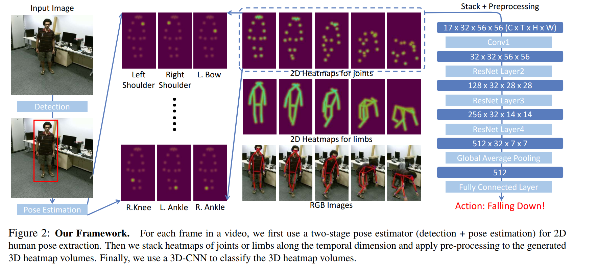
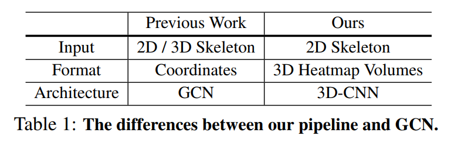
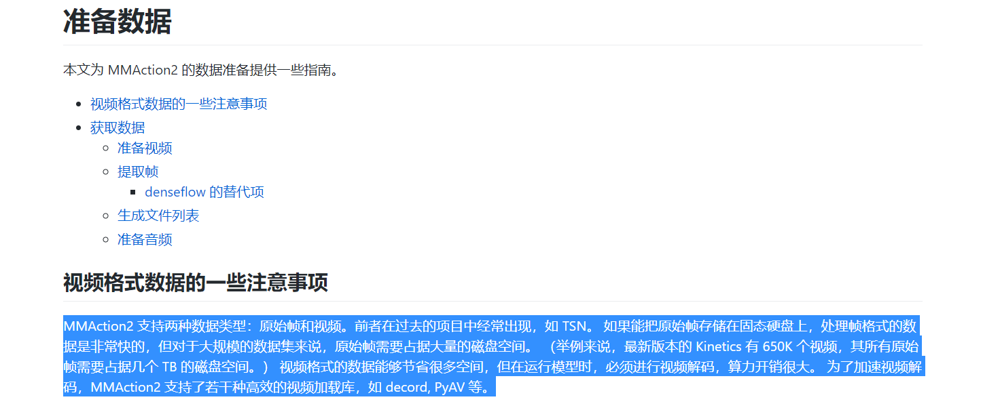
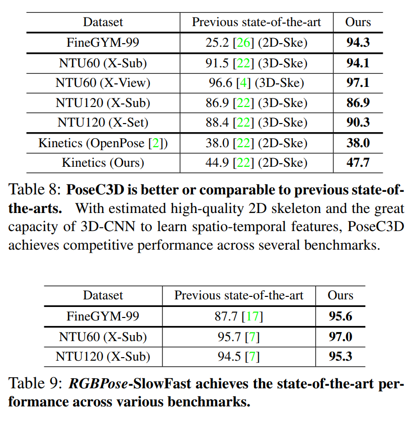
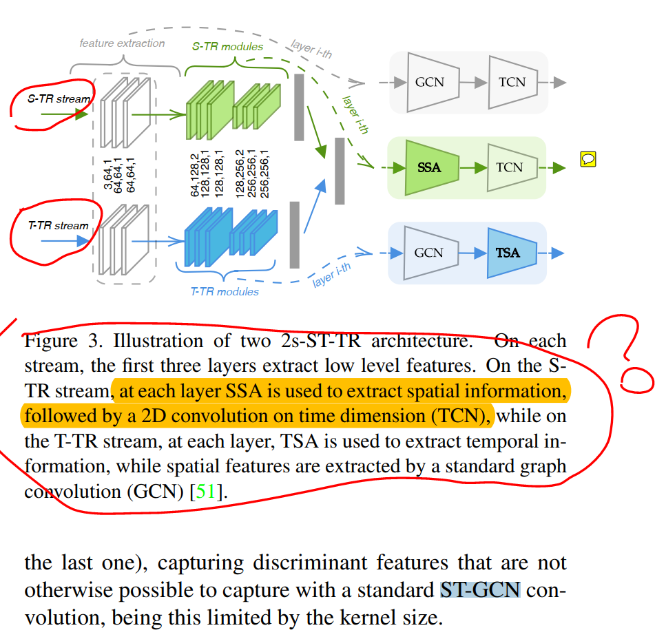

# Skeleton Based Action Recognition on NTU RGB+D

## Top acc

### PoseC3D 

https://github.com/open-mmlab/mmaction2

原始视频数据，算力开销巨大

## CNN

skeleton sequence  >> pseudo image

- (cpvr 2017) A New Representation of Skeleton Sequences for 3D Action Recognition  

- SkeleMotion: A New Representation of Skeleton Joint Sequences Based on
Motion Information for 3D Action Recognition  

## Transformer

seldom used

### ST-TR
https://github.com/Chiaraplizz/ST-TR

