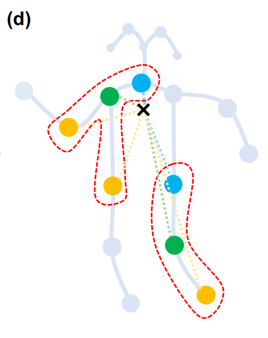
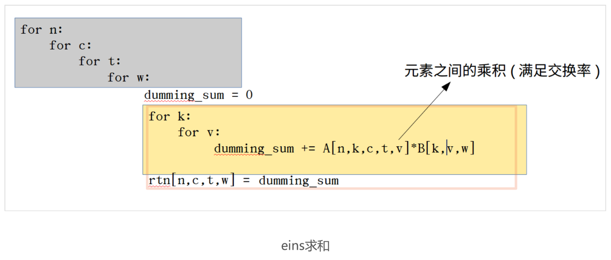
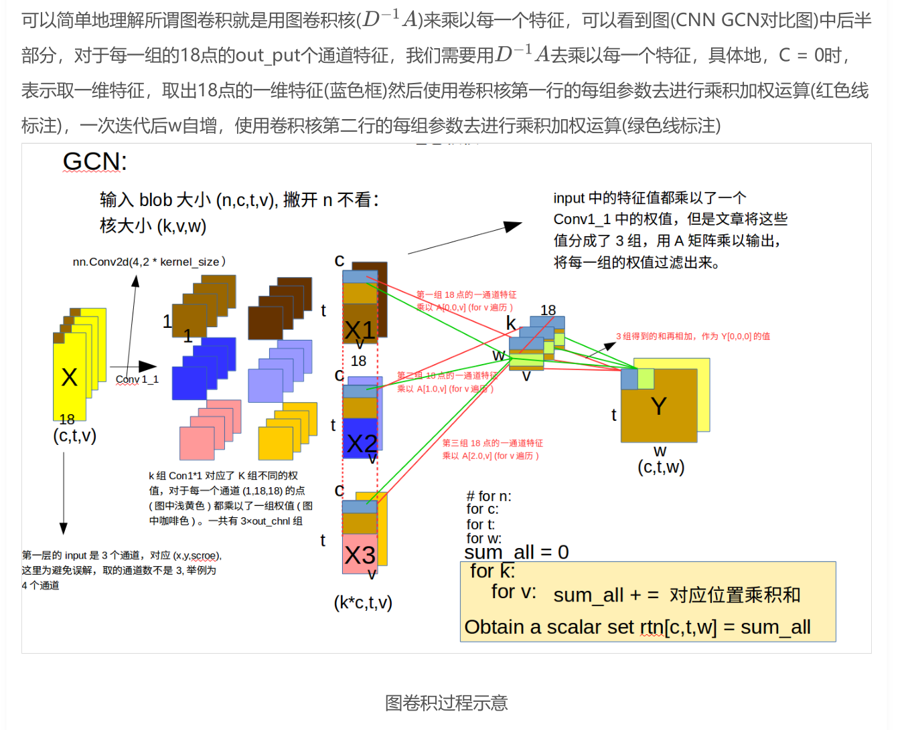

## 1. 图的构建

依据不同的关系构造邻接矩阵A。

ST-GCN代码采用，空间构型划分 Spatial configuration partitioning



将节点的1邻域划分为3个子集

第一个子集连接了空间位置上比根节点更远离整个骨架的邻居节点

第二个子集连接了更靠近中心的邻居节点

第三个子集为根节点本身

分别表示了离心运动、向心运动和静止的运动特征。

```
A.append(a_root)
A.append(a_root + a_close)
A.append(a_further)
A = np.stack(A)
```


## GCN图卷积过程


```
D是有i节点的度所组成的对角矩阵 D.shape (25,25)
A: 构造的邻接矩阵 A.shape:（3，25，25）
x: 实际输入数据  x.shape: (n, c, t, v)  对应 batch_size, channel, frame, joint_number 25
```


## 2.  爱因斯坦求和


```
x = torch.einsum('nkctv,kvw->nctw', (x, A))   # 这里的A是公式中的度矩阵*A
```


求和过程如图：




