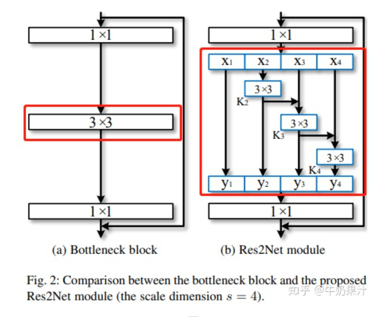
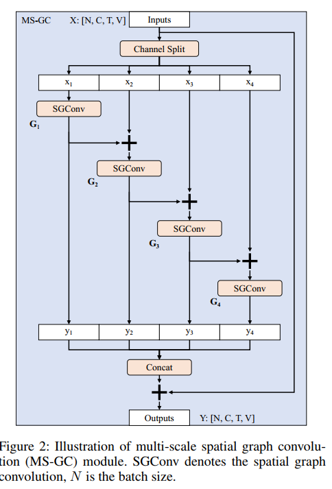
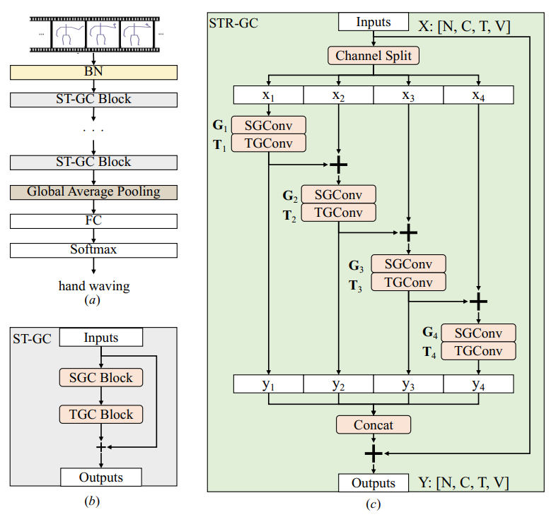
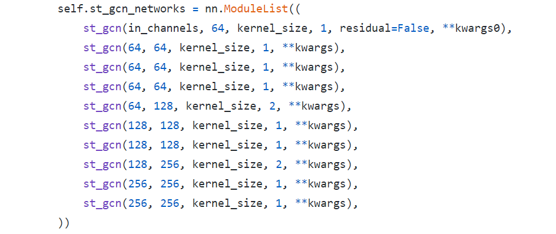
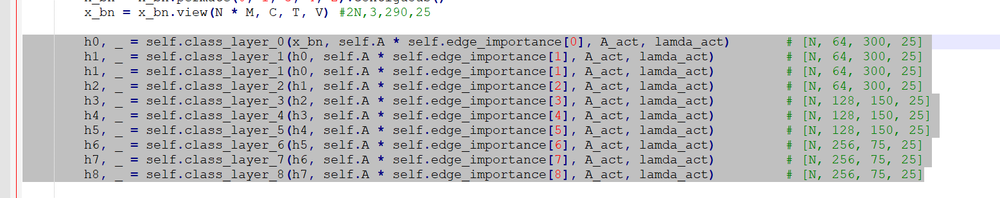

# Multi-Scale Spatial Temporal Graph Convolutional Network for Skeleton-Based Action Recognition

## 总结

### 基本信息
AAAI 2021的文章  

- **Zhan Chen **Peking University Shenzhen Graduate School
- **Sicheng Li **Zhejiang University
- **Bing Yang **Peking University Shenzhen Graduate School
- **Qinghan Li **Syracuse University
- **Hong Liu **Peking University Shenzhen Graduate School

### 主要工作
改造st-gcn网络，使其获得non-local 空间信息和long-range时间信息。

### 论文原文
The main idea is inspired by Res2Net (Gao et al. 2019) which has a great impact on many fields of image processing. We transfer it to GCN-based action recognition with skeleton data 

### 核心思想
借鉴Res2Net网络思想，滤波器组以分层类似残差样式的连接，以增加尺度表示输出特征，**并增加了每个网络层的感受野**。从而获得non-local 空间信息和long-range时间信息。

### 知乎对Res2Net网络的描述
第一部分线路很简单，x1不做处理，直接传到y1；第二部分线路，x2经过3x3卷积之后分为两条线路，一条继续向前传播给y2，另一条传到x3，这样第三条线路就获得了第二条线路的信息；第三条线路、第四条线路，以此类推。每条线路的通道数为n/s。

## MS-GC, spatial 

A multi-scale spatial graph convolution module to
capture both local joints connectives and non-local
joints relations for spatial modeling  

## MT-GC, temporal
A multi-scale temporal graph convolution module to
efficiently enlarge the temporal receptive field for
long-range temporal dynamics

## st-gcn 网络代码

## 启发

可以借用这种残差样式的连接网络思想，对目前所做实验进行改造，将AS-GCN 这部分改为多尺度网络。

只是改造GCN还是TCN，怎么与transformer结合，还需要进一步思考。

