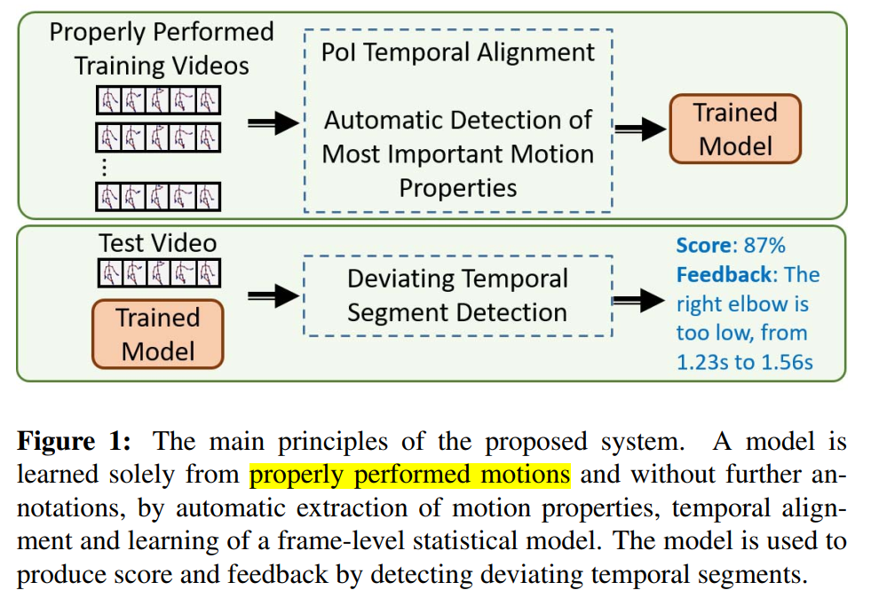

# ICCV 2019 A-MAL

## basic
ICCV 2019

task: motion assessment by 3D skeleton

## pipe



## Video Normalization model
removing unneeded, distracting information from the data


## code

1. 获取到平均边长度
```
vids = [skvp.create_length_scaled_video(vid, num_frames = vids_mean_len_before_filters) for vid in vids]
```

2. 利用SKVP 代码中create_length_scaled_video模块进行缩放
https://github.com/skvp-owner/SKVP-Python/blob/master/skvp.py

```
def create_length_scaled_video(ref_video, scale = None, num_frames = None, num_seconds = None):
	if scale == None and num_frames == None and num_seconds == None:
		raise SkvpUsageError('Must specify one of parameters {scale, num_frames, num_seconds}')
	if (scale != None and num_frames != None) or (scale != None and num_seconds != None) or (num_frames != None and num_seconds != None):
		raise SkvpUsageError('Must specify only one of parameters {scale, num_frames, num_seconds}')
	if scale != None:
		if not (type(scale) is int or type(scale) is float):
			raise SkvpUsageError('scale parameter must be a number')
		if scale <= 0:
			raise SkvpForbiddenOperationError('Scale must be a positive real number')
	if num_frames != None:
		if not type(num_frames) is int:
			raise SkvpUsageError('num_frames parameter must be an ineteger')
		if num_frames <= 0:
			raise SkvpForbiddenOperationError('Number of target frames must be a positive number')
	if num_seconds != None:
		if not (type(num_seconds) is int or type(num_seconds) is float):
			raise SkvpUsageError('num_seconds parameter must be a number')
		if num_seconds <= 0:
			raise SkvpForbiddenOperationError('Number of target seconds must be a positive number')
	if len(ref_video) == 0:
		raise SkvpForbiddenOperationError('Cannot scale empty video')
	final_scale = scale
	if num_frames != None:
		final_scale = num_frames / float(len(ref_video))
	elif num_seconds != None:
		final_scale = num_seconds / float(ref_video.get_video_length(seconds = True))
	if final_scale == 1.0:
		return ref_video[:]
	new_vid = ref_video[0:0]     # Creating empty video with same header
	num_frames_target_vid = int(round(len(ref_video) * final_scale))
	num_frames_ref_vid = len(ref_video)
	for i in range(num_frames_target_vid):
		if num_frames_target_vid == 1:
			frame_perc = 0
		else:
			frame_perc = (i) / float(num_frames_target_vid - 1)
		ref_frame = (num_frames_ref_vid - 1) * frame_perc
		upper_weight = ref_frame - int(ref_frame)
		lower_weight = 1.0 - upper_weight
		lower_index = int(ref_frame)
		if lower_weight == 1 or upper_weight == 1:
			new_vid.add_frame(ref_video.frames[lower_index])
		else:
			new_frame = []
			for j in range(ref_video.get_num_joints()):
				new_frame.append(lower_weight * ref_video.frames[lower_index][j] + upper_weight * ref_video.frames[lower_index + 1][j])
			new_vid.add_frame(new_frame)

	return new_vid
```


这份代码是处理视频的，修改成直接处理skeleton coordinate 数据，不知道可不可行，需要跑跑原来那套代码看看。


## others

尝试查找其他直接对NTU RGB D数据集进行normaliztion的代码，目前没有找到。


这里有个观点说 skeleton normalization step 不重要
https://github.com/shahroudy/NTURGB-D
(8) How important is the skeleton normalization step, described in experimantal setup section?
In the extension of our experiments, we found out the normalization is not vital. You can skip the normalization step and it should work fine. Actually the network is supposed to learn how to normalize the data by itself.


- Normalization: all joint positions are converted to the x-y coordinates relative to the skeleton bounding box.
https://github.com/dekucheng/Skeleton-Based-Human-Action-Recognition/blob/master/src/mylib/data_preprocessing.py