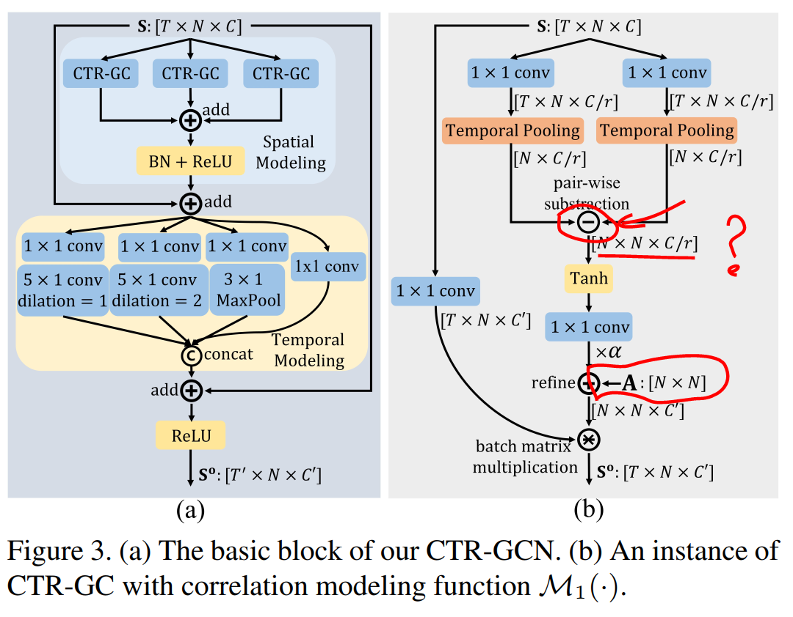
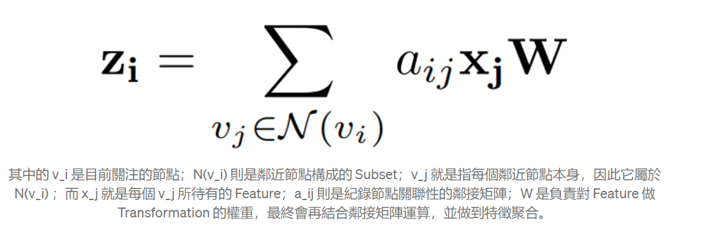
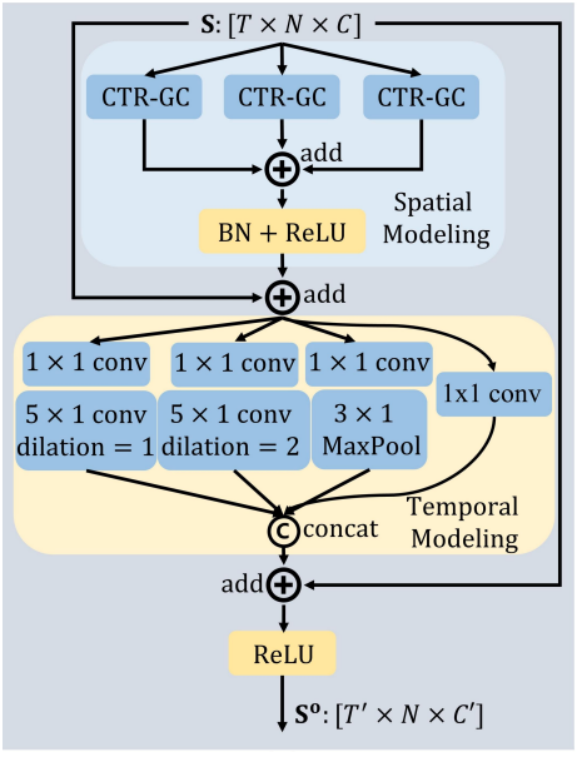

## 总体





**核心创新点：不同的channel 用不同的A**


## 分析


**Given a pair of vertices (vi; vj) and their corresponding features (xi; xj)**  

**M1(·) essentially ==calculates distances between (xi) and φ(xj) along channel dimension== and utilizes the nonlinear transformations of these distances as ==channel-specific topological relationship== between vi and vj.**  


沿着channel 维度是什么意思？是如何沿着channel维度？


linear transformation ξ to raise the channel dimension  


常見的 Topology-shared Graph Convolution 在公式上



留意的是「 a_ij 」( 鄰接矩陣 )
Static method 通常會事先定義好這部份的樣子，或者將其設定為可被訓練的參數。
Dynamic method 則會讓模型去對應 Sample 生成具備相依性的鄰接矩陣。


動態地推論 Channel-wise topologies 來捕捉節點在不同種 Motion features 的關聯性

再依照 Channel 維度將對應的 Topology 資訊和特徵做一種 Aggregation，才形成最終的輸出。


再仔細一點來看這個過程的話，一開始的特徵會先經過 ==φ 和 Ψ 是要進行維度的壓縮==，藉此降低運算量。

若將輸入的配對節點以 ( v_i , v_j ) 表示，對應特徵以 x_i 和 x_j 表示，M(·) 可以有 2 種寫法，第一種是：

本質上來看 M_1(·)的話，它就是==沿著 Channel 的維度==計算壓縮過後的 x_i 和 x_j 之間的距離，再透過非線性變換來生成 Channel-specific 的節點關聯性。

最原始的channel 是如何区分的？

> How to split for the origin different channels?
>
> c are respectively from c-th channel of Rc  
>
> Each channelgraph reflects relationships of vertices under a certain type of motion feature  





**Spatial Modeling**


同時切出 ==3 個 Branch== 來做 **CTR-GC** (这个三个branch是拆分还是复制？)


## 问题

- 这里的A共享邻接矩阵，是如何学习得到的？

> The adjacency matrix is used as shared topology for all
> channels and is learned through backpropagation  

- 文中的特征x是什么特征？最原始的就是坐标信息吗？


- 沿着channel 维度是什么意思？是如何沿着channel维度？
对应的顶点进行计算吗？
- 同時切出 ==3 個 Branch== 來做 **CTR-GC** (这个三个branch是拆分还是复制？)


## 改进点
feature transformation
用人为构造的与动作表达的有关的特征是不是好一点？
input 直接用坐标信息还是角度等信息？
时间维度卷积改进


# 实验

## errors
```
[ Wed Sep 15 00:11:28 2021 ] Eval epoch: 5
100%|#| 796/796 [08:07<00:00,  1.63it/s]
Accuracy:  0.6310021799328345  model:  work_dir/ntu120/csub/ctrgcn/runs
[ Wed Sep 15 00:19:36 2021 ]    Mean test loss of 796 batches: 1.2569574666158039.
[ Wed Sep 15 00:19:36 2021 ]    Top1: 63.10%
[ Wed Sep 15 00:19:36 2021 ]    Top5: 88.46%
[ Wed Sep 15 00:19:37 2021 ] Training epoch: 6
Traceback (most recent call last):
  File "main.py", line 580, in <module>
    processor.start()
  File "main.py", line 503, in start
    self.train(epoch, save_model=save_model)
  File "main.py", line 364, in train
    self.adjust_learning_rate(epoch)
  File "main.py", line 331, in adjust_learning_rate
    self.arg.lr_decay_rate ** np.sum(epoch >= np.array(self.arg.step)))
AttributeError: 'Namespace' object has no attribute 'lr_decay_rate'
```


