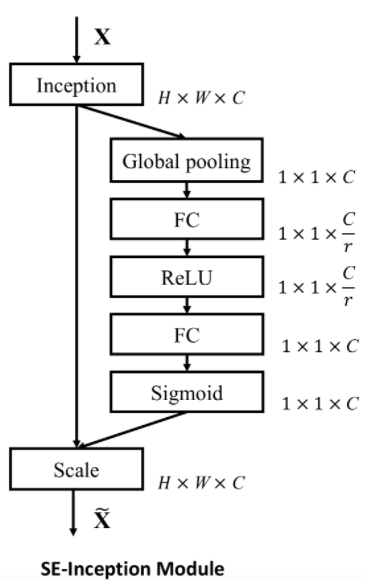
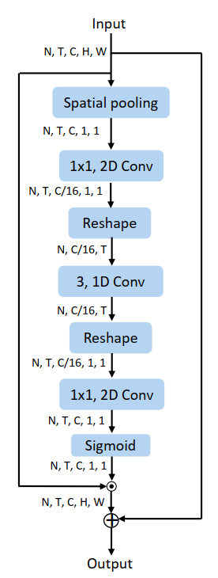
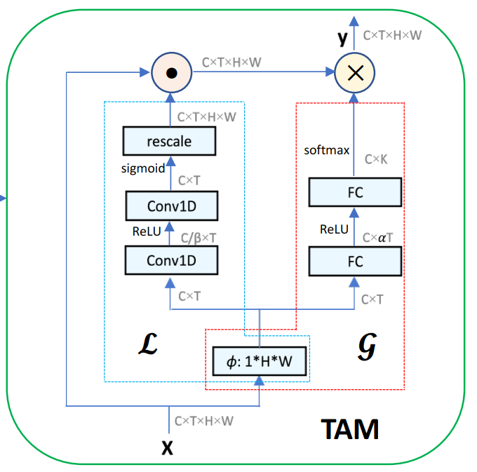

## SEnet



```
from torch import nn

class SELayer(nn.Module):
    def __init__(self, channel, reduction=16):
        super(SELayer, self).__init__()
        self.avg_pool = nn.AdaptiveAvgPool2d(1)
        self.fc = nn.Sequential(
            nn.Linear(channel, channel // reduction, bias=False),
            nn.ReLU(inplace=True),
            nn.Linear(channel // reduction, channel, bias=False),
            nn.Sigmoid()
        )

    def forward(self, x):
        b, c, _, _ = x.size()
        y = self.avg_pool(x).view(b, c)
        y = self.fc(y).view(b, c, 1, 1)
        return x * y.expand_as(x)
```


## ActionNet CE




```
        # # channel excitation
        self.action_p2_squeeze = nn.Conv2d(self.in_channels, self.reduced_channels, kernel_size=(1, 1), stride=(1 ,1), bias=False, padding=(0, 0))
        self.action_p2_conv1 = nn.Conv1d(self.reduced_channels, self.reduced_channels, kernel_size=3, stride=1, bias=False, padding=1, 
                                       groups=1)
        self.action_p2_expand = nn.Conv2d(self.reduced_channels, self.in_channels, kernel_size=(1, 1), stride=(1 ,1), bias=False, padding=(0, 0))


        # 2D convolution: c*T*1*1, channel excitation
        x_p2 = self.avg_pool(x_shift)
        x_p2 = self.action_p2_squeeze(x_p2)
        nt, c, h, w = x_p2.size()
        x_p2 = x_p2.view(n_batch, self.n_segment, c, 1, 1).squeeze(-1).squeeze(-1).transpose(2,1).contiguous()
        x_p2 = self.action_p2_conv1(x_p2)
        x_p2 = self.relu(x_p2)
        x_p2 = x_p2.transpose(2,1).contiguous().view(-1, c, 1, 1)
        x_p2 = self.action_p2_expand(x_p2)
        x_p2 = self.sigmoid(x_p2)
        x_p2 = x_shift * x_p2 + x_shift
```


## TAM   Local




```
        self.G = nn.Sequential(
            nn.Linear(n_segment, n_segment * 2, bias=False),
            nn.BatchNorm1d(n_segment * 2), nn.ReLU(inplace=True),
            nn.Linear(n_segment * 2, kernel_size, bias=False), nn.Softmax(-1))

        self.L = nn.Sequential(
            nn.Conv1d(in_channels,
                      in_channels // 4,
                      kernel_size,  # kernel_size=3
                      stride=1,
                      padding=kernel_size // 2,
                      bias=False), nn.BatchNorm1d(in_channels // 4),
            nn.ReLU(inplace=True),
            nn.Conv1d(in_channels // 4, in_channels, 1, bias=False),
            nn.Sigmoid())
```


> We notice that the structure of local branch is
> similar to the SENet [13] and STC [5]. The first obvious
> difference is the local branch does not squeeze the temporal
> dimension. We thus use temporal 1D convolution, instead
> of fc layer, as a basic layer. Two-layer design only seeks to
> make a trade-off between non-linear fitting capability and
> model complexity. The local branch provides the location
> sensitive information, and thereby addresses the issue that
> the global branch is insensitive to temporal location


