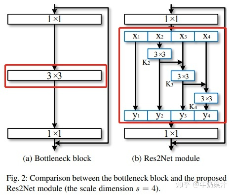
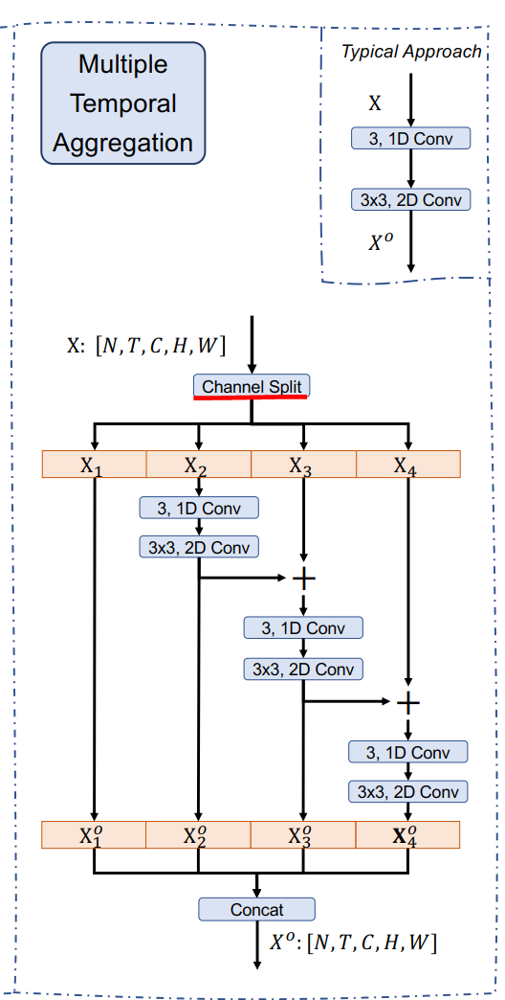
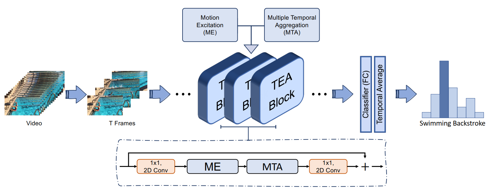
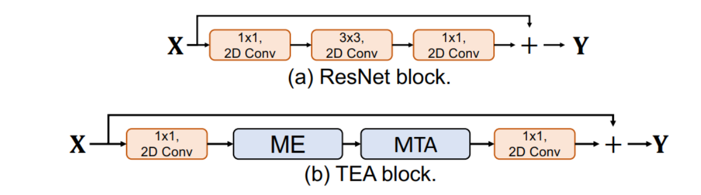
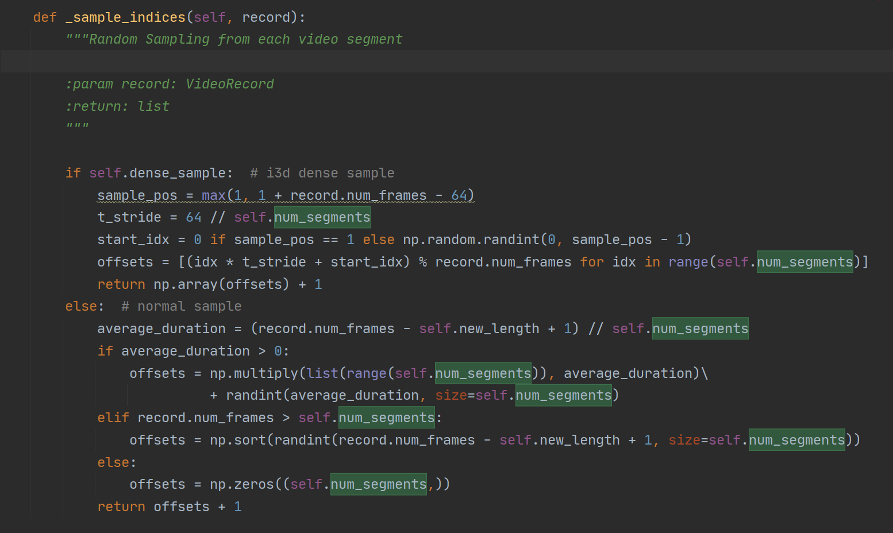

## net














## segment


> Firstly, the videos are evenly
> divided into T segments. Then one frame is randomly
> selected from each segment to form the input sequence
> with T frames. 





convs
```
ModuleList(
  (0): MTA_TCN_GCN_unit(
    (gcn1): Shift_gcn(
      (bn): BatchNorm1d(650, eps=1e-05, momentum=0.1, affine=True, track_running_stats=True)
      (relu): ReLU()
    )
    (tcn1): Shift_tcn(
      (bn): BatchNorm2d(26, eps=1e-05, momentum=0.1, affine=True, track_running_stats=True)
      (bn2): BatchNorm2d(26, eps=1e-05, momentum=0.1, affine=True, track_running_stats=True)
      (relu): ReLU(inplace)
      (shift_in): Shift()
      (shift_out): Shift()
      (temporal_linear): Conv2d(26, 26, kernel_size=(1, 1), stride=(1, 1))
    )
  )
  (1): MTA_TCN_GCN_unit(
    (gcn1): Shift_gcn(
      (bn): BatchNorm1d(650, eps=1e-05, momentum=0.1, affine=True, track_running_stats=True)
      (relu): ReLU()
    )
    (tcn1): Shift_tcn(
      (bn): BatchNorm2d(26, eps=1e-05, momentum=0.1, affine=True, track_running_stats=True)
      (bn2): BatchNorm2d(26, eps=1e-05, momentum=0.1, affine=True, track_running_stats=True)
      (relu): ReLU(inplace)
      (shift_in): Shift()
      (shift_out): Shift()
      (temporal_linear): Conv2d(26, 26, kernel_size=(1, 1), stride=(1, 1))
    )
  )
  (2): MTA_TCN_GCN_unit(
    (gcn1): Shift_gcn(
      (bn): BatchNorm1d(650, eps=1e-05, momentum=0.1, affine=True, track_running_stats=True)
      (relu): ReLU()
    )
    (tcn1): Shift_tcn(
      (bn): BatchNorm2d(26, eps=1e-05, momentum=0.1, affine=True, track_running_stats=True)
      (bn2): BatchNorm2d(26, eps=1e-05, momentum=0.1, affine=True, track_running_stats=True)
      (relu): ReLU(inplace)
      (shift_in): Shift()
      (shift_out): Shift()
      (temporal_linear): Conv2d(26, 26, kernel_size=(1, 1), stride=(1, 1))
    )
  )
)
```