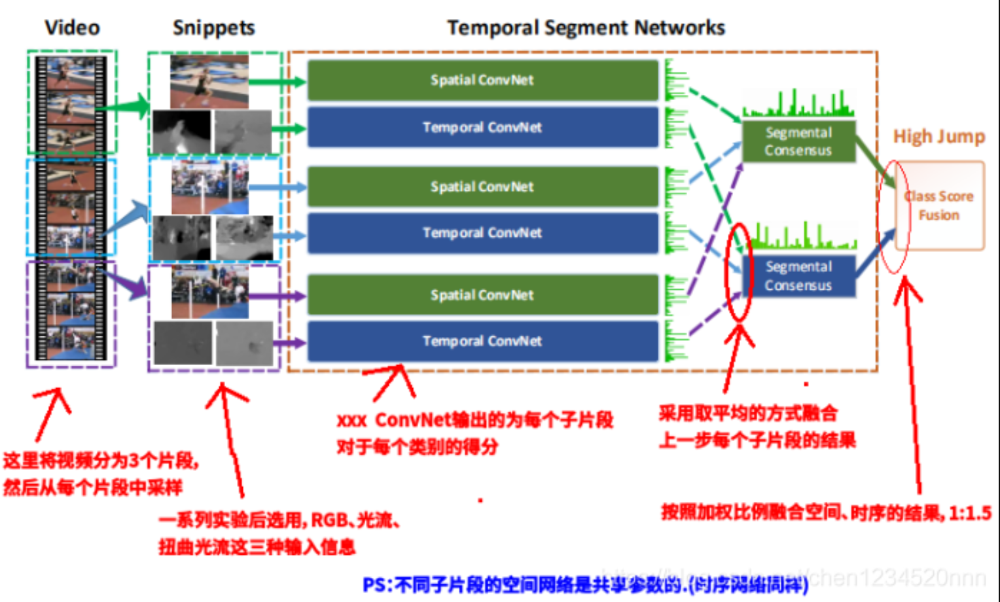

## TSN

Temporal Segment Networks (TSN)是在 ECCV 2016 上提出的，作者是Limin Wang, Yuanjun Xiong, Zhe Wang, Yu Qiao, Dahua Lin, Xiaoou Tang, and Luc Van Gool，是一个用于视频中人的行为识别的框架。论文中数据集表现：HMDB51(69.4%)、UCF101（94.2%），在 AcitivityNet challenge 2016 “untrimmed video classification”项目上取得了第一名。

TSN 项目主页：http://yjxiong.me/others/tsn/
TSN 代码 & 模型：https://github.com/yjxiong/temporal-segment-networks

https://blog.csdn.net/chen1234520nnn/article/details/104901072?utm_medium=distribute.pc_relevant.none-task-blog-2~default~baidujs_baidulandingword~default-0.no_search_link&spm=1001.2101.3001.4242

