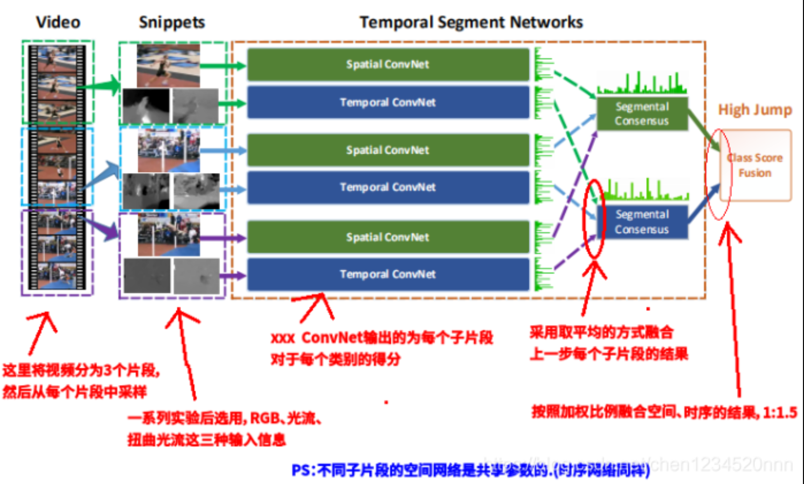

## TSN

Temporal Segment Networks (TSN)是在 ECCV 2016 上提出的，作者是Limin Wang, Yuanjun Xiong, Zhe Wang, Yu Qiao, Dahua Lin, Xiaoou Tang, and Luc Van Gool，是一个用于视频中人的行为识别的框架。论文中数据集表现：HMDB51(69.4%)、UCF101（94.2%），在 AcitivityNet challenge 2016 “untrimmed video classification”项目上取得了第一名。

TSN 项目主页：http://yjxiong.me/others/tsn/
TSN 代码 & 模型：https://github.com/yjxiong/temporal-segment-networks


https://blog.csdn.net/chen1234520nnn/article/details/104901072?utm_medium=distribute.pc_relevant.none-task-blog-2~default~baidujs_baidulandingword~default-0.no_search_link&spm=1001.2101.3001.4242


https://zhuanlan.zhihu.com/p/75548638





## TSM


上图展示的就是TSM的实现核心所在的一个建议图例，作者将不同视频帧之间的Channe进行平移置换，从而使得每一层的结果都有相邻帧之间的通道值，这使得新的混合的每一层似乎好像获得了一个时序上的特征。**注意**这里的帧不是实际视频中的相邻帧，是类似于 ![[公式]](https://www.zhihu.com/equation?tex=TSN) 网络的设置，将视频分割成段，每一段取一帧来代表整个视频。


## TEA motion excitation


## SE-Block

Squeeze-and-Excitation Networks(CVPR 2008) 


Excitation部分是用2个全连接来实现 ，第一个全连接把C个通道压缩成了C/r个通道来降低计算量（后面跟了RELU），第二个全连接再恢复回C个通道（后面跟了Sigmoid），r是指压缩的比例。

https://zhuanlan.zhihu.com/p/32702350


DataParallel(
  (module): TSN(
    (base_model): ResNet(
      (conv1): Conv2d(3, 64, kernel_size=(7, 7), stride=(2, 2), padding=(3, 3), bias=False)
      (bn1): BatchNorm2d(64, eps=1e-05, momentum=0.1, affine=True, track_running_stats=True)
      (relu): ReLU(inplace=True)
      (maxpool): MaxPool2d(kernel_size=3, stride=2, padding=1, dilation=1, ceil_mode=False)
      (layer1): Sequential(
        (0): Bottleneck(
          (conv1): Action(
            (net): Conv2d(64, 64, kernel_size=(1, 1), stride=(1, 1), bias=False)
            (avg_pool): AdaptiveAvgPool2d(output_size=1)
            (relu): ReLU(inplace=True)
            (sigmoid): Sigmoid()
            (action_shift): Conv1d(64, 64, kernel_size=(3,), stride=(1,), padding=(1,), groups=64, bias=False)
            (action_p1_conv1): Conv3d(1, 1, kernel_size=(3, 3, 3), stride=(1, 1, 1), padding=(1, 1, 1), bias=False)
            (action_p2_squeeze): Conv2d(64, 4, kernel_size=(1, 1), stride=(1, 1), bias=False)
            (action_p2_conv1): Conv1d(4, 4, kernel_size=(3,), stride=(1,), padding=(1,), bias=False)
            (action_p2_expand): Conv2d(4, 64, kernel_size=(1, 1), stride=(1, 1), bias=False)
            (action_p3_squeeze): Conv2d(64, 4, kernel_size=(1, 1), stride=(1, 1), bias=False)
            (action_p3_bn1): BatchNorm2d(4, eps=1e-05, momentum=0.1, affine=True, track_running_stats=True)
            (action_p3_conv1): Conv2d(4, 4, kernel_size=(3, 3), stride=(1, 1), padding=(1, 1), groups=4, bias=False)
            (action_p3_expand): Conv2d(4, 64, kernel_size=(1, 1), stride=(1, 1), bias=False)
          )
          (bn1): BatchNorm2d(64, eps=1e-05, momentum=0.1, affine=True, track_running_stats=True)
          (conv2): Conv2d(64, 64, kernel_size=(3, 3), stride=(1, 1), padding=(1, 1), bias=False)
          (bn2): BatchNorm2d(64, eps=1e-05, momentum=0.1, affine=True, track_running_stats=True)
          (conv3): Conv2d(64, 256, kernel_size=(1, 1), stride=(1, 1), bias=False)
          (bn3): BatchNorm2d(256, eps=1e-05, momentum=0.1, affine=True, track_running_stats=True)
          (relu): ReLU(inplace=True)
          (downsample): Sequential(
            (0): Conv2d(64, 256, kernel_size=(1, 1), stride=(1, 1), bias=False)
            (1): BatchNorm2d(256, eps=1e-05, momentum=0.1, affine=True, track_running_stats=True)
          )
        )
        (1): Bottleneck(
          (conv1): Action(
            (net): Conv2d(256, 64, kernel_size=(1, 1), stride=(1, 1), bias=False)
            (avg_pool): AdaptiveAvgPool2d(output_size=1)
            (relu): ReLU(inplace=True)
            (sigmoid): Sigmoid()
            (action_shift): Conv1d(256, 256, kernel_size=(3,), stride=(1,), padding=(1,), groups=256, bias=False)
            (action_p1_conv1): Conv3d(1, 1, kernel_size=(3, 3, 3), stride=(1, 1, 1), padding=(1, 1, 1), bias=False)
            (action_p2_squeeze): Conv2d(256, 16, kernel_size=(1, 1), stride=(1, 1), bias=False)
            (action_p2_conv1): Conv1d(16, 16, kernel_size=(3,), stride=(1,), padding=(1,), bias=False)
            (action_p2_expand): Conv2d(16, 256, kernel_size=(1, 1), stride=(1, 1), bias=False)
            (action_p3_squeeze): Conv2d(256, 16, kernel_size=(1, 1), stride=(1, 1), bias=False)
            (action_p3_bn1): BatchNorm2d(16, eps=1e-05, momentum=0.1, affine=True, track_running_stats=True)
            (action_p3_conv1): Conv2d(16, 16, kernel_size=(3, 3), stride=(1, 1), padding=(1, 1), groups=16, bias=False)
            (action_p3_expand): Conv2d(16, 256, kernel_size=(1, 1), stride=(1, 1), bias=False)
          )
          (bn1): BatchNorm2d(64, eps=1e-05, momentum=0.1, affine=True, track_running_stats=True)
          (conv2): Conv2d(64, 64, kernel_size=(3, 3), stride=(1, 1), padding=(1, 1), bias=False)
          (bn2): BatchNorm2d(64, eps=1e-05, momentum=0.1, affine=True, track_running_stats=True)
          (conv3): Conv2d(64, 256, kernel_size=(1, 1), stride=(1, 1), bias=False)
          (bn3): BatchNorm2d(256, eps=1e-05, momentum=0.1, affine=True, track_running_stats=True)
          (relu): ReLU(inplace=True)
        )
        (2): Bottleneck(
          (conv1): Action(
            (net): Conv2d(256, 64, kernel_size=(1, 1), stride=(1, 1), bias=False)
            (avg_pool): AdaptiveAvgPool2d(output_size=1)
            (relu): ReLU(inplace=True)
            (sigmoid): Sigmoid()
            (action_shift): Conv1d(256, 256, kernel_size=(3,), stride=(1,), padding=(1,), groups=256, bias=False)
            (action_p1_conv1): Conv3d(1, 1, kernel_size=(3, 3, 3), stride=(1, 1, 1), padding=(1, 1, 1), bias=False)
            (action_p2_squeeze): Conv2d(256, 16, kernel_size=(1, 1), stride=(1, 1), bias=False)
            (action_p2_conv1): Conv1d(16, 16, kernel_size=(3,), stride=(1,), padding=(1,), bias=False)
            (action_p2_expand): Conv2d(16, 256, kernel_size=(1, 1), stride=(1, 1), bias=False)
            (action_p3_squeeze): Conv2d(256, 16, kernel_size=(1, 1), stride=(1, 1), bias=False)
            (action_p3_bn1): BatchNorm2d(16, eps=1e-05, momentum=0.1, affine=True, track_running_stats=True)
            (action_p3_conv1): Conv2d(16, 16, kernel_size=(3, 3), stride=(1, 1), padding=(1, 1), groups=16, bias=False)
            (action_p3_expand): Conv2d(16, 256, kernel_size=(1, 1), stride=(1, 1), bias=False)
          )
          (bn1): BatchNorm2d(64, eps=1e-05, momentum=0.1, affine=True, track_running_stats=True)
          (conv2): Conv2d(64, 64, kernel_size=(3, 3), stride=(1, 1), padding=(1, 1), bias=False)
          (bn2): BatchNorm2d(64, eps=1e-05, momentum=0.1, affine=True, track_running_stats=True)
          (conv3): Conv2d(64, 256, kernel_size=(1, 1), stride=(1, 1), bias=False)
          (bn3): BatchNorm2d(256, eps=1e-05, momentum=0.1, affine=True, track_running_stats=True)
          (relu): ReLU(inplace=True)
        )
      )
      (layer2): Sequential(
        (0): Bottleneck(
          (conv1): Action(
            (net): Conv2d(256, 128, kernel_size=(1, 1), stride=(1, 1), bias=False)
            (avg_pool): AdaptiveAvgPool2d(output_size=1)
            (relu): ReLU(inplace=True)
            (sigmoid): Sigmoid()
            (action_shift): Conv1d(256, 256, kernel_size=(3,), stride=(1,), padding=(1,), groups=256, bias=False)
            (action_p1_conv1): Conv3d(1, 1, kernel_size=(3, 3, 3), stride=(1, 1, 1), padding=(1, 1, 1), bias=False)
            (action_p2_squeeze): Conv2d(256, 16, kernel_size=(1, 1), stride=(1, 1), bias=False)
            (action_p2_conv1): Conv1d(16, 16, kernel_size=(3,), stride=(1,), padding=(1,), bias=False)
            (action_p2_expand): Conv2d(16, 256, kernel_size=(1, 1), stride=(1, 1), bias=False)
            (action_p3_squeeze): Conv2d(256, 16, kernel_size=(1, 1), stride=(1, 1), bias=False)
            (action_p3_bn1): BatchNorm2d(16, eps=1e-05, momentum=0.1, affine=True, track_running_stats=True)
            (action_p3_conv1): Conv2d(16, 16, kernel_size=(3, 3), stride=(1, 1), padding=(1, 1), groups=16, bias=False)
            (action_p3_expand): Conv2d(16, 256, kernel_size=(1, 1), stride=(1, 1), bias=False)
          )
          (bn1): BatchNorm2d(128, eps=1e-05, momentum=0.1, affine=True, track_running_stats=True)
          (conv2): Conv2d(128, 128, kernel_size=(3, 3), stride=(2, 2), padding=(1, 1), bias=False)
          (bn2): BatchNorm2d(128, eps=1e-05, momentum=0.1, affine=True, track_running_stats=True)
          (conv3): Conv2d(128, 512, kernel_size=(1, 1), stride=(1, 1), bias=False)
          (bn3): BatchNorm2d(512, eps=1e-05, momentum=0.1, affine=True, track_running_stats=True)
          (relu): ReLU(inplace=True)
          (downsample): Sequential(
            (0): Conv2d(256, 512, kernel_size=(1, 1), stride=(2, 2), bias=False)
            (1): BatchNorm2d(512, eps=1e-05, momentum=0.1, affine=True, track_running_stats=True)
          )
        )
        (1): Bottleneck(
          (conv1): Action(
            (net): Conv2d(512, 128, kernel_size=(1, 1), stride=(1, 1), bias=False)
            (avg_pool): AdaptiveAvgPool2d(output_size=1)
            (relu): ReLU(inplace=True)
            (sigmoid): Sigmoid()
            (action_shift): Conv1d(512, 512, kernel_size=(3,), stride=(1,), padding=(1,), groups=512, bias=False)
            (action_p1_conv1): Conv3d(1, 1, kernel_size=(3, 3, 3), stride=(1, 1, 1), padding=(1, 1, 1), bias=False)
            (action_p2_squeeze): Conv2d(512, 32, kernel_size=(1, 1), stride=(1, 1), bias=False)
            (action_p2_conv1): Conv1d(32, 32, kernel_size=(3,), stride=(1,), padding=(1,), bias=False)
            (action_p2_expand): Conv2d(32, 512, kernel_size=(1, 1), stride=(1, 1), bias=False)
            (action_p3_squeeze): Conv2d(512, 32, kernel_size=(1, 1), stride=(1, 1), bias=False)
            (action_p3_bn1): BatchNorm2d(32, eps=1e-05, momentum=0.1, affine=True, track_running_stats=True)
            (action_p3_conv1): Conv2d(32, 32, kernel_size=(3, 3), stride=(1, 1), padding=(1, 1), groups=32, bias=False)
            (action_p3_expand): Conv2d(32, 512, kernel_size=(1, 1), stride=(1, 1), bias=False)
          )
          (bn1): BatchNorm2d(128, eps=1e-05, momentum=0.1, affine=True, track_running_stats=True)
          (conv2): Conv2d(128, 128, kernel_size=(3, 3), stride=(1, 1), padding=(1, 1), bias=False)
          (bn2): BatchNorm2d(128, eps=1e-05, momentum=0.1, affine=True, track_running_stats=True)
          (conv3): Conv2d(128, 512, kernel_size=(1, 1), stride=(1, 1), bias=False)
          (bn3): BatchNorm2d(512, eps=1e-05, momentum=0.1, affine=True, track_running_stats=True)
          (relu): ReLU(inplace=True)
        )
        (2): Bottleneck(
          (conv1): Action(
            (net): Conv2d(512, 128, kernel_size=(1, 1), stride=(1, 1), bias=False)
            (avg_pool): AdaptiveAvgPool2d(output_size=1)
            (relu): ReLU(inplace=True)
            (sigmoid): Sigmoid()
            (action_shift): Conv1d(512, 512, kernel_size=(3,), stride=(1,), padding=(1,), groups=512, bias=False)
            (action_p1_conv1): Conv3d(1, 1, kernel_size=(3, 3, 3), stride=(1, 1, 1), padding=(1, 1, 1), bias=False)
            (action_p2_squeeze): Conv2d(512, 32, kernel_size=(1, 1), stride=(1, 1), bias=False)
            (action_p2_conv1): Conv1d(32, 32, kernel_size=(3,), stride=(1,), padding=(1,), bias=False)
            (action_p2_expand): Conv2d(32, 512, kernel_size=(1, 1), stride=(1, 1), bias=False)
            (action_p3_squeeze): Conv2d(512, 32, kernel_size=(1, 1), stride=(1, 1), bias=False)
            (action_p3_bn1): BatchNorm2d(32, eps=1e-05, momentum=0.1, affine=True, track_running_stats=True)
            (action_p3_conv1): Conv2d(32, 32, kernel_size=(3, 3), stride=(1, 1), padding=(1, 1), groups=32, bias=False)
            (action_p3_expand): Conv2d(32, 512, kernel_size=(1, 1), stride=(1, 1), bias=False)
          )
          (bn1): BatchNorm2d(128, eps=1e-05, momentum=0.1, affine=True, track_running_stats=True)
          (conv2): Conv2d(128, 128, kernel_size=(3, 3), stride=(1, 1), padding=(1, 1), bias=False)
          (bn2): BatchNorm2d(128, eps=1e-05, momentum=0.1, affine=True, track_running_stats=True)
          (conv3): Conv2d(128, 512, kernel_size=(1, 1), stride=(1, 1), bias=False)
          (bn3): BatchNorm2d(512, eps=1e-05, momentum=0.1, affine=True, track_running_stats=True)
          (relu): ReLU(inplace=True)
        )
        (3): Bottleneck(
          (conv1): Action(
            (net): Conv2d(512, 128, kernel_size=(1, 1), stride=(1, 1), bias=False)
            (avg_pool): AdaptiveAvgPool2d(output_size=1)
            (relu): ReLU(inplace=True)
            (sigmoid): Sigmoid()
            (action_shift): Conv1d(512, 512, kernel_size=(3,), stride=(1,), padding=(1,), groups=512, bias=False)
            (action_p1_conv1): Conv3d(1, 1, kernel_size=(3, 3, 3), stride=(1, 1, 1), padding=(1, 1, 1), bias=False)
            (action_p2_squeeze): Conv2d(512, 32, kernel_size=(1, 1), stride=(1, 1), bias=False)
            (action_p2_conv1): Conv1d(32, 32, kernel_size=(3,), stride=(1,), padding=(1,), bias=False)
            (action_p2_expand): Conv2d(32, 512, kernel_size=(1, 1), stride=(1, 1), bias=False)
            (action_p3_squeeze): Conv2d(512, 32, kernel_size=(1, 1), stride=(1, 1), bias=False)
            (action_p3_bn1): BatchNorm2d(32, eps=1e-05, momentum=0.1, affine=True, track_running_stats=True)
            (action_p3_conv1): Conv2d(32, 32, kernel_size=(3, 3), stride=(1, 1), padding=(1, 1), groups=32, bias=False)
            (action_p3_expand): Conv2d(32, 512, kernel_size=(1, 1), stride=(1, 1), bias=False)
          )
          (bn1): BatchNorm2d(128, eps=1e-05, momentum=0.1, affine=True, track_running_stats=True)
          (conv2): Conv2d(128, 128, kernel_size=(3, 3), stride=(1, 1), padding=(1, 1), bias=False)
          (bn2): BatchNorm2d(128, eps=1e-05, momentum=0.1, affine=True, track_running_stats=True)
          (conv3): Conv2d(128, 512, kernel_size=(1, 1), stride=(1, 1), bias=False)
          (bn3): BatchNorm2d(512, eps=1e-05, momentum=0.1, affine=True, track_running_stats=True)
          (relu): ReLU(inplace=True)
        )
      )
      (layer3): Sequential(
        (0): Bottleneck(
          (conv1): Action(
            (net): Conv2d(512, 256, kernel_size=(1, 1), stride=(1, 1), bias=False)
            (avg_pool): AdaptiveAvgPool2d(output_size=1)
            (relu): ReLU(inplace=True)
            (sigmoid): Sigmoid()
            (action_shift): Conv1d(512, 512, kernel_size=(3,), stride=(1,), padding=(1,), groups=512, bias=False)
            (action_p1_conv1): Conv3d(1, 1, kernel_size=(3, 3, 3), stride=(1, 1, 1), padding=(1, 1, 1), bias=False)
            (action_p2_squeeze): Conv2d(512, 32, kernel_size=(1, 1), stride=(1, 1), bias=False)
            (action_p2_conv1): Conv1d(32, 32, kernel_size=(3,), stride=(1,), padding=(1,), bias=False)
            (action_p2_expand): Conv2d(32, 512, kernel_size=(1, 1), stride=(1, 1), bias=False)
            (action_p3_squeeze): Conv2d(512, 32, kernel_size=(1, 1), stride=(1, 1), bias=False)
            (action_p3_bn1): BatchNorm2d(32, eps=1e-05, momentum=0.1, affine=True, track_running_stats=True)
            (action_p3_conv1): Conv2d(32, 32, kernel_size=(3, 3), stride=(1, 1), padding=(1, 1), groups=32, bias=False)
            (action_p3_expand): Conv2d(32, 512, kernel_size=(1, 1), stride=(1, 1), bias=False)
          )
          (bn1): BatchNorm2d(256, eps=1e-05, momentum=0.1, affine=True, track_running_stats=True)
          (conv2): Conv2d(256, 256, kernel_size=(3, 3), stride=(2, 2), padding=(1, 1), bias=False)
          (bn2): BatchNorm2d(256, eps=1e-05, momentum=0.1, affine=True, track_running_stats=True)
          (conv3): Conv2d(256, 1024, kernel_size=(1, 1), stride=(1, 1), bias=False)
          (bn3): BatchNorm2d(1024, eps=1e-05, momentum=0.1, affine=True, track_running_stats=True)
          (relu): ReLU(inplace=True)
          (downsample): Sequential(
            (0): Conv2d(512, 1024, kernel_size=(1, 1), stride=(2, 2), bias=False)
            (1): BatchNorm2d(1024, eps=1e-05, momentum=0.1, affine=True, track_running_stats=True)
          )
        )
        (1): Bottleneck(
          (conv1): Action(
            (net): Conv2d(1024, 256, kernel_size=(1, 1), stride=(1, 1), bias=False)
            (avg_pool): AdaptiveAvgPool2d(output_size=1)
            (relu): ReLU(inplace=True)
            (sigmoid): Sigmoid()
            (action_shift): Conv1d(1024, 1024, kernel_size=(3,), stride=(1,), padding=(1,), groups=1024, bias=False)
            (action_p1_conv1): Conv3d(1, 1, kernel_size=(3, 3, 3), stride=(1, 1, 1), padding=(1, 1, 1), bias=False)
            (action_p2_squeeze): Conv2d(1024, 64, kernel_size=(1, 1), stride=(1, 1), bias=False)
            (action_p2_conv1): Conv1d(64, 64, kernel_size=(3,), stride=(1,), padding=(1,), bias=False)
            (action_p2_expand): Conv2d(64, 1024, kernel_size=(1, 1), stride=(1, 1), bias=False)
            (action_p3_squeeze): Conv2d(1024, 64, kernel_size=(1, 1), stride=(1, 1), bias=False)
            (action_p3_bn1): BatchNorm2d(64, eps=1e-05, momentum=0.1, affine=True, track_running_stats=True)
            (action_p3_conv1): Conv2d(64, 64, kernel_size=(3, 3), stride=(1, 1), padding=(1, 1), groups=64, bias=False)
            (action_p3_expand): Conv2d(64, 1024, kernel_size=(1, 1), stride=(1, 1), bias=False)
          )
          (bn1): BatchNorm2d(256, eps=1e-05, momentum=0.1, affine=True, track_running_stats=True)
          (conv2): Conv2d(256, 256, kernel_size=(3, 3), stride=(1, 1), padding=(1, 1), bias=False)
          (bn2): BatchNorm2d(256, eps=1e-05, momentum=0.1, affine=True, track_running_stats=True)
          (conv3): Conv2d(256, 1024, kernel_size=(1, 1), stride=(1, 1), bias=False)
          (bn3): BatchNorm2d(1024, eps=1e-05, momentum=0.1, affine=True, track_running_stats=True)
          (relu): ReLU(inplace=True)
        )
        (2): Bottleneck(
          (conv1): Action(
            (net): Conv2d(1024, 256, kernel_size=(1, 1), stride=(1, 1), bias=False)
            (avg_pool): AdaptiveAvgPool2d(output_size=1)
            (relu): ReLU(inplace=True)
            (sigmoid): Sigmoid()
            (action_shift): Conv1d(1024, 1024, kernel_size=(3,), stride=(1,), padding=(1,), groups=1024, bias=False)
            (action_p1_conv1): Conv3d(1, 1, kernel_size=(3, 3, 3), stride=(1, 1, 1), padding=(1, 1, 1), bias=False)
            (action_p2_squeeze): Conv2d(1024, 64, kernel_size=(1, 1), stride=(1, 1), bias=False)
            (action_p2_conv1): Conv1d(64, 64, kernel_size=(3,), stride=(1,), padding=(1,), bias=False)
            (action_p2_expand): Conv2d(64, 1024, kernel_size=(1, 1), stride=(1, 1), bias=False)
            (action_p3_squeeze): Conv2d(1024, 64, kernel_size=(1, 1), stride=(1, 1), bias=False)
            (action_p3_bn1): BatchNorm2d(64, eps=1e-05, momentum=0.1, affine=True, track_running_stats=True)
            (action_p3_conv1): Conv2d(64, 64, kernel_size=(3, 3), stride=(1, 1), padding=(1, 1), groups=64, bias=False)
            (action_p3_expand): Conv2d(64, 1024, kernel_size=(1, 1), stride=(1, 1), bias=False)
          )
          (bn1): BatchNorm2d(256, eps=1e-05, momentum=0.1, affine=True, track_running_stats=True)
          (conv2): Conv2d(256, 256, kernel_size=(3, 3), stride=(1, 1), padding=(1, 1), bias=False)
          (bn2): BatchNorm2d(256, eps=1e-05, momentum=0.1, affine=True, track_running_stats=True)
          (conv3): Conv2d(256, 1024, kernel_size=(1, 1), stride=(1, 1), bias=False)
          (bn3): BatchNorm2d(1024, eps=1e-05, momentum=0.1, affine=True, track_running_stats=True)
          (relu): ReLU(inplace=True)
        )
        (3): Bottleneck(
          (conv1): Action(
            (net): Conv2d(1024, 256, kernel_size=(1, 1), stride=(1, 1), bias=False)
            (avg_pool): AdaptiveAvgPool2d(output_size=1)
            (relu): ReLU(inplace=True)
            (sigmoid): Sigmoid()
            (action_shift): Conv1d(1024, 1024, kernel_size=(3,), stride=(1,), padding=(1,), groups=1024, bias=False)
            (action_p1_conv1): Conv3d(1, 1, kernel_size=(3, 3, 3), stride=(1, 1, 1), padding=(1, 1, 1), bias=False)
            (action_p2_squeeze): Conv2d(1024, 64, kernel_size=(1, 1), stride=(1, 1), bias=False)
            (action_p2_conv1): Conv1d(64, 64, kernel_size=(3,), stride=(1,), padding=(1,), bias=False)
            (action_p2_expand): Conv2d(64, 1024, kernel_size=(1, 1), stride=(1, 1), bias=False)
            (action_p3_squeeze): Conv2d(1024, 64, kernel_size=(1, 1), stride=(1, 1), bias=False)
            (action_p3_bn1): BatchNorm2d(64, eps=1e-05, momentum=0.1, affine=True, track_running_stats=True)
            (action_p3_conv1): Conv2d(64, 64, kernel_size=(3, 3), stride=(1, 1), padding=(1, 1), groups=64, bias=False)
            (action_p3_expand): Conv2d(64, 1024, kernel_size=(1, 1), stride=(1, 1), bias=False)
          )
          (bn1): BatchNorm2d(256, eps=1e-05, momentum=0.1, affine=True, track_running_stats=True)
          (conv2): Conv2d(256, 256, kernel_size=(3, 3), stride=(1, 1), padding=(1, 1), bias=False)
          (bn2): BatchNorm2d(256, eps=1e-05, momentum=0.1, affine=True, track_running_stats=True)
          (conv3): Conv2d(256, 1024, kernel_size=(1, 1), stride=(1, 1), bias=False)
          (bn3): BatchNorm2d(1024, eps=1e-05, momentum=0.1, affine=True, track_running_stats=True)
          (relu): ReLU(inplace=True)
        )
        (4): Bottleneck(
          (conv1): Action(
            (net): Conv2d(1024, 256, kernel_size=(1, 1), stride=(1, 1), bias=False)
            (avg_pool): AdaptiveAvgPool2d(output_size=1)
            (relu): ReLU(inplace=True)
            (sigmoid): Sigmoid()
            (action_shift): Conv1d(1024, 1024, kernel_size=(3,), stride=(1,), padding=(1,), groups=1024, bias=False)
            (action_p1_conv1): Conv3d(1, 1, kernel_size=(3, 3, 3), stride=(1, 1, 1), padding=(1, 1, 1), bias=False)
            (action_p2_squeeze): Conv2d(1024, 64, kernel_size=(1, 1), stride=(1, 1), bias=False)
            (action_p2_conv1): Conv1d(64, 64, kernel_size=(3,), stride=(1,), padding=(1,), bias=False)
            (action_p2_expand): Conv2d(64, 1024, kernel_size=(1, 1), stride=(1, 1), bias=False)
            (action_p3_squeeze): Conv2d(1024, 64, kernel_size=(1, 1), stride=(1, 1), bias=False)
            (action_p3_bn1): BatchNorm2d(64, eps=1e-05, momentum=0.1, affine=True, track_running_stats=True)
            (action_p3_conv1): Conv2d(64, 64, kernel_size=(3, 3), stride=(1, 1), padding=(1, 1), groups=64, bias=False)
            (action_p3_expand): Conv2d(64, 1024, kernel_size=(1, 1), stride=(1, 1), bias=False)
          )
          (bn1): BatchNorm2d(256, eps=1e-05, momentum=0.1, affine=True, track_running_stats=True)
          (conv2): Conv2d(256, 256, kernel_size=(3, 3), stride=(1, 1), padding=(1, 1), bias=False)
          (bn2): BatchNorm2d(256, eps=1e-05, momentum=0.1, affine=True, track_running_stats=True)
          (conv3): Conv2d(256, 1024, kernel_size=(1, 1), stride=(1, 1), bias=False)
          (bn3): BatchNorm2d(1024, eps=1e-05, momentum=0.1, affine=True, track_running_stats=True)
          (relu): ReLU(inplace=True)
        )
        (5): Bottleneck(
          (conv1): Action(
            (net): Conv2d(1024, 256, kernel_size=(1, 1), stride=(1, 1), bias=False)
            (avg_pool): AdaptiveAvgPool2d(output_size=1)
            (relu): ReLU(inplace=True)
            (sigmoid): Sigmoid()
            (action_shift): Conv1d(1024, 1024, kernel_size=(3,), stride=(1,), padding=(1,), groups=1024, bias=False)
            (action_p1_conv1): Conv3d(1, 1, kernel_size=(3, 3, 3), stride=(1, 1, 1), padding=(1, 1, 1), bias=False)
            (action_p2_squeeze): Conv2d(1024, 64, kernel_size=(1, 1), stride=(1, 1), bias=False)
            (action_p2_conv1): Conv1d(64, 64, kernel_size=(3,), stride=(1,), padding=(1,), bias=False)
            (action_p2_expand): Conv2d(64, 1024, kernel_size=(1, 1), stride=(1, 1), bias=False)
            (action_p3_squeeze): Conv2d(1024, 64, kernel_size=(1, 1), stride=(1, 1), bias=False)
            (action_p3_bn1): BatchNorm2d(64, eps=1e-05, momentum=0.1, affine=True, track_running_stats=True)
            (action_p3_conv1): Conv2d(64, 64, kernel_size=(3, 3), stride=(1, 1), padding=(1, 1), groups=64, bias=False)
            (action_p3_expand): Conv2d(64, 1024, kernel_size=(1, 1), stride=(1, 1), bias=False)
          )
          (bn1): BatchNorm2d(256, eps=1e-05, momentum=0.1, affine=True, track_running_stats=True)
          (conv2): Conv2d(256, 256, kernel_size=(3, 3), stride=(1, 1), padding=(1, 1), bias=False)
          (bn2): BatchNorm2d(256, eps=1e-05, momentum=0.1, affine=True, track_running_stats=True)
          (conv3): Conv2d(256, 1024, kernel_size=(1, 1), stride=(1, 1), bias=False)
          (bn3): BatchNorm2d(1024, eps=1e-05, momentum=0.1, affine=True, track_running_stats=True)
          (relu): ReLU(inplace=True)
        )
      )
      (layer4): Sequential(
        (0): Bottleneck(
          (conv1): Action(
            (net): Conv2d(1024, 512, kernel_size=(1, 1), stride=(1, 1), bias=False)
            (avg_pool): AdaptiveAvgPool2d(output_size=1)
            (relu): ReLU(inplace=True)
            (sigmoid): Sigmoid()
            (action_shift): Conv1d(1024, 1024, kernel_size=(3,), stride=(1,), padding=(1,), groups=1024, bias=False)
            (action_p1_conv1): Conv3d(1, 1, kernel_size=(3, 3, 3), stride=(1, 1, 1), padding=(1, 1, 1), bias=False)
            (action_p2_squeeze): Conv2d(1024, 64, kernel_size=(1, 1), stride=(1, 1), bias=False)
            (action_p2_conv1): Conv1d(64, 64, kernel_size=(3,), stride=(1,), padding=(1,), bias=False)
            (action_p2_expand): Conv2d(64, 1024, kernel_size=(1, 1), stride=(1, 1), bias=False)
            (action_p3_squeeze): Conv2d(1024, 64, kernel_size=(1, 1), stride=(1, 1), bias=False)
            (action_p3_bn1): BatchNorm2d(64, eps=1e-05, momentum=0.1, affine=True, track_running_stats=True)
            (action_p3_conv1): Conv2d(64, 64, kernel_size=(3, 3), stride=(1, 1), padding=(1, 1), groups=64, bias=False)
            (action_p3_expand): Conv2d(64, 1024, kernel_size=(1, 1), stride=(1, 1), bias=False)
          )
          (bn1): BatchNorm2d(512, eps=1e-05, momentum=0.1, affine=True, track_running_stats=True)
          (conv2): Conv2d(512, 512, kernel_size=(3, 3), stride=(2, 2), padding=(1, 1), bias=False)
          (bn2): BatchNorm2d(512, eps=1e-05, momentum=0.1, affine=True, track_running_stats=True)
          (conv3): Conv2d(512, 2048, kernel_size=(1, 1), stride=(1, 1), bias=False)
          (bn3): BatchNorm2d(2048, eps=1e-05, momentum=0.1, affine=True, track_running_stats=True)
          (relu): ReLU(inplace=True)
          (downsample): Sequential(
            (0): Conv2d(1024, 2048, kernel_size=(1, 1), stride=(2, 2), bias=False)
            (1): BatchNorm2d(2048, eps=1e-05, momentum=0.1, affine=True, track_running_stats=True)
          )
        )
        (1): Bottleneck(
          (conv1): Action(
            (net): Conv2d(2048, 512, kernel_size=(1, 1), stride=(1, 1), bias=False)
            (avg_pool): AdaptiveAvgPool2d(output_size=1)
            (relu): ReLU(inplace=True)
            (sigmoid): Sigmoid()
            (action_shift): Conv1d(2048, 2048, kernel_size=(3,), stride=(1,), padding=(1,), groups=2048, bias=False)
            (action_p1_conv1): Conv3d(1, 1, kernel_size=(3, 3, 3), stride=(1, 1, 1), padding=(1, 1, 1), bias=False)
            (action_p2_squeeze): Conv2d(2048, 128, kernel_size=(1, 1), stride=(1, 1), bias=False)
            (action_p2_conv1): Conv1d(128, 128, kernel_size=(3,), stride=(1,), padding=(1,), bias=False)
            (action_p2_expand): Conv2d(128, 2048, kernel_size=(1, 1), stride=(1, 1), bias=False)
            (action_p3_squeeze): Conv2d(2048, 128, kernel_size=(1, 1), stride=(1, 1), bias=False)
            (action_p3_bn1): BatchNorm2d(128, eps=1e-05, momentum=0.1, affine=True, track_running_stats=True)
            (action_p3_conv1): Conv2d(128, 128, kernel_size=(3, 3), stride=(1, 1), padding=(1, 1), groups=128, bias=False)
            (action_p3_expand): Conv2d(128, 2048, kernel_size=(1, 1), stride=(1, 1), bias=False)
          )
          (bn1): BatchNorm2d(512, eps=1e-05, momentum=0.1, affine=True, track_running_stats=True)
          (conv2): Conv2d(512, 512, kernel_size=(3, 3), stride=(1, 1), padding=(1, 1), bias=False)
          (bn2): BatchNorm2d(512, eps=1e-05, momentum=0.1, affine=True, track_running_stats=True)
          (conv3): Conv2d(512, 2048, kernel_size=(1, 1), stride=(1, 1), bias=False)
          (bn3): BatchNorm2d(2048, eps=1e-05, momentum=0.1, affine=True, track_running_stats=True)
          (relu): ReLU(inplace=True)
        )
        (2): Bottleneck(
          (conv1): Action(
            (net): Conv2d(2048, 512, kernel_size=(1, 1), stride=(1, 1), bias=False)
            (avg_pool): AdaptiveAvgPool2d(output_size=1)
            (relu): ReLU(inplace=True)
            (sigmoid): Sigmoid()
            (action_shift): Conv1d(2048, 2048, kernel_size=(3,), stride=(1,), padding=(1,), groups=2048, bias=False)
            (action_p1_conv1): Conv3d(1, 1, kernel_size=(3, 3, 3), stride=(1, 1, 1), padding=(1, 1, 1), bias=False)
            (action_p2_squeeze): Conv2d(2048, 128, kernel_size=(1, 1), stride=(1, 1), bias=False)
            (action_p2_conv1): Conv1d(128, 128, kernel_size=(3,), stride=(1,), padding=(1,), bias=False)
            (action_p2_expand): Conv2d(128, 2048, kernel_size=(1, 1), stride=(1, 1), bias=False)
            (action_p3_squeeze): Conv2d(2048, 128, kernel_size=(1, 1), stride=(1, 1), bias=False)
            (action_p3_bn1): BatchNorm2d(128, eps=1e-05, momentum=0.1, affine=True, track_running_stats=True)
            (action_p3_conv1): Conv2d(128, 128, kernel_size=(3, 3), stride=(1, 1), padding=(1, 1), groups=128, bias=False)
            (action_p3_expand): Conv2d(128, 2048, kernel_size=(1, 1), stride=(1, 1), bias=False)
          )
          (bn1): BatchNorm2d(512, eps=1e-05, momentum=0.1, affine=True, track_running_stats=True)
          (conv2): Conv2d(512, 512, kernel_size=(3, 3), stride=(1, 1), padding=(1, 1), bias=False)
          (bn2): BatchNorm2d(512, eps=1e-05, momentum=0.1, affine=True, track_running_stats=True)
          (conv3): Conv2d(512, 2048, kernel_size=(1, 1), stride=(1, 1), bias=False)
          (bn3): BatchNorm2d(2048, eps=1e-05, momentum=0.1, affine=True, track_running_stats=True)
          (relu): ReLU(inplace=True)
        )
      )
      (avgpool): AdaptiveAvgPool2d(output_size=1)
      (fc): Dropout(p=0.5, inplace=False)
    )
    (new_fc): Linear(in_features=2048, out_features=174, bias=True)
    (consensus): ConsensusModule()
  )
)


## ActionNet

```
DataParallel(
  (module): TSN(
    (base_model): ResNet(
      (conv1): Conv2d(3, 64, kernel_size=(7, 7), stride=(2, 2), padding=(3, 3), bias=False)
      (bn1): BatchNorm2d(64, eps=1e-05, momentum=0.1, affine=True, track_running_stats=True)
      (relu): ReLU(inplace=True)
      (maxpool): MaxPool2d(kernel_size=3, stride=2, padding=1, dilation=1, ceil_mode=False)
      (layer1): Sequential(
        (0): Bottleneck(
          (conv1): Action(
            (net): Conv2d(64, 64, kernel_size=(1, 1), stride=(1, 1), bias=False)
            (avg_pool): AdaptiveAvgPool2d(output_size=1)
            (relu): ReLU(inplace=True)
            (sigmoid): Sigmoid()
            (action_shift): Conv1d(64, 64, kernel_size=(3,), stride=(1,), padding=(1,), groups=64, bias=False)
            (action_p1_conv1): Conv3d(1, 1, kernel_size=(3, 3, 3), stride=(1, 1, 1), padding=(1, 1, 1), bias=False)
            (action_p2_squeeze): Conv2d(64, 4, kernel_size=(1, 1), stride=(1, 1), bias=False)
            (action_p2_conv1): Conv1d(4, 4, kernel_size=(3,), stride=(1,), padding=(1,), bias=False)
            (action_p2_expand): Conv2d(4, 64, kernel_size=(1, 1), stride=(1, 1), bias=False)
            (action_p3_squeeze): Conv2d(64, 4, kernel_size=(1, 1), stride=(1, 1), bias=False)
            (action_p3_bn1): BatchNorm2d(4, eps=1e-05, momentum=0.1, affine=True, track_running_stats=True)
            (action_p3_conv1): Conv2d(4, 4, kernel_size=(3, 3), stride=(1, 1), padding=(1, 1), groups=4, bias=False)
            (action_p3_expand): Conv2d(4, 64, kernel_size=(1, 1), stride=(1, 1), bias=False)
          )
          (bn1): BatchNorm2d(64, eps=1e-05, momentum=0.1, affine=True, track_running_stats=True)
          (conv2): Conv2d(64, 64, kernel_size=(3, 3), stride=(1, 1), padding=(1, 1), bias=False)
          (bn2): BatchNorm2d(64, eps=1e-05, momentum=0.1, affine=True, track_running_stats=True)
          (conv3): Conv2d(64, 256, kernel_size=(1, 1), stride=(1, 1), bias=False)
          (bn3): BatchNorm2d(256, eps=1e-05, momentum=0.1, affine=True, track_running_stats=True)
          (relu): ReLU(inplace=True)
          (downsample): Sequential(
            (0): Conv2d(64, 256, kernel_size=(1, 1), stride=(1, 1), bias=False)
            (1): BatchNorm2d(256, eps=1e-05, momentum=0.1, affine=True, track_running_stats=True)
          )
        )
        (1): Bottleneck(
          (conv1): Action(
            (net): Conv2d(256, 64, kernel_size=(1, 1), stride=(1, 1), bias=False)
            (avg_pool): AdaptiveAvgPool2d(output_size=1)
            (relu): ReLU(inplace=True)
            (sigmoid): Sigmoid()
            (action_shift): Conv1d(256, 256, kernel_size=(3,), stride=(1,), padding=(1,), groups=256, bias=False)
            (action_p1_conv1): Conv3d(1, 1, kernel_size=(3, 3, 3), stride=(1, 1, 1), padding=(1, 1, 1), bias=False)
            (action_p2_squeeze): Conv2d(256, 16, kernel_size=(1, 1), stride=(1, 1), bias=False)
            (action_p2_conv1): Conv1d(16, 16, kernel_size=(3,), stride=(1,), padding=(1,), bias=False)
            (action_p2_expand): Conv2d(16, 256, kernel_size=(1, 1), stride=(1, 1), bias=False)
            (action_p3_squeeze): Conv2d(256, 16, kernel_size=(1, 1), stride=(1, 1), bias=False)
            (action_p3_bn1): BatchNorm2d(16, eps=1e-05, momentum=0.1, affine=True, track_running_stats=True)
            (action_p3_conv1): Conv2d(16, 16, kernel_size=(3, 3), stride=(1, 1), padding=(1, 1), groups=16, bias=False)
            (action_p3_expand): Conv2d(16, 256, kernel_size=(1, 1), stride=(1, 1), bias=False)
          )
          (bn1): BatchNorm2d(64, eps=1e-05, momentum=0.1, affine=True, track_running_stats=True)
          (conv2): Conv2d(64, 64, kernel_size=(3, 3), stride=(1, 1), padding=(1, 1), bias=False)
          (bn2): BatchNorm2d(64, eps=1e-05, momentum=0.1, affine=True, track_running_stats=True)
          (conv3): Conv2d(64, 256, kernel_size=(1, 1), stride=(1, 1), bias=False)
          (bn3): BatchNorm2d(256, eps=1e-05, momentum=0.1, affine=True, track_running_stats=True)
          (relu): ReLU(inplace=True)
        )
        (2): Bottleneck(
          (conv1): Action(
            (net): Conv2d(256, 64, kernel_size=(1, 1), stride=(1, 1), bias=False)
            (avg_pool): AdaptiveAvgPool2d(output_size=1)
            (relu): ReLU(inplace=True)
            (sigmoid): Sigmoid()
            (action_shift): Conv1d(256, 256, kernel_size=(3,), stride=(1,), padding=(1,), groups=256, bias=False)
            (action_p1_conv1): Conv3d(1, 1, kernel_size=(3, 3, 3), stride=(1, 1, 1), padding=(1, 1, 1), bias=False)
            (action_p2_squeeze): Conv2d(256, 16, kernel_size=(1, 1), stride=(1, 1), bias=False)
            (action_p2_conv1): Conv1d(16, 16, kernel_size=(3,), stride=(1,), padding=(1,), bias=False)
            (action_p2_expand): Conv2d(16, 256, kernel_size=(1, 1), stride=(1, 1), bias=False)
            (action_p3_squeeze): Conv2d(256, 16, kernel_size=(1, 1), stride=(1, 1), bias=False)
            (action_p3_bn1): BatchNorm2d(16, eps=1e-05, momentum=0.1, affine=True, track_running_stats=True)
            (action_p3_conv1): Conv2d(16, 16, kernel_size=(3, 3), stride=(1, 1), padding=(1, 1), groups=16, bias=False)
            (action_p3_expand): Conv2d(16, 256, kernel_size=(1, 1), stride=(1, 1), bias=False)
          )
          (bn1): BatchNorm2d(64, eps=1e-05, momentum=0.1, affine=True, track_running_stats=True)
          (conv2): Conv2d(64, 64, kernel_size=(3, 3), stride=(1, 1), padding=(1, 1), bias=False)
          (bn2): BatchNorm2d(64, eps=1e-05, momentum=0.1, affine=True, track_running_stats=True)
          (conv3): Conv2d(64, 256, kernel_size=(1, 1), stride=(1, 1), bias=False)
          (bn3): BatchNorm2d(256, eps=1e-05, momentum=0.1, affine=True, track_running_stats=True)
          (relu): ReLU(inplace=True)
        )
      )
      (layer2): Sequential(
        (0): Bottleneck(
          (conv1): Action(
            (net): Conv2d(256, 128, kernel_size=(1, 1), stride=(1, 1), bias=False)
            (avg_pool): AdaptiveAvgPool2d(output_size=1)
            (relu): ReLU(inplace=True)
            (sigmoid): Sigmoid()
            (action_shift): Conv1d(256, 256, kernel_size=(3,), stride=(1,), padding=(1,), groups=256, bias=False)
            (action_p1_conv1): Conv3d(1, 1, kernel_size=(3, 3, 3), stride=(1, 1, 1), padding=(1, 1, 1), bias=False)
            (action_p2_squeeze): Conv2d(256, 16, kernel_size=(1, 1), stride=(1, 1), bias=False)
            (action_p2_conv1): Conv1d(16, 16, kernel_size=(3,), stride=(1,), padding=(1,), bias=False)
            (action_p2_expand): Conv2d(16, 256, kernel_size=(1, 1), stride=(1, 1), bias=False)
            (action_p3_squeeze): Conv2d(256, 16, kernel_size=(1, 1), stride=(1, 1), bias=False)
            (action_p3_bn1): BatchNorm2d(16, eps=1e-05, momentum=0.1, affine=True, track_running_stats=True)
            (action_p3_conv1): Conv2d(16, 16, kernel_size=(3, 3), stride=(1, 1), padding=(1, 1), groups=16, bias=False)
            (action_p3_expand): Conv2d(16, 256, kernel_size=(1, 1), stride=(1, 1), bias=False)
          )
          (bn1): BatchNorm2d(128, eps=1e-05, momentum=0.1, affine=True, track_running_stats=True)
          (conv2): Conv2d(128, 128, kernel_size=(3, 3), stride=(2, 2), padding=(1, 1), bias=False)
          (bn2): BatchNorm2d(128, eps=1e-05, momentum=0.1, affine=True, track_running_stats=True)
          (conv3): Conv2d(128, 512, kernel_size=(1, 1), stride=(1, 1), bias=False)
          (bn3): BatchNorm2d(512, eps=1e-05, momentum=0.1, affine=True, track_running_stats=True)
          (relu): ReLU(inplace=True)
          (downsample): Sequential(
            (0): Conv2d(256, 512, kernel_size=(1, 1), stride=(2, 2), bias=False)
            (1): BatchNorm2d(512, eps=1e-05, momentum=0.1, affine=True, track_running_stats=True)
          )
        )
        (1): Bottleneck(
          (conv1): Action(
            (net): Conv2d(512, 128, kernel_size=(1, 1), stride=(1, 1), bias=False)
            (avg_pool): AdaptiveAvgPool2d(output_size=1)
            (relu): ReLU(inplace=True)
            (sigmoid): Sigmoid()
            (action_shift): Conv1d(512, 512, kernel_size=(3,), stride=(1,), padding=(1,), groups=512, bias=False)
            (action_p1_conv1): Conv3d(1, 1, kernel_size=(3, 3, 3), stride=(1, 1, 1), padding=(1, 1, 1), bias=False)
            (action_p2_squeeze): Conv2d(512, 32, kernel_size=(1, 1), stride=(1, 1), bias=False)
            (action_p2_conv1): Conv1d(32, 32, kernel_size=(3,), stride=(1,), padding=(1,), bias=False)
            (action_p2_expand): Conv2d(32, 512, kernel_size=(1, 1), stride=(1, 1), bias=False)
            (action_p3_squeeze): Conv2d(512, 32, kernel_size=(1, 1), stride=(1, 1), bias=False)
            (action_p3_bn1): BatchNorm2d(32, eps=1e-05, momentum=0.1, affine=True, track_running_stats=True)
            (action_p3_conv1): Conv2d(32, 32, kernel_size=(3, 3), stride=(1, 1), padding=(1, 1), groups=32, bias=False)
            (action_p3_expand): Conv2d(32, 512, kernel_size=(1, 1), stride=(1, 1), bias=False)
          )
          (bn1): BatchNorm2d(128, eps=1e-05, momentum=0.1, affine=True, track_running_stats=True)
          (conv2): Conv2d(128, 128, kernel_size=(3, 3), stride=(1, 1), padding=(1, 1), bias=False)
          (bn2): BatchNorm2d(128, eps=1e-05, momentum=0.1, affine=True, track_running_stats=True)
          (conv3): Conv2d(128, 512, kernel_size=(1, 1), stride=(1, 1), bias=False)
          (bn3): BatchNorm2d(512, eps=1e-05, momentum=0.1, affine=True, track_running_stats=True)
          (relu): ReLU(inplace=True)
        )
        (2): Bottleneck(
          (conv1): Action(
            (net): Conv2d(512, 128, kernel_size=(1, 1), stride=(1, 1), bias=False)
            (avg_pool): AdaptiveAvgPool2d(output_size=1)
            (relu): ReLU(inplace=True)
            (sigmoid): Sigmoid()
            (action_shift): Conv1d(512, 512, kernel_size=(3,), stride=(1,), padding=(1,), groups=512, bias=False)
            (action_p1_conv1): Conv3d(1, 1, kernel_size=(3, 3, 3), stride=(1, 1, 1), padding=(1, 1, 1), bias=False)
            (action_p2_squeeze): Conv2d(512, 32, kernel_size=(1, 1), stride=(1, 1), bias=False)
            (action_p2_conv1): Conv1d(32, 32, kernel_size=(3,), stride=(1,), padding=(1,), bias=False)
            (action_p2_expand): Conv2d(32, 512, kernel_size=(1, 1), stride=(1, 1), bias=False)
            (action_p3_squeeze): Conv2d(512, 32, kernel_size=(1, 1), stride=(1, 1), bias=False)
            (action_p3_bn1): BatchNorm2d(32, eps=1e-05, momentum=0.1, affine=True, track_running_stats=True)
            (action_p3_conv1): Conv2d(32, 32, kernel_size=(3, 3), stride=(1, 1), padding=(1, 1), groups=32, bias=False)
            (action_p3_expand): Conv2d(32, 512, kernel_size=(1, 1), stride=(1, 1), bias=False)
          )
          (bn1): BatchNorm2d(128, eps=1e-05, momentum=0.1, affine=True, track_running_stats=True)
          (conv2): Conv2d(128, 128, kernel_size=(3, 3), stride=(1, 1), padding=(1, 1), bias=False)
          (bn2): BatchNorm2d(128, eps=1e-05, momentum=0.1, affine=True, track_running_stats=True)
          (conv3): Conv2d(128, 512, kernel_size=(1, 1), stride=(1, 1), bias=False)
          (bn3): BatchNorm2d(512, eps=1e-05, momentum=0.1, affine=True, track_running_stats=True)
          (relu): ReLU(inplace=True)
        )
        (3): Bottleneck(
          (conv1): Action(
            (net): Conv2d(512, 128, kernel_size=(1, 1), stride=(1, 1), bias=False)
            (avg_pool): AdaptiveAvgPool2d(output_size=1)
            (relu): ReLU(inplace=True)
            (sigmoid): Sigmoid()
            (action_shift): Conv1d(512, 512, kernel_size=(3,), stride=(1,), padding=(1,), groups=512, bias=False)
            (action_p1_conv1): Conv3d(1, 1, kernel_size=(3, 3, 3), stride=(1, 1, 1), padding=(1, 1, 1), bias=False)
            (action_p2_squeeze): Conv2d(512, 32, kernel_size=(1, 1), stride=(1, 1), bias=False)
            (action_p2_conv1): Conv1d(32, 32, kernel_size=(3,), stride=(1,), padding=(1,), bias=False)
            (action_p2_expand): Conv2d(32, 512, kernel_size=(1, 1), stride=(1, 1), bias=False)
            (action_p3_squeeze): Conv2d(512, 32, kernel_size=(1, 1), stride=(1, 1), bias=False)
            (action_p3_bn1): BatchNorm2d(32, eps=1e-05, momentum=0.1, affine=True, track_running_stats=True)
            (action_p3_conv1): Conv2d(32, 32, kernel_size=(3, 3), stride=(1, 1), padding=(1, 1), groups=32, bias=False)
            (action_p3_expand): Conv2d(32, 512, kernel_size=(1, 1), stride=(1, 1), bias=False)
          )
          (bn1): BatchNorm2d(128, eps=1e-05, momentum=0.1, affine=True, track_running_stats=True)
          (conv2): Conv2d(128, 128, kernel_size=(3, 3), stride=(1, 1), padding=(1, 1), bias=False)
          (bn2): BatchNorm2d(128, eps=1e-05, momentum=0.1, affine=True, track_running_stats=True)
          (conv3): Conv2d(128, 512, kernel_size=(1, 1), stride=(1, 1), bias=False)
          (bn3): BatchNorm2d(512, eps=1e-05, momentum=0.1, affine=True, track_running_stats=True)
          (relu): ReLU(inplace=True)
        )
      )
      (layer3): Sequential(
        (0): Bottleneck(
          (conv1): Action(
            (net): Conv2d(512, 256, kernel_size=(1, 1), stride=(1, 1), bias=False)
            (avg_pool): AdaptiveAvgPool2d(output_size=1)
            (relu): ReLU(inplace=True)
            (sigmoid): Sigmoid()
            (action_shift): Conv1d(512, 512, kernel_size=(3,), stride=(1,), padding=(1,), groups=512, bias=False)
            (action_p1_conv1): Conv3d(1, 1, kernel_size=(3, 3, 3), stride=(1, 1, 1), padding=(1, 1, 1), bias=False)
            (action_p2_squeeze): Conv2d(512, 32, kernel_size=(1, 1), stride=(1, 1), bias=False)
            (action_p2_conv1): Conv1d(32, 32, kernel_size=(3,), stride=(1,), padding=(1,), bias=False)
            (action_p2_expand): Conv2d(32, 512, kernel_size=(1, 1), stride=(1, 1), bias=False)
            (action_p3_squeeze): Conv2d(512, 32, kernel_size=(1, 1), stride=(1, 1), bias=False)
            (action_p3_bn1): BatchNorm2d(32, eps=1e-05, momentum=0.1, affine=True, track_running_stats=True)
            (action_p3_conv1): Conv2d(32, 32, kernel_size=(3, 3), stride=(1, 1), padding=(1, 1), groups=32, bias=False)
            (action_p3_expand): Conv2d(32, 512, kernel_size=(1, 1), stride=(1, 1), bias=False)
          )
          (bn1): BatchNorm2d(256, eps=1e-05, momentum=0.1, affine=True, track_running_stats=True)
          (conv2): Conv2d(256, 256, kernel_size=(3, 3), stride=(2, 2), padding=(1, 1), bias=False)
          (bn2): BatchNorm2d(256, eps=1e-05, momentum=0.1, affine=True, track_running_stats=True)
          (conv3): Conv2d(256, 1024, kernel_size=(1, 1), stride=(1, 1), bias=False)
          (bn3): BatchNorm2d(1024, eps=1e-05, momentum=0.1, affine=True, track_running_stats=True)
          (relu): ReLU(inplace=True)
          (downsample): Sequential(
            (0): Conv2d(512, 1024, kernel_size=(1, 1), stride=(2, 2), bias=False)
            (1): BatchNorm2d(1024, eps=1e-05, momentum=0.1, affine=True, track_running_stats=True)
          )
        )
        (1): Bottleneck(
          (conv1): Action(
            (net): Conv2d(1024, 256, kernel_size=(1, 1), stride=(1, 1), bias=False)
            (avg_pool): AdaptiveAvgPool2d(output_size=1)
            (relu): ReLU(inplace=True)
            (sigmoid): Sigmoid()
            (action_shift): Conv1d(1024, 1024, kernel_size=(3,), stride=(1,), padding=(1,), groups=1024, bias=False)
            (action_p1_conv1): Conv3d(1, 1, kernel_size=(3, 3, 3), stride=(1, 1, 1), padding=(1, 1, 1), bias=False)
            (action_p2_squeeze): Conv2d(1024, 64, kernel_size=(1, 1), stride=(1, 1), bias=False)
            (action_p2_conv1): Conv1d(64, 64, kernel_size=(3,), stride=(1,), padding=(1,), bias=False)
            (action_p2_expand): Conv2d(64, 1024, kernel_size=(1, 1), stride=(1, 1), bias=False)
            (action_p3_squeeze): Conv2d(1024, 64, kernel_size=(1, 1), stride=(1, 1), bias=False)
            (action_p3_bn1): BatchNorm2d(64, eps=1e-05, momentum=0.1, affine=True, track_running_stats=True)
            (action_p3_conv1): Conv2d(64, 64, kernel_size=(3, 3), stride=(1, 1), padding=(1, 1), groups=64, bias=False)
            (action_p3_expand): Conv2d(64, 1024, kernel_size=(1, 1), stride=(1, 1), bias=False)
          )
          (bn1): BatchNorm2d(256, eps=1e-05, momentum=0.1, affine=True, track_running_stats=True)
          (conv2): Conv2d(256, 256, kernel_size=(3, 3), stride=(1, 1), padding=(1, 1), bias=False)
          (bn2): BatchNorm2d(256, eps=1e-05, momentum=0.1, affine=True, track_running_stats=True)
          (conv3): Conv2d(256, 1024, kernel_size=(1, 1), stride=(1, 1), bias=False)
          (bn3): BatchNorm2d(1024, eps=1e-05, momentum=0.1, affine=True, track_running_stats=True)
          (relu): ReLU(inplace=True)
        )
        (2): Bottleneck(
          (conv1): Action(
            (net): Conv2d(1024, 256, kernel_size=(1, 1), stride=(1, 1), bias=False)
            (avg_pool): AdaptiveAvgPool2d(output_size=1)
            (relu): ReLU(inplace=True)
            (sigmoid): Sigmoid()
            (action_shift): Conv1d(1024, 1024, kernel_size=(3,), stride=(1,), padding=(1,), groups=1024, bias=False)
            (action_p1_conv1): Conv3d(1, 1, kernel_size=(3, 3, 3), stride=(1, 1, 1), padding=(1, 1, 1), bias=False)
            (action_p2_squeeze): Conv2d(1024, 64, kernel_size=(1, 1), stride=(1, 1), bias=False)
            (action_p2_conv1): Conv1d(64, 64, kernel_size=(3,), stride=(1,), padding=(1,), bias=False)
            (action_p2_expand): Conv2d(64, 1024, kernel_size=(1, 1), stride=(1, 1), bias=False)
            (action_p3_squeeze): Conv2d(1024, 64, kernel_size=(1, 1), stride=(1, 1), bias=False)
            (action_p3_bn1): BatchNorm2d(64, eps=1e-05, momentum=0.1, affine=True, track_running_stats=True)
            (action_p3_conv1): Conv2d(64, 64, kernel_size=(3, 3), stride=(1, 1), padding=(1, 1), groups=64, bias=False)
            (action_p3_expand): Conv2d(64, 1024, kernel_size=(1, 1), stride=(1, 1), bias=False)
          )
          (bn1): BatchNorm2d(256, eps=1e-05, momentum=0.1, affine=True, track_running_stats=True)
          (conv2): Conv2d(256, 256, kernel_size=(3, 3), stride=(1, 1), padding=(1, 1), bias=False)
          (bn2): BatchNorm2d(256, eps=1e-05, momentum=0.1, affine=True, track_running_stats=True)
          (conv3): Conv2d(256, 1024, kernel_size=(1, 1), stride=(1, 1), bias=False)
          (bn3): BatchNorm2d(1024, eps=1e-05, momentum=0.1, affine=True, track_running_stats=True)
          (relu): ReLU(inplace=True)
        )
        (3): Bottleneck(
          (conv1): Action(
            (net): Conv2d(1024, 256, kernel_size=(1, 1), stride=(1, 1), bias=False)
            (avg_pool): AdaptiveAvgPool2d(output_size=1)
            (relu): ReLU(inplace=True)
            (sigmoid): Sigmoid()
            (action_shift): Conv1d(1024, 1024, kernel_size=(3,), stride=(1,), padding=(1,), groups=1024, bias=False)
            (action_p1_conv1): Conv3d(1, 1, kernel_size=(3, 3, 3), stride=(1, 1, 1), padding=(1, 1, 1), bias=False)
            (action_p2_squeeze): Conv2d(1024, 64, kernel_size=(1, 1), stride=(1, 1), bias=False)
            (action_p2_conv1): Conv1d(64, 64, kernel_size=(3,), stride=(1,), padding=(1,), bias=False)
            (action_p2_expand): Conv2d(64, 1024, kernel_size=(1, 1), stride=(1, 1), bias=False)
            (action_p3_squeeze): Conv2d(1024, 64, kernel_size=(1, 1), stride=(1, 1), bias=False)
            (action_p3_bn1): BatchNorm2d(64, eps=1e-05, momentum=0.1, affine=True, track_running_stats=True)
            (action_p3_conv1): Conv2d(64, 64, kernel_size=(3, 3), stride=(1, 1), padding=(1, 1), groups=64, bias=False)
            (action_p3_expand): Conv2d(64, 1024, kernel_size=(1, 1), stride=(1, 1), bias=False)
          )
          (bn1): BatchNorm2d(256, eps=1e-05, momentum=0.1, affine=True, track_running_stats=True)
          (conv2): Conv2d(256, 256, kernel_size=(3, 3), stride=(1, 1), padding=(1, 1), bias=False)
          (bn2): BatchNorm2d(256, eps=1e-05, momentum=0.1, affine=True, track_running_stats=True)
          (conv3): Conv2d(256, 1024, kernel_size=(1, 1), stride=(1, 1), bias=False)
          (bn3): BatchNorm2d(1024, eps=1e-05, momentum=0.1, affine=True, track_running_stats=True)
          (relu): ReLU(inplace=True)
        )
        (4): Bottleneck(
          (conv1): Action(
            (net): Conv2d(1024, 256, kernel_size=(1, 1), stride=(1, 1), bias=False)
            (avg_pool): AdaptiveAvgPool2d(output_size=1)
            (relu): ReLU(inplace=True)
            (sigmoid): Sigmoid()
            (action_shift): Conv1d(1024, 1024, kernel_size=(3,), stride=(1,), padding=(1,), groups=1024, bias=False)
            (action_p1_conv1): Conv3d(1, 1, kernel_size=(3, 3, 3), stride=(1, 1, 1), padding=(1, 1, 1), bias=False)
            (action_p2_squeeze): Conv2d(1024, 64, kernel_size=(1, 1), stride=(1, 1), bias=False)
            (action_p2_conv1): Conv1d(64, 64, kernel_size=(3,), stride=(1,), padding=(1,), bias=False)
            (action_p2_expand): Conv2d(64, 1024, kernel_size=(1, 1), stride=(1, 1), bias=False)
            (action_p3_squeeze): Conv2d(1024, 64, kernel_size=(1, 1), stride=(1, 1), bias=False)
            (action_p3_bn1): BatchNorm2d(64, eps=1e-05, momentum=0.1, affine=True, track_running_stats=True)
            (action_p3_conv1): Conv2d(64, 64, kernel_size=(3, 3), stride=(1, 1), padding=(1, 1), groups=64, bias=False)
            (action_p3_expand): Conv2d(64, 1024, kernel_size=(1, 1), stride=(1, 1), bias=False)
          )
          (bn1): BatchNorm2d(256, eps=1e-05, momentum=0.1, affine=True, track_running_stats=True)
          (conv2): Conv2d(256, 256, kernel_size=(3, 3), stride=(1, 1), padding=(1, 1), bias=False)
          (bn2): BatchNorm2d(256, eps=1e-05, momentum=0.1, affine=True, track_running_stats=True)
          (conv3): Conv2d(256, 1024, kernel_size=(1, 1), stride=(1, 1), bias=False)
          (bn3): BatchNorm2d(1024, eps=1e-05, momentum=0.1, affine=True, track_running_stats=True)
          (relu): ReLU(inplace=True)
        )
        (5): Bottleneck(
          (conv1): Action(
            (net): Conv2d(1024, 256, kernel_size=(1, 1), stride=(1, 1), bias=False)
            (avg_pool): AdaptiveAvgPool2d(output_size=1)
            (relu): ReLU(inplace=True)
            (sigmoid): Sigmoid()
            (action_shift): Conv1d(1024, 1024, kernel_size=(3,), stride=(1,), padding=(1,), groups=1024, bias=False)
            (action_p1_conv1): Conv3d(1, 1, kernel_size=(3, 3, 3), stride=(1, 1, 1), padding=(1, 1, 1), bias=False)
            (action_p2_squeeze): Conv2d(1024, 64, kernel_size=(1, 1), stride=(1, 1), bias=False)
            (action_p2_conv1): Conv1d(64, 64, kernel_size=(3,), stride=(1,), padding=(1,), bias=False)
            (action_p2_expand): Conv2d(64, 1024, kernel_size=(1, 1), stride=(1, 1), bias=False)
            (action_p3_squeeze): Conv2d(1024, 64, kernel_size=(1, 1), stride=(1, 1), bias=False)
            (action_p3_bn1): BatchNorm2d(64, eps=1e-05, momentum=0.1, affine=True, track_running_stats=True)
            (action_p3_conv1): Conv2d(64, 64, kernel_size=(3, 3), stride=(1, 1), padding=(1, 1), groups=64, bias=False)
            (action_p3_expand): Conv2d(64, 1024, kernel_size=(1, 1), stride=(1, 1), bias=False)
          )
          (bn1): BatchNorm2d(256, eps=1e-05, momentum=0.1, affine=True, track_running_stats=True)
          (conv2): Conv2d(256, 256, kernel_size=(3, 3), stride=(1, 1), padding=(1, 1), bias=False)
          (bn2): BatchNorm2d(256, eps=1e-05, momentum=0.1, affine=True, track_running_stats=True)
          (conv3): Conv2d(256, 1024, kernel_size=(1, 1), stride=(1, 1), bias=False)
          (bn3): BatchNorm2d(1024, eps=1e-05, momentum=0.1, affine=True, track_running_stats=True)
          (relu): ReLU(inplace=True)
        )
      )
      (layer4): Sequential(
        (0): Bottleneck(
          (conv1): Action(
            (net): Conv2d(1024, 512, kernel_size=(1, 1), stride=(1, 1), bias=False)
            (avg_pool): AdaptiveAvgPool2d(output_size=1)
            (relu): ReLU(inplace=True)
            (sigmoid): Sigmoid()
            (action_shift): Conv1d(1024, 1024, kernel_size=(3,), stride=(1,), padding=(1,), groups=1024, bias=False)
            (action_p1_conv1): Conv3d(1, 1, kernel_size=(3, 3, 3), stride=(1, 1, 1), padding=(1, 1, 1), bias=False)
            (action_p2_squeeze): Conv2d(1024, 64, kernel_size=(1, 1), stride=(1, 1), bias=False)
            (action_p2_conv1): Conv1d(64, 64, kernel_size=(3,), stride=(1,), padding=(1,), bias=False)
            (action_p2_expand): Conv2d(64, 1024, kernel_size=(1, 1), stride=(1, 1), bias=False)
            (action_p3_squeeze): Conv2d(1024, 64, kernel_size=(1, 1), stride=(1, 1), bias=False)
            (action_p3_bn1): BatchNorm2d(64, eps=1e-05, momentum=0.1, affine=True, track_running_stats=True)
            (action_p3_conv1): Conv2d(64, 64, kernel_size=(3, 3), stride=(1, 1), padding=(1, 1), groups=64, bias=False)
            (action_p3_expand): Conv2d(64, 1024, kernel_size=(1, 1), stride=(1, 1), bias=False)
          )
          (bn1): BatchNorm2d(512, eps=1e-05, momentum=0.1, affine=True, track_running_stats=True)
          (conv2): Conv2d(512, 512, kernel_size=(3, 3), stride=(2, 2), padding=(1, 1), bias=False)
          (bn2): BatchNorm2d(512, eps=1e-05, momentum=0.1, affine=True, track_running_stats=True)
          (conv3): Conv2d(512, 2048, kernel_size=(1, 1), stride=(1, 1), bias=False)
          (bn3): BatchNorm2d(2048, eps=1e-05, momentum=0.1, affine=True, track_running_stats=True)
          (relu): ReLU(inplace=True)
          (downsample): Sequential(
            (0): Conv2d(1024, 2048, kernel_size=(1, 1), stride=(2, 2), bias=False)
            (1): BatchNorm2d(2048, eps=1e-05, momentum=0.1, affine=True, track_running_stats=True)
          )
        )
        (1): Bottleneck(
          (conv1): Action(
            (net): Conv2d(2048, 512, kernel_size=(1, 1), stride=(1, 1), bias=False)
            (avg_pool): AdaptiveAvgPool2d(output_size=1)
            (relu): ReLU(inplace=True)
            (sigmoid): Sigmoid()
            (action_shift): Conv1d(2048, 2048, kernel_size=(3,), stride=(1,), padding=(1,), groups=2048, bias=False)
            (action_p1_conv1): Conv3d(1, 1, kernel_size=(3, 3, 3), stride=(1, 1, 1), padding=(1, 1, 1), bias=False)
            (action_p2_squeeze): Conv2d(2048, 128, kernel_size=(1, 1), stride=(1, 1), bias=False)
            (action_p2_conv1): Conv1d(128, 128, kernel_size=(3,), stride=(1,), padding=(1,), bias=False)
            (action_p2_expand): Conv2d(128, 2048, kernel_size=(1, 1), stride=(1, 1), bias=False)
            (action_p3_squeeze): Conv2d(2048, 128, kernel_size=(1, 1), stride=(1, 1), bias=False)
            (action_p3_bn1): BatchNorm2d(128, eps=1e-05, momentum=0.1, affine=True, track_running_stats=True)
            (action_p3_conv1): Conv2d(128, 128, kernel_size=(3, 3), stride=(1, 1), padding=(1, 1), groups=128, bias=False)
            (action_p3_expand): Conv2d(128, 2048, kernel_size=(1, 1), stride=(1, 1), bias=False)
          )
          (bn1): BatchNorm2d(512, eps=1e-05, momentum=0.1, affine=True, track_running_stats=True)
          (conv2): Conv2d(512, 512, kernel_size=(3, 3), stride=(1, 1), padding=(1, 1), bias=False)
          (bn2): BatchNorm2d(512, eps=1e-05, momentum=0.1, affine=True, track_running_stats=True)
          (conv3): Conv2d(512, 2048, kernel_size=(1, 1), stride=(1, 1), bias=False)
          (bn3): BatchNorm2d(2048, eps=1e-05, momentum=0.1, affine=True, track_running_stats=True)
          (relu): ReLU(inplace=True)
        )
        (2): Bottleneck(
          (conv1): Action(
            (net): Conv2d(2048, 512, kernel_size=(1, 1), stride=(1, 1), bias=False)
            (avg_pool): AdaptiveAvgPool2d(output_size=1)
            (relu): ReLU(inplace=True)
            (sigmoid): Sigmoid()
            (action_shift): Conv1d(2048, 2048, kernel_size=(3,), stride=(1,), padding=(1,), groups=2048, bias=False)
            (action_p1_conv1): Conv3d(1, 1, kernel_size=(3, 3, 3), stride=(1, 1, 1), padding=(1, 1, 1), bias=False)
            (action_p2_squeeze): Conv2d(2048, 128, kernel_size=(1, 1), stride=(1, 1), bias=False)
            (action_p2_conv1): Conv1d(128, 128, kernel_size=(3,), stride=(1,), padding=(1,), bias=False)
            (action_p2_expand): Conv2d(128, 2048, kernel_size=(1, 1), stride=(1, 1), bias=False)
            (action_p3_squeeze): Conv2d(2048, 128, kernel_size=(1, 1), stride=(1, 1), bias=False)
            (action_p3_bn1): BatchNorm2d(128, eps=1e-05, momentum=0.1, affine=True, track_running_stats=True)
            (action_p3_conv1): Conv2d(128, 128, kernel_size=(3, 3), stride=(1, 1), padding=(1, 1), groups=128, bias=False)
            (action_p3_expand): Conv2d(128, 2048, kernel_size=(1, 1), stride=(1, 1), bias=False)
          )
          (bn1): BatchNorm2d(512, eps=1e-05, momentum=0.1, affine=True, track_running_stats=True)
          (conv2): Conv2d(512, 512, kernel_size=(3, 3), stride=(1, 1), padding=(1, 1), bias=False)
          (bn2): BatchNorm2d(512, eps=1e-05, momentum=0.1, affine=True, track_running_stats=True)
          (conv3): Conv2d(512, 2048, kernel_size=(1, 1), stride=(1, 1), bias=False)
          (bn3): BatchNorm2d(2048, eps=1e-05, momentum=0.1, affine=True, track_running_stats=True)
          (relu): ReLU(inplace=True)
        )
      )
      (avgpool): AdaptiveAvgPool2d(output_size=1)
      (fc): Dropout(p=0.5, inplace=False)
    )
    (new_fc): Linear(in_features=2048, out_features=174, bias=True)
    (consensus): ConsensusModule()
  )
)

```


## bottleneck
```
Sequential(
  (0): Bottleneck(
    (conv1): Action(
      (net): Conv2d(64, 64, kernel_size=(1, 1), stride=(1, 1), bias=False)
      (avg_pool): AdaptiveAvgPool2d(output_size=1)
      (relu): ReLU(inplace=True)
      (sigmoid): Sigmoid()
      (action_shift): Conv1d(64, 64, kernel_size=(3,), stride=(1,), padding=(1,), groups=64, bias=False)
      (action_p1_conv1): Conv3d(1, 1, kernel_size=(3, 3, 3), stride=(1, 1, 1), padding=(1, 1, 1), bias=False)
      (action_p2_squeeze): Conv2d(64, 4, kernel_size=(1, 1), stride=(1, 1), bias=False)
      (action_p2_conv1): Conv1d(4, 4, kernel_size=(3,), stride=(1,), padding=(1,), bias=False)
      (action_p2_expand): Conv2d(4, 64, kernel_size=(1, 1), stride=(1, 1), bias=False)
      (action_p3_squeeze): Conv2d(64, 4, kernel_size=(1, 1), stride=(1, 1), bias=False)
      (action_p3_bn1): BatchNorm2d(4, eps=1e-05, momentum=0.1, affine=True, track_running_stats=True)
      (action_p3_conv1): Conv2d(4, 4, kernel_size=(3, 3), stride=(1, 1), padding=(1, 1), groups=4, bias=False)
      (action_p3_expand): Conv2d(4, 64, kernel_size=(1, 1), stride=(1, 1), bias=False)
    )
    (bn1): BatchNorm2d(64, eps=1e-05, momentum=0.1, affine=True, track_running_stats=True)
    (conv2): Conv2d(64, 64, kernel_size=(3, 3), stride=(1, 1), padding=(1, 1), bias=False)
    (bn2): BatchNorm2d(64, eps=1e-05, momentum=0.1, affine=True, track_running_stats=True)
    (conv3): Conv2d(64, 256, kernel_size=(1, 1), stride=(1, 1), bias=False)
    (bn3): BatchNorm2d(256, eps=1e-05, momentum=0.1, affine=True, track_running_stats=True)
    (relu): ReLU(inplace=True)
    (downsample): Sequential(
      (0): Conv2d(64, 256, kernel_size=(1, 1), stride=(1, 1), bias=False)
      (1): BatchNorm2d(256, eps=1e-05, momentum=0.1, affine=True, track_running_stats=True)
    )
  )
  (1): Bottleneck(
    (conv1): Action(
      (net): Conv2d(256, 64, kernel_size=(1, 1), stride=(1, 1), bias=False)
      (avg_pool): AdaptiveAvgPool2d(output_size=1)
      (relu): ReLU(inplace=True)
      (sigmoid): Sigmoid()
      (action_shift): Conv1d(256, 256, kernel_size=(3,), stride=(1,), padding=(1,), groups=256, bias=False)
      (action_p1_conv1): Conv3d(1, 1, kernel_size=(3, 3, 3), stride=(1, 1, 1), padding=(1, 1, 1), bias=False)
      (action_p2_squeeze): Conv2d(256, 16, kernel_size=(1, 1), stride=(1, 1), bias=False)
      (action_p2_conv1): Conv1d(16, 16, kernel_size=(3,), stride=(1,), padding=(1,), bias=False)
      (action_p2_expand): Conv2d(16, 256, kernel_size=(1, 1), stride=(1, 1), bias=False)
      (action_p3_squeeze): Conv2d(256, 16, kernel_size=(1, 1), stride=(1, 1), bias=False)
      (action_p3_bn1): BatchNorm2d(16, eps=1e-05, momentum=0.1, affine=True, track_running_stats=True)
      (action_p3_conv1): Conv2d(16, 16, kernel_size=(3, 3), stride=(1, 1), padding=(1, 1), groups=16, bias=False)
      (action_p3_expand): Conv2d(16, 256, kernel_size=(1, 1), stride=(1, 1), bias=False)
    )
    (bn1): BatchNorm2d(64, eps=1e-05, momentum=0.1, affine=True, track_running_stats=True)
    (conv2): Conv2d(64, 64, kernel_size=(3, 3), stride=(1, 1), padding=(1, 1), bias=False)
    (bn2): BatchNorm2d(64, eps=1e-05, momentum=0.1, affine=True, track_running_stats=True)
    (conv3): Conv2d(64, 256, kernel_size=(1, 1), stride=(1, 1), bias=False)
    (bn3): BatchNorm2d(256, eps=1e-05, momentum=0.1, affine=True, track_running_stats=True)
    (relu): ReLU(inplace=True)
  )
  (2): Bottleneck(
    (conv1): Action(
      (net): Conv2d(256, 64, kernel_size=(1, 1), stride=(1, 1), bias=False)
      (avg_pool): AdaptiveAvgPool2d(output_size=1)
      (relu): ReLU(inplace=True)
      (sigmoid): Sigmoid()
      (action_shift): Conv1d(256, 256, kernel_size=(3,), stride=(1,), padding=(1,), groups=256, bias=False)
      (action_p1_conv1): Conv3d(1, 1, kernel_size=(3, 3, 3), stride=(1, 1, 1), padding=(1, 1, 1), bias=False)
      (action_p2_squeeze): Conv2d(256, 16, kernel_size=(1, 1), stride=(1, 1), bias=False)
      (action_p2_conv1): Conv1d(16, 16, kernel_size=(3,), stride=(1,), padding=(1,), bias=False)
      (action_p2_expand): Conv2d(16, 256, kernel_size=(1, 1), stride=(1, 1), bias=False)
      (action_p3_squeeze): Conv2d(256, 16, kernel_size=(1, 1), stride=(1, 1), bias=False)
      (action_p3_bn1): BatchNorm2d(16, eps=1e-05, momentum=0.1, affine=True, track_running_stats=True)
      (action_p3_conv1): Conv2d(16, 16, kernel_size=(3, 3), stride=(1, 1), padding=(1, 1), groups=16, bias=False)
      (action_p3_expand): Conv2d(16, 256, kernel_size=(1, 1), stride=(1, 1), bias=False)
    )
    (bn1): BatchNorm2d(64, eps=1e-05, momentum=0.1, affine=True, track_running_stats=True)
    (conv2): Conv2d(64, 64, kernel_size=(3, 3), stride=(1, 1), padding=(1, 1), bias=False)
    (bn2): BatchNorm2d(64, eps=1e-05, momentum=0.1, affine=True, track_running_stats=True)
    (conv3): Conv2d(64, 256, kernel_size=(1, 1), stride=(1, 1), bias=False)
    (bn3): BatchNorm2d(256, eps=1e-05, momentum=0.1, affine=True, track_running_stats=True)
    (relu): ReLU(inplace=True)
  )
)
```


## Temporal Shift
x:  n_batch,  n_segment,  c,  h,  w

reshape to:

n_batch*h*w,  	c,  	self.n_segment


```
Conv1d(64, 64, kernel_size=(3,), stride=(1,), padding=(1,), groups=64, bias=False)
```


