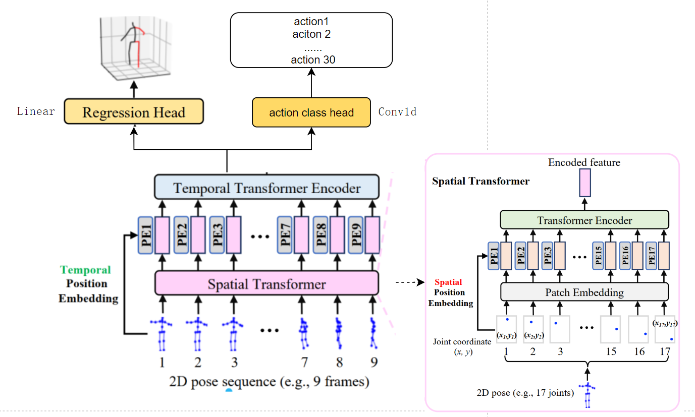

# dataset
human 3.6m

## data_2d_h36m_cpn_ft_h36m_dbb.npz
```
keypoints = np.load('data_2d_h36m_cpn_ft_h36m_dbb.npz')

keypoints_metadata = keypoints['metadata'].item()
{'num_joints': 17, 'keypoints_symmetry': [[4, 5, 6, 11, 12, 13], [1, 2, 3, 14, 15, 16]]}

keypoints['positions_2d'].item()
keys: ['S1', 'S5', 'S6', 'S7', 'S8', 'S9', 'S11']

30 actions
keypoints['positions_2d']['S1']
dict_keys(['Discussion', 'WalkTogether 1', 'Phoning 1', 'Directions 1', 'Sitting 2', 'Posing', 'Purchases 1', 'WalkDog 1', 'Directions', 'Smoking', 'Waiting 1', 'Phoning', 'Eating', 'Waiting', 'Photo 1', 'Walking 1', 'Smoking 1', 'Purchases', 'Discussion 1', 'Photo', 'SittingDown', 'Greeting 1', 'Walking', 'WalkTogether', 'Posing 1', 'WalkDog', 'Greeting', 'Eating 2', 'Sitting 1', 'SittingDown 2'])


 {'S1': {'Discussion': [array([[[514.2701 , 436.5464 ],
        [531.65204, 432.7718 ],
        [531.38007, 526.4631 ],
        ...,
        [548.2074 , 346.2106 ],
        [569.70795, 402.22003],
        [522.9931 , 400.72577]],

       [[514.2922 , 436.55664],
        [531.6912 , 432.781  ],
        [531.38947, 526.47406],
        ...,
        [548.2112 , 346.20065],
        [569.80005, 402.17664],
        [523.11365, 400.7329 ]],

       [[514.3226 , 436.55975],
        [531.7369 , 432.78354],
        [531.404  , 526.4785 ],
        ...,
        [548.273  , 346.19366],
        [569.9048 , 402.15262],
        [523.23956, 400.73834]],

       ...,

       [[546.6005 , 438.49078],
        [563.2012 , 431.26184],
        [556.1054 , 523.0286 ],
        ...,
        [589.0358 , 350.69824],
        [590.6743 , 406.2694 ],
        [548.3223 , 376.48346]],

       [[546.578  , 438.47037],
        [563.1034 , 431.27985],
        [556.04364, 523.05206],
        ...,
        [589.0186 , 350.73672],
        [590.7454 , 406.26572],
        [548.38513, 376.5313 ]],

       [[546.5654 , 438.45117],
        [563.03406, 431.28888],
        [555.9561 , 523.0603 ],
        ...,
        [588.97253, 350.79248],
        [590.81604, 406.27408],
        [548.4679 , 376.5554 ]]], dtype=float32), array([[[516.13135, 395.85703],
        [489.1853 , 394.6016 ],
        [495.24615, 481.05994],
        ...,


```


## data_3d_h36m.npz
```
subject:
['S1', 'S5', 'S6', 'S7', 'S8', 'S9', 'S11'])

acition: (30)
['Discussion', 'WalkTogether 1', 'Phoning 1', 'Directions 1', 'Sitting 2', 'Posing', 'Purchases 1', 'WalkDog 1', 'Directions', 'Smoking', 'Waiting 1', 'Phoning', 'Eating', 'Waiting', 'Photo 1', 'Walking 1', 'Smoking 1', 'Purchases', 'Discussion 1', 'Photo', 'SittingDown', 'Greeting 1', 'Walking', 'WalkTogether', 'Posing 1', 'WalkDog', 'Greeting', 'Eating 2', 'Sitting 1', 'SittingDown 2']

anim = {dict:2 }
	positions (3852,17,3)
	cameras = {list: 4}
```

## fetch()
```
fetch()
input
(subjects_train, action_filter, subset=args.subset)
return 
out_camera_params, out_poses_3d, out_poses_2d

poses_train_2d
[array([[[ 0.02854013, -0.12890723],
        [ 0.06330407, -0.1364564 ],
        [ 0.06276011,  0.05092618],
        ...,
        [ 0.0964148 , -0.3095788 ],
        [ 0.13941586, -0.19755992],
        [ 0.04598618, -0.20054844]],

poses_train
[array([[[ 8.00681114e-03, -3.64739895e-01,  5.28298473e+00],
        [ 8.19845200e-02, -2.48622894e-02,  1.01664066e-01],
        [ 8.11154842e-02,  4.16893482e-01,  1.33388996e-01],
        ...,
        [ 1.57140732e-01, -4.19042587e-01, -8.41474533e-03],
        [ 2.58288145e-01, -1.63083076e-01,  3.66988182e-02],
        [ 4.18603420e-02, -1.82578087e-01,  1.63766384e-01]],

cameras_train
[array([ 2.2900989e+00,  2.2875624e+00,  2.5083065e-02,  2.8902981e-02,
       -2.0709892e-01,  2.4777518e-01, -3.0751503e-03, -9.7569887e-04,
       -1.4244716e-03], dtype=float32), array([ 2.2993512e+00,  2.2951834e+00,  1.7697215e-02,  1.6129851e-02,
       -1.9421363e-01,  2.4040854e-01,  6.8199756e-03, -1.6190266e-03,
       -2.7408944e-03], dtype=float32), array([ 2.2982814e+00,  2.2975979e+00,  3.9631724e-02,  2.8053522e-03,
       -2.0833819e-01,  2.5548801e-01, -2.4604974e-03,  1.4843870e-03,
       -7.5999933e-04], dtype=float32), array([ 2.2910228e+00,  2.2895479e+00,  2.9936433e-02,  1.7640333e-03,
       -1.9838409e-01,  2.1832368e-01, -8.9478074e-03, -5.8720558e-04,
       -1.8133620e-03], dtype=float32), array([ 2.2900989e+00,  2.2875624e+00,  2.5083065e-02,  2.8902981e-02,
       -2.0709892e-01,  2.4777518e-01, -3.0751503e-03, -9.7569887e-04,
```
## action recoginze task
### how 2d to 3d caculate the loss


### and one head and task


```
H = F.avg_pool2d(H, H.size()[2:])
```

```
batch_2d
(1,1475,17,2)

batch_3d
(1,1449,17,3)
```


