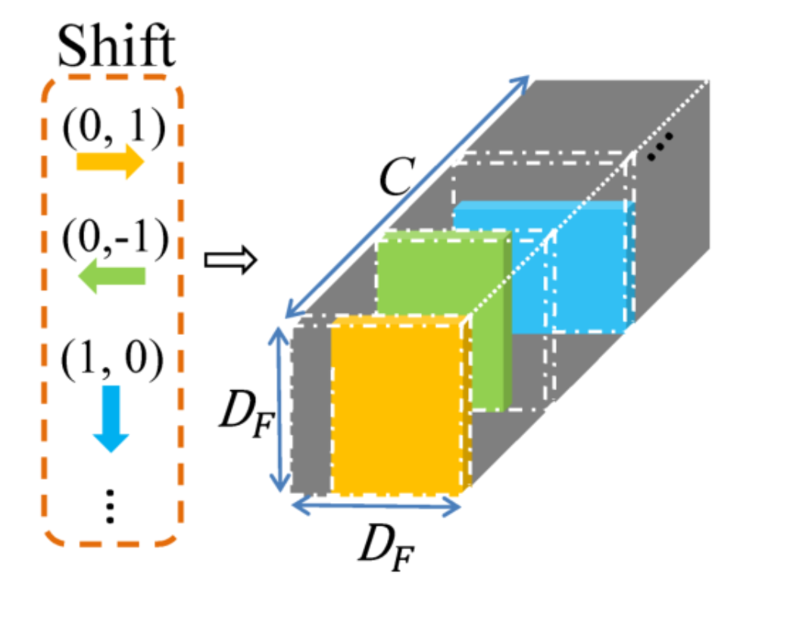
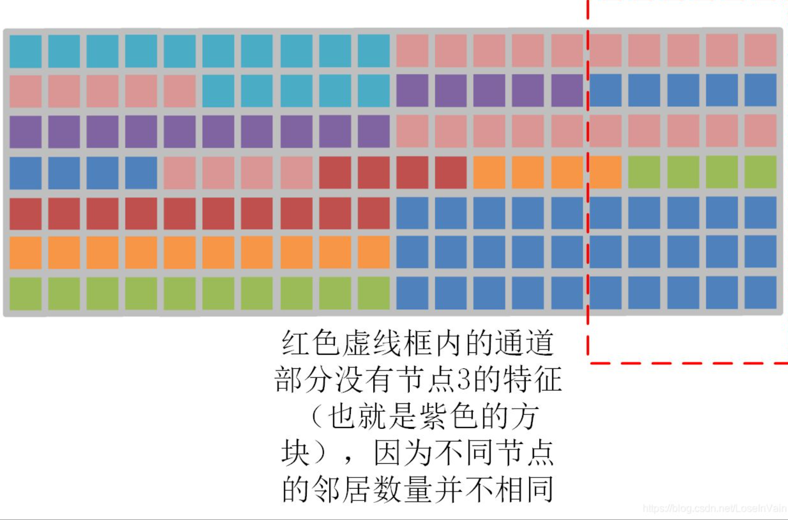
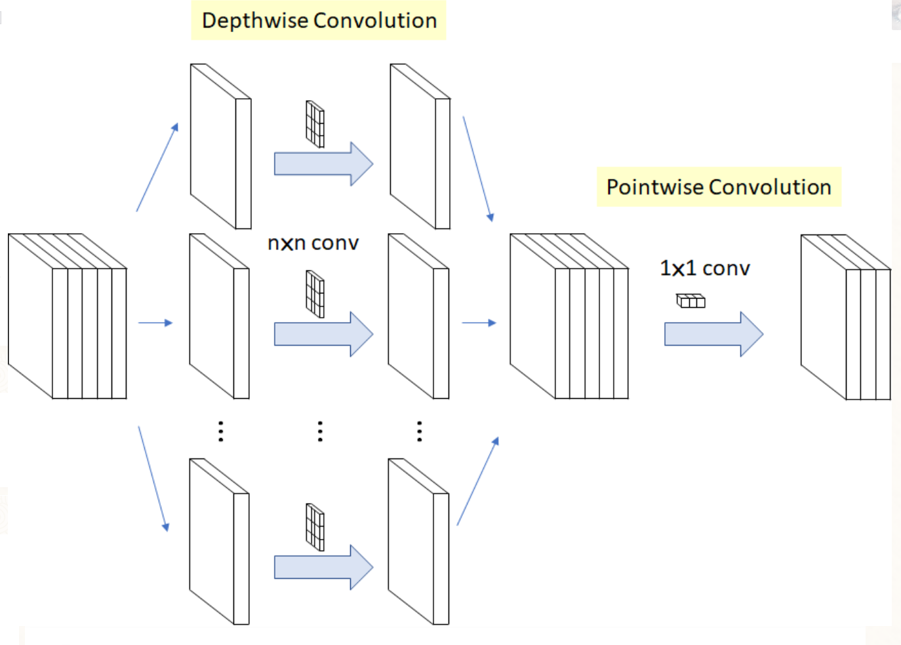
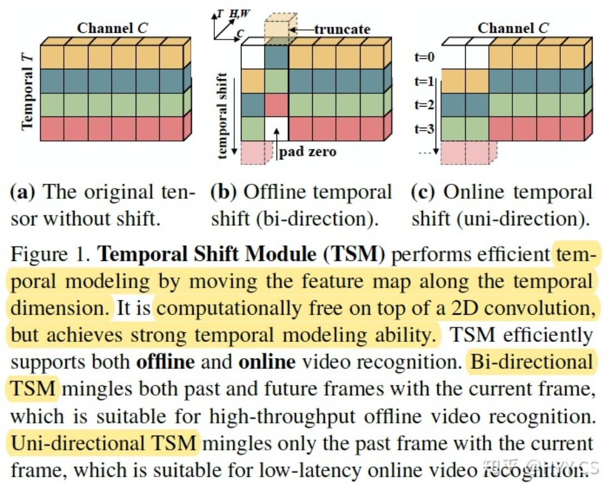
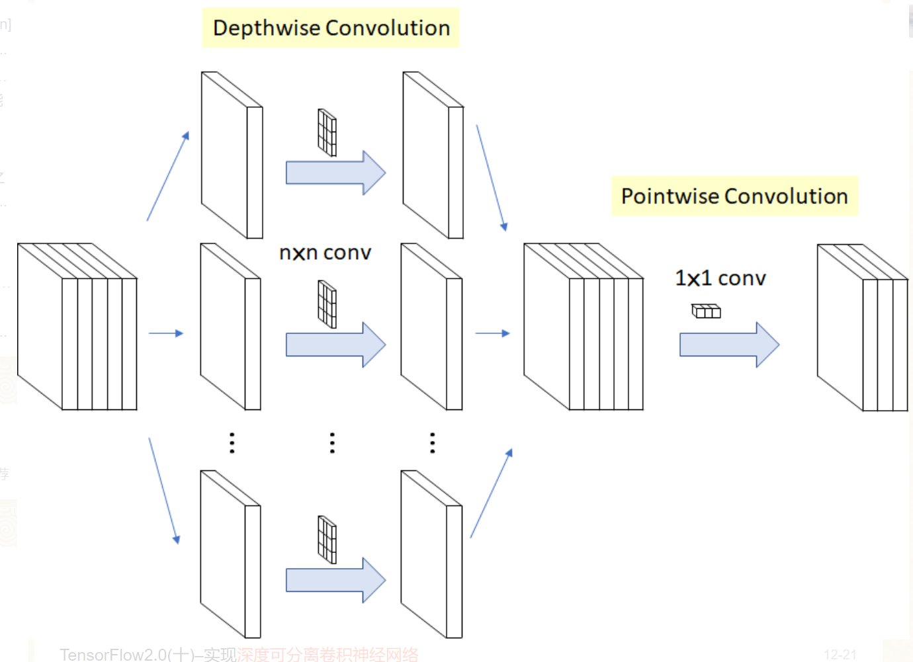

# gcn shift conv

## 引入

### CNN shfit conv

https://zhuanlan.zhihu.com/p/183183514

https://zhuanlan.zhihu.com/p/279617431

移位之后就是进行逐点卷积的操作，因为在每个方向上进行了移位操作，通道与通道之间的特征进行了交换，位移能起到 ==交换通道间的信息== 的作用，

而点卷积可以起到 ==降低计算量== 的作用。

## 空间域  gcn shfit conv
> 介绍图像上的移位卷积其实就是为了类比GCN，对于图像卷积，可以看做 ![[公式]](https://www.zhihu.com/equation?tex=3%5Ctimes+3) 的 ![[公式]](https://www.zhihu.com/equation?tex=9) 个点卷积的融合，而对于GCN，相当于 ![[公式]](https://www.zhihu.com/equation?tex=3) 个点卷积的融合，分别为：向心点、根节点和离心点。之前我们提到，这种卷积方式只能提取到局部特征，所以作者提出局部移位图卷积和非局部移位图卷积两种。
>

### 局部移位图卷积
这里的移位是根据人体的物理结构定义的，也就是说只会在相邻节点之间进行移位操作。跟CNN不同的是，不同节点的邻居是不同的。对于节点 ![[公式]](https://www.zhihu.com/equation?tex=v) ，假设有 ![[公式]](https://www.zhihu.com/equation?tex=n) 个相邻节点，我们将节点 ![[公式]](https://www.zhihu.com/equation?tex=v) 的通道 ==均匀分成 ![[公式]](https://www.zhihu.com/equation?tex=n%2B1) 个分区== ，第一个分区保留节点 ![[公式]](https://www.zhihu.com/equation?tex=v) 的特征，剩下 ![[公式]](https://www.zhihu.com/equation?tex=n) 个分区分别来自相邻 ![[公式]](https://www.zhihu.com/equation?tex=n) 个节点的移位。如果用公式来表示就是下面的公式（3）。

这里 ![[公式]](https://www.zhihu.com/equation?tex=F) 表示单个帧的特征， ![[公式]](https://www.zhihu.com/equation?tex=%5Ctilde%7BF%7D) 代表相应的移位后的特征， ![[公式]](https://www.zhihu.com/equation?tex=%7C%7C) 代表按通道连接。

为了直观的说明整个步骤，这里假设了一个只有 ![[公式]](https://www.zhihu.com/equation?tex=7) 个关节 ![[公式]](https://www.zhihu.com/equation?tex=20) 个通道的小图，如下图（a）。对于节点 ![[公式]](https://www.zhihu.com/equation?tex=1) ，它只有一个邻居节点，所以他的通道被分成了两个分区，第一个分区用来存放节点 ![[公式]](https://www.zhihu.com/equation?tex=1) 的特征，第二个分区是从节点 ![[公式]](https://www.zhihu.com/equation?tex=2) 移动过来的特征。移位之后节点 ![[公式]](https://www.zhihu.com/equation?tex=1) 的特征就是右边第一行，一半蓝色（节点 ![[公式]](https://www.zhihu.com/equation?tex=1) 自身特征），一半粉色（节点 ![[公式]](https://www.zhihu.com/equation?tex=2) 的特征）。对于节点 ![[公式]](https://www.zhihu.com/equation?tex=2) ，它有三个相邻节点，所以节点 ![[公式]](https://www.zhihu.com/equation?tex=2) 的通道被分成四个分区，==第一个分区保留节点 ![[公式]](https://www.zhihu.com/equation?tex=2) 的特征，其他三个分区分别从节点 ![[公式]](https://www.zhihu.com/equation?tex=1) 、节点 ![[公式]](https://www.zhihu.com/equation?tex=3) 、节点 ![[公式]](https://www.zhihu.com/equation?tex=4) 移位过来的==，最后移位后的特征图就是图（a）右边部分，其他节点的通道也是类似移位过来的。

局部移位的方式缺点很多，主要就是 ==不能整体的利用所有关节的信息== ，这在很多论文中已经提到过了。

### 非局部移位图卷积
这种方式就是抛弃人体本身的物理连接，假设所有节点都是有连接的。非局部移位方式如下图（b），通道数还是 ![[公式]](https://www.zhihu.com/equation?tex=20) ，区别于局部移位，==这里将每个通道都划分为一个分区，从自身节点开始，其他节点相继移位到该节点通道上，并以此循环，直至最后一个通道==。对于节点 ![[公式]](https://www.zhihu.com/equation?tex=1) ，自身节点和其他节点以此占用 ![[公式]](https://www.zhihu.com/equation?tex=7) 个通道，最后一个通道是第三次循环的第 ![[公式]](https://www.zhihu.com/equation?tex=6) 个节点（ ![[公式]](https://www.zhihu.com/equation?tex=20%3D3%5Ctimes+7-1) ）。节点 ![[公式]](https://www.zhihu.com/equation?tex=2) 类似，总的移位之后的特征图就有点像一个螺旋，这是循环移位导致的。

## 时间域移位卷积

### 简单的时间移位图卷积

文章直接介绍将信道划分为 ![[公式]](https://www.zhihu.com/equation?tex=2u%2B1) 个分区，也没说明 ![[公式]](https://www.zhihu.com/equation?tex=u) 是什么，我个人理解：一个帧相邻的有前后两帧，如果设置 ![[公式]](https://www.zhihu.com/equation?tex=u%3D1) ，那么就是只相邻的前后两帧进行移位，如果 ![[公式]](https://www.zhihu.com/equation?tex=u%3D2) 就是前后四帧。一般如ST-GCN使用TCN就是长度为 ![[公式]](https://www.zhihu.com/equation?tex=9) 的卷积核，相当于时间移位卷积 ![[公式]](https://www.zhihu.com/equation?tex=u%3D4) 的本身帧加前后各四帧。

### 自适应时间移位图卷积

因为上面的 ![[公式]](https://www.zhihu.com/equation?tex=u) 是手动设置的，缺乏灵活性，最近一些研究说明不同的层可能需要不同的感受野，还有就是不同的数据集需要不同的感受野。这两个方面我没怎么了解，要恶补几篇论文了。

自适应时间移位图卷积就是设置一个可学习的时移参数 ![[公式]](https://www.zhihu.com/equation?tex=S_%7Bi%7D%2Ci%3D1%2C2%2C...%2CC) ，这里的时移参数就是每次时移的距离。将时间移位的参数由整数放宽到实数，也就是分区不再按整数划分。最后的计算如公式（5）所示。

## 对比

## 补充

> 移位的作用是交换通道信息，真正减少计算量是因为用的是点卷积，移位+点卷积取代了固定卷积核的卷积。

什么是点卷积？

> 逐点卷积就是1x1的普通卷积。因为深度卷积没有融合通道间信息，所以需要配合逐点卷积使用。

### TSM
Temporal shift module for efficient video understanding.

https://zhuanlan.zhihu.com/p/84868486

- **Shift：**对tensor(T*C*H*W)，TSM沿着temporal维度移动部分channels，比如bi-direction TSM进行了时间维度shift +/-1，使得每个时间维度t上的tensor(C*H*W)获得了相邻帧的feature，在时间维度T上感受野达到了3.
- **Multiply-accumulate(卷积):** 通过对tensor(T*C*H*W)在时间维度T上进行shift操作后，每个时间t上的tensor(C*H*W)在channel C维度上涵盖了相邻帧的feature，对每个时间t上的tensor(C*H*W)用权重共享Conv-2D处理，类似于在时间t维度上进行了一个卷积核为3的Conv-2D.

### 关系

https://zhuanlan.zhihu.com/p/80041030

**深度可分离卷积**(Depthwise Separable Convolution) = **深度卷积**(Depthwise Convolution) + 逐点卷积(Pointwise Convolution)。

1. Depthwise Convolution不同于常规卷积操作，Depthwise Convolution的一个卷积核负责一个通道，一个通道只被一个卷积核卷积。

2. Pointwise Convolution的运算与常规卷积运算非常相似，它的卷积核的尺寸为 1×1×M，M为上一层的通道数。所以这里的卷积运算会将上一步的map在深度方向上进行加权组合，生成新的Feature map。

## 总结

> Shift-GCN是对ST-GCN的改进，其启发自Shift卷积算子[1]，主要想法是利用1x1卷积算子结合空间shift操作，使得1x1卷积同时可 ==融合空间域和通道域的信息==，采用shift卷积可以 ==大幅度地减少参数量和计算量==。对于单帧而言，类似于传统的Shift操作：可以分为Graph Shift和1x1 conv两个阶段。然而，和传统Shift操作不同的是，之前Shift应用在图片数据上，这种数据是典型的欧几里德结构数据[7]，数据节点的邻居节点可以很容易定义出来，因此卷积操作也很容易定义。而图数据的特点决定了其某个数据节点的邻居数量（也即是“度”）都可能不同，因此传统的卷积在图数据上并不管用，传统的shift卷积操作也同样并不能直接在骨骼点数据上应用。那么就需要重新在骨骼点数据上定义shift卷积操作。
>

## 参考文献
https://zhuanlan.zhihu.com/p/183183514

https://zhuanlan.zhihu.com/p/279617431