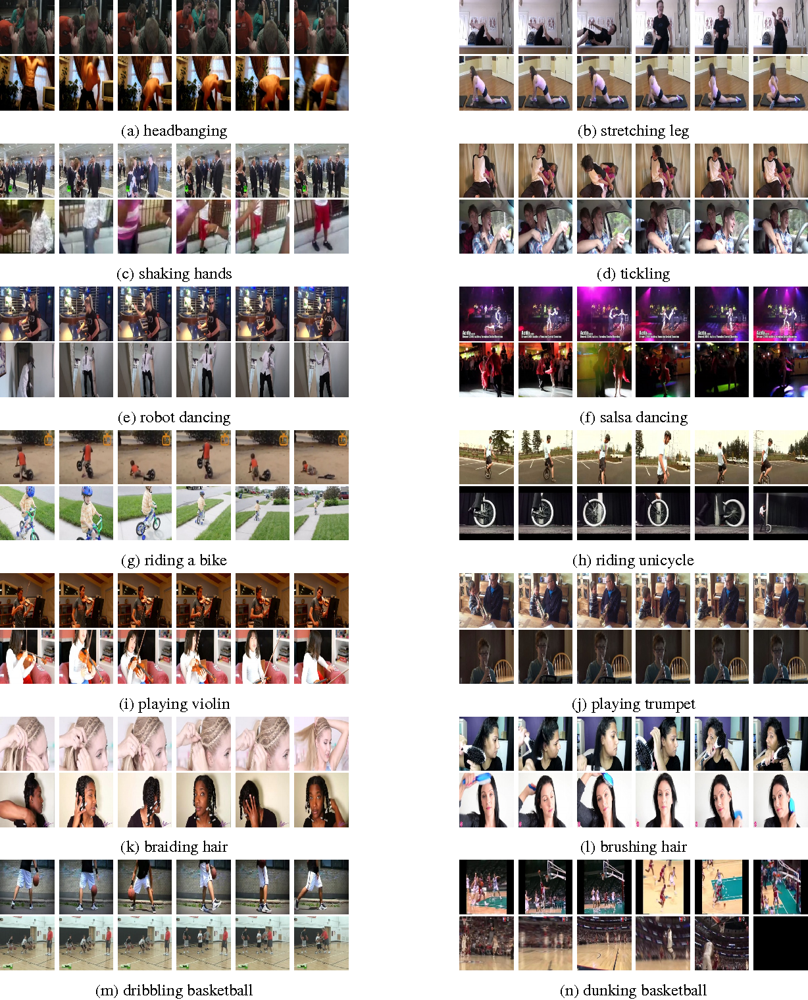
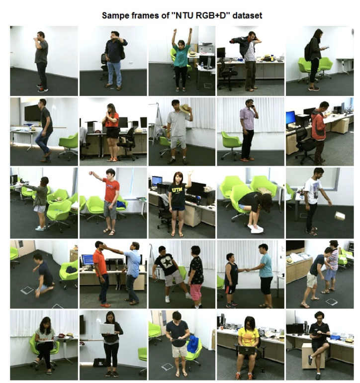
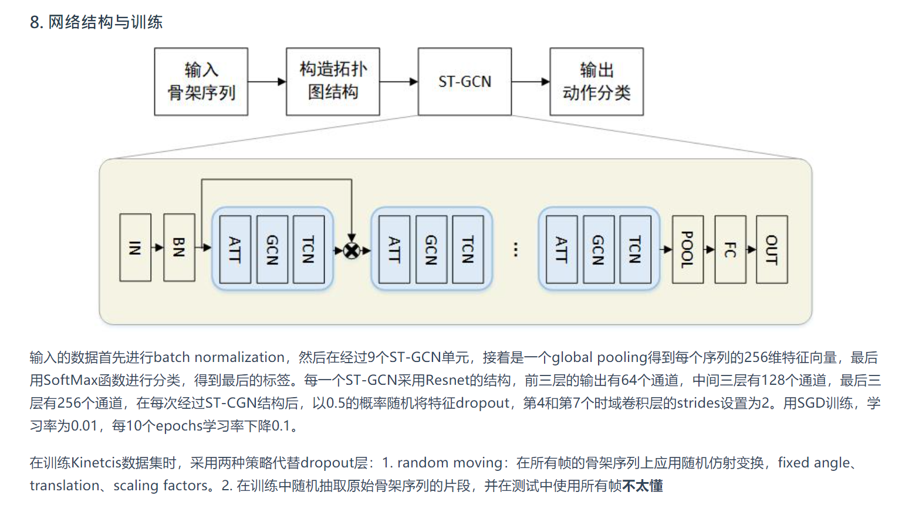
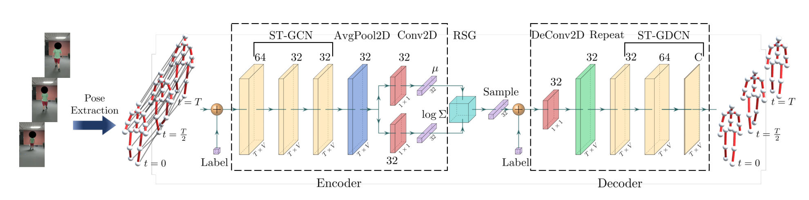

# st-gcn study note
main contribution
1. open_pose preporcess
2. gcn
3. tcn

simple attention block


## dataset
```
st-gcn-processed-data
├── Kinetics
│   └── kinetics-skeleton
│       ├── train_data.npy
│       ├── train_label.pkl
│       ├── val_data.npy
│       └── val_label.pkl
└── NTU-RGB-D
    ├── xsub
    │   ├── train_data.npy
    │   ├── train_label.pkl
    │   ├── val_data.npy
    │   └── val_label.pkl
    └── xview
        ├── train_data.npy
        ├── train_label.pkl
        ├── val_data.npy
        └── val_label.pkl

```
### 1. Kinetics
#### info

```
300,000 video clips
400 human
Each clip in Kinetics lasts around 10 seconds.

RGB to 18 joints (x,y,c) by OpenPose
2D coordinates (x,y) and c: confidence scores
```

datasets content
```
retrieved from YouTube. 
cover as many as 400 human action classes, 

ranging from daily activities, sports scenes, to complex actions with interactions.

cover a broad range of classes including human-object interactions such as playing instruments, 
as well as human-human interactions such as shaking hands. 
```



## ?

For the multi-person
cases, we select 2 people with the highest average joint confidence in each clip. So if there is only one person in the frame, the another pad 0 ?

#### shape
```
train_data.npy
(240436, 3, 300, 18, 2)

val_data.npy
(19796, 3, 300, 18, 2)

train_label.pkl
([...],   # _.json * 240436]
 [...])   # number * 240436]
 
 train_label.pkl
([...],   # _.json * 19796]
 [...])   # number * 19796]

val:train  8:100
```


#### analyize
```
train_data.npy
shape (240436, 3, 300, 18, 2)

240436 
clips

3 
(X,Y,C)

300 
frames

18 
joints

2 
For the multi-person cases, we select 2 people with the highest average joint confidence in each clip
```


#### Sample 
```
>>> print(td[1,0,1]) 
# x
[[ 0.061  0.   ]
 [ 0.     0.   ]
 [ 0.     0.   ]
 [ 0.     0.   ]
 [ 0.     0.   ]
 [ 0.     0.   ]
 [ 0.     0.   ]
 [ 0.     0.   ]
 [ 0.     0.   ]
 [ 0.     0.   ]
 [ 0.     0.   ]
 [ 0.     0.   ]
 [ 0.     0.   ]
 [ 0.     0.   ]
 [-0.013  0.   ]
 [ 0.208  0.   ]
 [ 0.     0.   ]
 [ 0.     0.   ]]

# y 
>>> print(td[1,1,1])
[[ 0.122  0.   ]
 [ 0.     0.   ]
 [ 0.     0.   ]
 [ 0.     0.   ]
 [ 0.     0.   ]
 [ 0.     0.   ]
 [ 0.     0.   ]
 [ 0.     0.   ]
 [ 0.     0.   ]
 [ 0.     0.   ]
 [ 0.     0.   ]
 [ 0.     0.   ]
 [ 0.     0.   ]
 [ 0.     0.   ]
 [-0.033  0.   ]
 [-0.011  0.   ]
 [ 0.     0.   ]
 [ 0.     0.   ]]

 # c
>>> print(td[1,2,1])
[[0.301 0.   ]
 [0.    0.   ]
 [0.    0.   ]
 [0.    0.   ]
 [0.    0.   ]
 [0.    0.   ]
 [0.    0.   ]
 [0.    0.   ]
 [0.    0.   ]
 [0.    0.   ]
 [0.    0.   ]
 [0.    0.   ]
 [0.    0.   ]
 [0.    0.   ]
 [0.397 0.   ]
 [0.44  0.   ]
 [0.    0.   ]
 [0.    0.   ]]
>>>

train_label_pkl[0][:10]:
 ['xl6vmD0XBS0.json', 'OkLnSMGCWSw.json', 'IBopZFDKfYk.json', 'HpoFylcrYT4.json', 'mlAtn_zi0bY.json', 'P924_DoqgaA.json', 'Qvqr7tHPSBY.json', 'wj6VN9D0B1Q.json', '8F4rDSxTJlQ.json', 'k2pUg1s6yvk.json']

train_label_pkl[1][:10]:
 [235, 388, 326, 306, 105, 369, 72, 306, 229, 44]


val_label[0][:10]:
 ['_3qg-oAr7b0.json', 'HxGk6WDkOzk.json', 'fa1WrHOTjxY.json', 'pF6EjkDzs5o.json', 'syJ-6ygTmVM.json', 'Hu4OX-8jzoc.json', 'EUIGpdmtzuA.json', 'HXhYD9z_DlE.json', 'PcaO-L9HPrU.json', 'yGkAoxnV-Fw.json']

val_label[1][:10]:
 [66, 6, 187, 323, 278, 183, 213, 92, 290, 377]

```

### 2. NTU-RGB-D
#### info
```
56,000 action clips
60 action classes
40 volunteers
3D joint locations (X; Y; Z) 
25 joints
each clip most 2 subject

detected by the Kinect depth sensors
three camera views recorded simultaneously
```

content
```
Our dataset contains 60 different action classes 
including daily, mutual, and health-related actions. 
```

```
http://rose1.ntu.edu.sg/datasets/actionrecognition.asp
```


**x-sub**
40320 train actors subset1
16560 evaluate actors subset2

**x-view**
37920 train camera view 2&3
18960 evaluate camera view 1

#### shape
```
#x-sub
train_data.npy
(40091, 3, 300, 25, 2)

"val_data.npy"
(16487, 3, 300, 25, 2)

train_label.pkl
data[0][:10]:
 ['S011C001P019R001A005.skeleton', 'S010C001P019R002A027.skeleton', 'S011C002P001R001A023.skeleton', 'S013C001P019R002A024.skeleton', 'S001C003P005R002A060.skeleton', 'S011C003P027R002A053.skeleton', 'S003C001P019R002A043.skeleton', 'S011C001P002R002A050.skeleton', 'S014C003P017R001A014.skeleton', 'S013C003P015R001A055.skeleton']
data[1][]:
 [4, 26, 22, 23, 59, 52, 42, 49, 13, 54]
tuple1:  40091
tuple2:  40091

val_label.pkl
data[0][:10]:
 ['S003C002P007R001A026.skeleton', 'S005C001P010R001A059.skeleton', 'S009C003P007R001A020.skeleton', 'S002C003P007R001A020.skeleton', 'S016C001P021R001A053.skeleton', 'S008C003P032R002A036.skeleton', 'S016C003P040R002A025.skeleton', 'S008C002P036R001A040.skeleton', 'S014C001P039R001A022.skeleton', 'S008C001P030R001A029.skeleton']
data[1][:10]:
 [25, 58, 19, 19, 52, 35, 24, 39, 21, 28]
tuple1:  16487
tuple2:  16487


#x-veiw
train_data.npy
(37646, 3, 300, 25, 2)

val_data.npy
(18932, 3, 300, 25, 2)

```


## training process


### Run successfully
final env
```
Python3.6.6 + Pytorch1.2.0 + cudatoolkit10.0.130 + cudnn7.6.0 + torchvision0.4.0
```

environment.yaml
```
name: stgcn
channels:
  - pytorch
  - defaults
dependencies:
  - _libgcc_mutex=0.1=main
  - blas=1.0=mkl
  - ca-certificates=2021.1.19=h06a4308_1
  - certifi=2020.12.5=py36h06a4308_0
  - cffi=1.14.5=py36h261ae71_0
  - cuda90=1.0=h6433d27_0
  - cudatoolkit=10.0.130=0
  - cudnn=7.6.5=cuda10.0_0
  - freetype=2.10.4=h5ab3b9f_0
  - intel-openmp=2019.4=243
  - jpeg=9b=h024ee3a_2
  - lcms2=2.11=h396b838_0
  - ld_impl_linux-64=2.33.1=h53a641e_7
  - libffi=3.3=he6710b0_2
  - libgcc-ng=9.1.0=hdf63c60_0
  - libgfortran-ng=7.3.0=hdf63c60_0
  - libpng=1.6.37=hbc83047_0
  - libstdcxx-ng=9.1.0=hdf63c60_0
  - libtiff=4.2.0=h3942068_0
  - libwebp-base=1.2.0=h27cfd23_0
  - lz4-c=1.9.3=h2531618_0
  - mkl=2018.0.3=1
  - ncurses=6.2=he6710b0_1
  - ninja=1.10.2=py36hff7bd54_0
  - olefile=0.46=py36_0
  - openssl=1.1.1j=h27cfd23_0
  - pillow=8.1.2=py36he98fc37_0
  - pip=21.0.1=py36h06a4308_0
  - pycparser=2.20=py_2
  - python=3.6.13=hdb3f193_0
  - pytorch=1.4.0=py3.6_cuda10.0.130_cudnn7.6.3_0
  - readline=8.1=h27cfd23_0
  - setuptools=52.0.0=py36h06a4308_0
  - six=1.15.0=py36h06a4308_0
  - sqlite=3.35.1=hdfb4753_0
  - tk=8.6.10=hbc83047_0
  - wheel=0.36.2=pyhd3eb1b0_0
  - xz=5.2.5=h7b6447c_0
  - zlib=1.2.11=h7b6447c_3
  - zstd=1.4.5=h9ceee32_0
  - pip:
    - argparse==1.4.0
    - cached-property==1.5.2
    - dataclasses==0.8
    - h5py==3.1.0
    - imageio==2.9.0
    - numpy==1.19.5
    - opencv-python==4.5.1.48
    - pyyaml==5.4.1
    - scikit-video==1.1.11
    - scipy==1.5.4
    - torch==1.8.0
    - torchvision==0.9.0
    - typing-extensions==3.7.4.3
prefix: /home/wsx/anaconda3/envs/stgcn
```

error
```
RuntimeError: CuDNN error: CUDNN_STATUS_SUCCESS
```
solution
```
conda install cudatoolkit==10.0.130
接着安装cudnn，直接使用conda install cudnn安装即可，它自己会选择和cuda版本对应的安装包
最后安装Pytorch，从官网https://pytorch.org/get-started/locally/可以获得安装命令，记住cuda要选10.0的版本。得到的命令如下：conda install pytorch torchvision cudatoolkit=10.0 -c pytorch
```
error
```
RuntimeError: CUDA out of memory. Tried to allocate 352.00 MiB (GPU 0; 7.80 GiB total capacity; 6.45
```
solution: smaller batch_size


bci  gpu

```
python main.py recognition -c config/st_gcn/kinetics-skeleton/train.yaml --work_dir work_dir --device 0 1 2
```
my gpu
```
python main.py recognition -c /home/wsx/st-gcn/config/st_gcn/kinetics-skeleton/train.yaml  --work_dir work_dir --device 0 --batch_size 10
```


### flow



# focus point when reading code
1. dataset format
2. training process


## zhou:
```
week3
两个数据格式不同的数据集，是如何区分处理的
数据集的实际运动类型

week4
找预测最后预测最后一帧的项目代码去借鉴
https://github.com/1suancaiyu/Locality-Awareness-SGE
```


## task
```
1. 先跑通任务3
2. 将网络修改为基于st-gcn的atuo-encoder
3. 最后实现任务1
```





