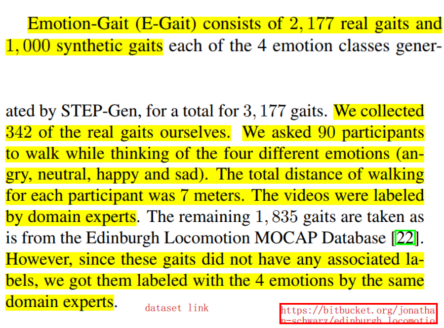

# offical readme
```
generator_cvae is the generator.
classifier_stgcn_real_only is the baseline classifier using only the real 342 gaits.
classifier_stgcn_real_and_synth is the baseline classifier using both real 342 and N synthetic gaits.
clasifier_hybrid is the hybrid classifier using both deep and physiologically-motivated features.
```

# data
## info
```
emotion gait
90 subjects 342 gaits
ELMD 1835
1000 synthetic

T : number of time steps (75 in our dataset); 
V : number of nodes (16 in our dataset);

75 frames
48 = 16 joints * 3 dim (x,y,z)
```

## paper said



## tree
```
data/
├── README.md
├── features.h5 (342, 75, 48)
├── labels.h5   (342,)

├── features_ELMD.h5 (1835, 240, 48)
├── labels_ELMD.h5  (1835,)

├── affectiveFeatures.h5
├── affectiveFeatures_ELMD.h5

├── features.h5
├── featuresCVAEGCN_2001_4000.h5

├── features4DCVAEGCN.h5 (60, 18, 48)
├── labels4DCVAEGCN.h5

└── labels_edin_locomotion
    ├── ELMD-1.csv
    ├── ELMD-10.csv
    ├── ELMD-2.csv
    ├── ELMD-3.csv
    ├── ELMD-4.csv
    ├── ELMD-5.csv
    ├── ELMD-6.csv
    ├── ELMD-7.csv
    ├── ELMD-8.csv
    └── ELMD-9.csv
```

## size
```
(step) wsx@nvidiat4-vm:~/step/data$ du -h *.h5
220K    affectiveFeatures.h5
1.2M    affectiveFeatures_ELMD.h5
4.8M    features.h5
432K    features4DCVAEGCN.h5
56M     featuresCVAEGCN_1_2000.h5
56M     featuresCVAEGCN_2001_4000.h5
162M    features_ELMD.h5
136K    labels.h5
28K     labels4DCVAEGCN.h5
684K    labels_ELMD.h5
```

## 342
features.h5
labels.h5
```
wsx base_path /home/wsx/step/classifier_stgcn_real_only
wsx data_patch /home/wsx/step/classifier_stgcn_real_only/../data
wsx model_path /home/wsx/step/classifier_stgcn_real_only/model_classifier_stgcn/features
wsx file_feature /home/wsx/step/classifier_stgcn_real_only/../data/features.h5
wsx data.shape (342, 75, 48)
wsx labels.shape (342,)
wsx data_train.shape (307, 75, 48)
wsx labels_train.shape (307,)
wsx data_test.shape (35, 75, 48)
wsx data_test.shape (35, 75, 48)
wsx data 
 [[[ 0.00000000e+00 -1.73472348e-18  6.93889390e-18  1.77119300e-02
    1.86576900e-01 -4.04795900e-02  3.65145100e-02  3.84642600e-01
   -8.34518000e-02  4.54266000e-02  4.76033900e-01 -1.92289400e-01
   -7.49920200e-02  3.43289800e-01 -1.03495400e-01 -1.89019200e-01
    1.63821700e-01 -1.70964100e-01 -1.21590600e-01 -1.67391600e-02
   -1.35800400e-01  1.27436000e-01  3.06377100e-01 -9.47085100e-02
    1.44954600e-01  1.26104400e-01  3.61844900e-02  1.44954600e-01
   -6.17211100e-02 -2.25629000e-02 -1.10836700e-01 -3.89765000e-03
   -9.68278900e-03 -9.59079100e-02 -3.61550100e-01 -1.17224400e-02
   -6.12857000e-02 -4.83319100e-01  3.13026600e-01  1.10016800e-01
   -3.90230000e-03  1.69472900e-02  9.66129900e-02 -3.42248600e-01
   -9.67633300e-02  7.81257100e-02 -6.67029000e-01  2.10213300e-02]
  ...
   -5.58183905e-01  1.88147518e-01]]] 

wsx labels 
 [1. 3. 1. 3. 1. 3. 3. 3. 1. 0. 3. 2. 1. 3. 3. 2. 0. 0. 3. 0. 1. 3. 3. 2.
 0. 3. 3. 3. 1. 1. 3. 2. 3. 0. 3. 2. 3. 2. 2. 2. 3. 3. 3. 2. 0. 0. 3. 2.
 1. 1. 3. 2. 1. 0. 3. 3. 3. 3. 3. 3. 3. 3. 3. 3. 1. 0. 3. 2. 3. 0. 0. 2.
 3. 0. 3. 3. 1. 0. 3. 3. 1. 3. 3. 2. 3. 3. 3. 3. 0. 0. 2. 3. 2. 2. 0. 2.
 3. 1. 3. 2. 3. 2. 2. 3. 0. 3. 2. 3. 0. 0. 3. 3. 0. 1. 1. 0. 3. 0. 2. 2.
 0. 3. 1. 0. 0. 0. 0. 0. 3. 3. 0. 2. 0. 0. 0. 0. 0. 3. 2. 2. 0. 2. 2. 0.
 0. 0. 0. 0. 0. 0. 0. 1. 3. 0. 2. 2. 2. 0. 1. 2. 2. 0. 0. 0. 0. 3. 1. 2.
 0. 3. 3. 2. 0. 0. 0. 0. 0. 0. 3. 3. 3. 3. 3. 0. 3. 0. 0. 0. 3. 3. 0. 2.
 0. 0. 2. 0. 1. 1. 0. 2. 0. 2. 3. 0. 3. 0. 0. 0. 1. 2. 2. 0. 2. 2. 1. 0.
 0. 0. 2. 1. 3. 0. 0. 0. 0. 3. 3. 0. 3. 3. 3. 2. 3. 2. 0. 0. 3. 3. 1. 1.
 1. 2. 1. 3. 2. 2. 0. 0. 0. 2. 3. 3. 3. 2. 0. 3. 1. 2. 1. 3. 2. 2. 3. 0.
 3. 2. 3. 2. 2. 2. 3. 3. 2. 3. 3. 0. 3. 3. 0. 0. 0. 2. 3. 0. 3. 3. 0. 2.
 3. 2. 2. 3. 3. 2. 0. 0. 3. 2. 1. 0. 3. 2. 0. 0. 3. 3. 0. 0. 3. 2. 0. 0.
 3. 3. 0. 3. 3. 2. 3. 0. 0. 2. 0. 0. 3. 3. 0. 0. 3. 2. 0. 0. 0. 2. 3. 3.
 2. 2. 2. 2. 2. 2.] 

Train set size: 307
Test set size: 35
Number of classes: 4
0.	Angry
1.	Sad
2.	Sad
3.	Sad
4.	Sad
5.	Sad
6.	Sad
7.	Sad
8.	Happy
9.	Sad
10.	Sad
...
339.	Happy
340.	Happy
341.	Happy
Done
```


## 1835
features_ELMD.h5
features_ELMD.h5
```
wsx base_path /home/wsx/step/classifier_stgcn_real_only
wsx data_patch /home/wsx/step/classifier_stgcn_real_only/../data
wsx model_path /home/wsx/step/classifier_stgcn_real_only/model_classifier_stgcn/features_ELMD
wsx file_feature /home/wsx/step/classifier_stgcn_real_only/../data/features_ELMD.h5
wsx data.shape (1835, 240, 48)
wsx labels.shape (1835,)
wsx data_train.shape (1651, 240, 48)
wsx labels_train.shape (1651,)
wsx data_test.shape (184, 240, 48)
wsx data_test.shape (184, 240, 48)
wsx data 
 [[[ 1.73472348e-18  6.93889390e-18  3.46944695e-18 ...  8.74310686e-02
   -6.69173159e-01 -6.64537982e-02]
  [ 1.73472348e-18  6.93889390e-18  3.46944695e-18 ...  8.74531501e-02
   -6.68833379e-01 -6.66215411e-02]
  [ 1.73472348e-18  6.93889390e-18  3.46944695e-18 ...  8.74058515e-02
   -6.68477709e-01 -6.68357413e-02]
  ...
  [-1.62413889e-02  4.68916618e-02 -6.42696092e-02 ...  1.03241011e-01
   -6.45644179e-01  1.88531353e-01]
  [-1.62413889e-02  4.68916618e-02 -6.42696092e-02 ...  1.07474308e-01
   -6.46091292e-01  1.88115924e-01]
  [-1.62413889e-02  4.68916618e-02 -6.42696092e-02 ...  1.12494451e-01
   -6.47151418e-01  1.82120303e-01]]] 

wsx labels 
 [0. 0. 0. ... 1. 1. 1.] 

Train set size: 1651
Test set size: 184
Number of classes: 4
0.	Angry
1.	Angry
2.	Angry
3.	Angry
4.	Angry
5.	Angry
6.	Angry
7.	Angry
8.	Angry
9.	Angry
10.	Angry
...
1830.	Neutral
1831.	Neutral
1832.	Neutral
1833.	Neutral
1834.	Neutral
Done
```

## 60
features4DCVAEGCN.h5
labels4DCVAEGCN.h5

```
wsx base_path /home/wsx/step/classifier_stgcn_real_only
wsx data_patch /home/wsx/step/classifier_stgcn_real_only/
wsx model_path /home/wsx/step/classifier_stgcn_real_only/model_classifier_stgcn/features4DCVAEGCN
wsx file_feature /home/wsx/step/classifier_stgcn_real_only/features4DCVAEGCN.h5
wsx data.shape (60, 18, 48)
wsx labels.shape (60,)
wsx data_train.shape (54, 18, 48)
wsx labels_train.shape (54,)
wsx data_test.shape (6, 18, 48)
wsx data_test.shape (6, 18, 48)
wsx data 
 [[[-1.90819582e-16 -1.11022302e-16 -9.84455573e-17 ... -6.44779576e-03
   -1.94813358e-01  8.02498038e-03]
  [-1.90819582e-16 -1.11022302e-16 -9.84455573e-17 ... -7.55130403e-03
   -1.97325072e-01  1.02082196e-02]
  [-1.90819582e-16 -1.11022302e-16 -9.84455573e-17 ... -8.48663449e-03
   -1.98069516e-01  1.21511476e-02]
  ...
  [-6.43262261e-06 -1.50031087e-04  7.67897442e-06 ... -7.18962653e-03
   -2.07855712e-01  1.39556070e-02]
  [-6.43262261e-06 -1.50031087e-04  7.67897442e-06 ... -6.18985199e-03
   -2.10886488e-01  1.25373322e-02]
  [-6.43262261e-06 -1.50031087e-04  7.67897442e-06 ... -5.11499750e-03
   -2.11661662e-01  1.03707973e-02]]] 

wsx labels 
 [1. 0. 4. 3. 2. 5. 1. 0. 4. 3. 2. 5. 1. 0. 4. 3. 2. 5. 1. 0. 4. 3. 2. 5.
 1. 0. 4. 3. 2. 5. 1. 0. 4. 3. 2. 5. 1. 0. 4. 3. 2. 5. 1. 0. 4. 3. 2. 5.
 1. 0. 4. 3. 2. 5. 1. 0. 4. 3. 2. 5.] 

Train set size: 54
Test set size: 6
Number of classes: 6
0.	Sad
1.	Sad
2.	Happy
3.	Sad
4.	Neutral
5.	Sad
6.	Neutral
7.	Sad
8.	Happy
9.	Sad
10.	Neutral
...
50.	Sad
51.	Neutral
52.	Happy
53.	Sad
54.	Happy
55.	Happy
56.	Sad
57.	Neutral
58.	Neutral
59.	Sad
Done
```
# set env
```
ImportError: cannot import name 'torchlight' from 'torchlight'
python setup.py install
```
```
No module named 'yaml'
pip install pyyaml
```

```
ImportError: cannot import name 'torchlight' from 'torchlight'

cp /STEP/torchlight/*.py ../   # cp  gpu.py  io.py __init__.py under torchlight dir
cp -r /STEP/torchlight  [to the  relveatnt dir]
```
# run 

## classifier_stgcn_real_only
### file dir error
```
(step) wsx@nvidiat4-vm:~/step/classifier_stgcn_real_only$ python main.py 
OSError: Unable to open file (unable to open file: name = '/home/wsx/step/classifier_stgcn_real_only/../../data/features4DCVAEGCN.h5', errno =           2, error message = 'No such file or directory', flags = 0, o_flags = 0)

```

main.py
```
test_size = 0.1
data, labels,\
    data_train, labels_train,\
    data_test, labels_test = loader.load_data(data_path, ftype, coords, joints,
                                              cycles=cycles, test_size=test_size)
```

loader.py
```
def load_data(_path, _ftype, coords, joints, cycles=3, test_size=0.1):

    file_feature = os.path.join(_path, 'features' + _ftype + '.h5')
    ff = h5py.File(file_feature, 'r')
    file_label = os.path.join(_path, 'labels' + _ftype + '.h5')
    fl = h5py.File(file_label, 'r')
```

### solution
```
change the value of "ftype" to '' using files below
features.h5
labels.h5

or
change datapath
```

## generator_cvae

### get_transformation error
```
(step) wsx@nvidiat4-vm:~/step/generator_cvae$ python main_stgcn.py --train T
log file_feature /home/wsx/step/generator_cvae/../data/features.h5
log file_lable /home/wsx/step/generator_cvae/../data/labels.h5
Traceback (most recent call last):
  File "/home/wsx/step/generator_cvae/main_stgcn.py", line 72, in <module>
    loader.load_data(data_path, ftype, coords, joints, cycles=cycles)
  File "/home/wsx/step/generator_cvae/utils/loader_stgcn.py", line 41, in load_data
    data = common.get_affective_features(np.reshape(data, (data.shape[0], data.shape[1], joints, coords)))[:, :, :48]
  File "/home/wsx/step/generator_cvae/utils/common.py", line 106, in get_affective_features
    R, c, t = get_transformation(X, Y)
  File "/home/wsx/step/generator_cvae/utils/common.py", line 266, in get_transformation
    S[m, m] = -1
IndexError: index 3 is out of bounds for axis 0 with size 3
```
```
(step) wsx@nvidiat4-vm:~/step/generator_cvae$ python main_stgcn.py --train T
log file_feature /home/wsx/step/generator_cvae/../data/features_ELMD.h5
log file_lable /home/wsx/step/generator_cvae/../data/labels_ELMD.h5
Traceback (most recent call last):
  File "/home/wsx/step/generator_cvae/main_stgcn.py", line 72, in <module>
    loader.load_data(data_path, ftype, coords, joints, cycles=cycles)
  File "/home/wsx/step/generator_cvae/utils/loader_stgcn.py", line 41, in load_data
    data = common.get_affective_features(np.reshape(data, (data.shape[0], data.shape[1], joints, coords)))[:, :, :48]
  File "/home/wsx/step/generator_cvae/utils/common.py", line 106, in get_affective_features
    R, c, t = get_transformation(X, Y)
  File "/home/wsx/step/generator_cvae/utils/common.py", line 266, in get_transformation
    S[m, m] = -1
IndexError: index 3 is out of bounds for axis 0 with size 3

```

```
log file_feature /home/wsx/step/generator_cvae/../data/features.h5
log file_lable /home/wsx/step/generator_cvae/../data/labels.h5
log st_gcn load_data data.shape (342, 75, 48)
log: enter get_affective_features(gaits)
log: gaits.shape (342, 75, 16, 3)
log: Y shape (3, 16)
log: X shape (3, 16)
log: X shape (3, 16)
log: X shape (3, 16)
log: X shape (3, 16)
```

### solution
```
wrong step/generator_cvae/utils/common.py get_transformation
copy the right code frome step/classifier_stgcn_real_only/utils/common.py 
```

### features data reshape error
```
  File "/home/wsx/step/generator_cvae/main_stgcn.py", line 81, in <module>
    dataset=loader.TrainTestLoader(data_train, labels_train, joints, coords, num_classes),
  File "/home/wsx/step/generator_cvae/utils/loader_stgcn.py", line 73, in __init__
    self.data = np.reshape(data, (data.shape[0], data.shape[1], joints, coords, 1))
  File "<__array_function__ internals>", line 5, in reshape
  File "/home/wsx/anaconda3/envs/step/lib/python3.9/site-packages/numpy/core/fromnumeric.py", line 299, in reshap
    return _wrapfunc(a, 'reshape', newshape, order=order)
  File "/home/wsx/anaconda3/envs/step/lib/python3.9/site-packages/numpy/core/fromnumeric.py", line 67, in _wrapfu
    return _wrapit(obj, method, *args, **kwds)
  File "/home/wsx/anaconda3/envs/step/lib/python3.9/site-packages/numpy/core/fromnumeric.py", line 44, in _wrapit
    result = getattr(asarray(obj), method)(*args, **kwds)
TypeError: only integer scalar arrays can be converted to a scalar index
```

### solution
```
change 
    def __init__(self, data, joints, coords, label, num_classes):
to
    def __init__(self, data, label, joints, coords, num_classes):
```

### result
```
(step) wsx@nvidiat4-vm:~/step/generator_cvae$ python main_stgcn.py --train T
log file_feature /home/wsx/step/generator_cvae/../data/features.h5
log file_lable /home/wsx/step/generator_cvae/../data/labels.h5
log st_gcn load_data data.shape (342, 75, 48)
log: enter get_affective_features(gaits)
log: gaits.shape (342, 75, 16, 3)
log: Y shape (3, 16)
log: X shape (3, 16)
log: Y content:  [[ 0.          0.01771193  0.03651451  0.0454266  -0.07499202 -0.1890192
  -0.1215906   0.127436    0.1449546   0.1449546  -0.1108367  -0.09590791
  -0.0612857   0.1100168   0.09661299  0.07812571]
 [ 0.          0.1865769   0.3846426   0.4760339   0.3432898   0.1638217
  -0.01673916  0.3063771   0.1261044  -0.06172111 -0.00389765 -0.3615501
  -0.4833191  -0.0039023  -0.3422486  -0.667029  ]
 [ 0.         -0.04047959 -0.0834518  -0.1922894  -0.1034954  -0.1709641
  -0.1358004  -0.09470851  0.03618449 -0.0225629  -0.00968279 -0.01172244
   0.3130266   0.01694729 -0.09676333  0.02102133]]
log: X content:  [[ 0.          0.01771193  0.03651451  0.0454266  -0.07499202 -0.1890192
  -0.1215906   0.127436    0.1449546   0.1449546  -0.1108367  -0.09590791
  -0.0612857   0.1100168   0.09661299  0.07812571]
 [ 0.          0.1865769   0.3846426   0.4760339   0.3432898   0.1638217
  -0.01673916  0.3063771   0.1261044  -0.06172111 -0.00389765 -0.3615501
  -0.4833191  -0.0039023  -0.3422486  -0.667029  ]
 [ 0.         -0.04047959 -0.0834518  -0.1922894  -0.1034954  -0.1709641
  -0.1358004  -0.09470851  0.03618449 -0.0225629  -0.00968279 -0.01172244
   0.3130266   0.01694729 -0.09676333  0.02102133]]

log: get_affective_features data shape (342, 75, 48)
[04.18.21|21:23:24] Eval epoch: 0
[04.18.21|21:23:43]     mean_loss: 2500.9530. Best so far: 2500.9530 (epoch: 0).
[04.18.21|21:23:43] Done.
Generating data: 10 of 10 (100.00%).
[04.18.21|21:23:44] Training epoch: 1
[04.18.21|21:37:32]     mean_loss: 396.9214. Best so far: 2500.9530 (epoch: 0).
[04.18.21|21:37:32] Time consumption:
[04.18.21|21:37:33] Done.
[04.18.21|21:37:34] Eval epoch: 1
[04.18.21|21:37:53]     mean_loss: 457.9971. Best so far: 457.9971 (epoch: 1).
[04.18.21|21:37:53] Done.
Generating data: 10 of 10 (100.00%).
[04.18.21|21:37:53] Training epoch: 2
...
```


# analysis

```
原始数据 (342, 75, 48)
在get_affective_features之前 reshape成(342, 75, 16, 3)
get_affective_features之后 (342, 75, 175) num_features = 175

之后
data = common.get_affective_features(np.reshape(data, (data.shape[0], data.shape[1], joints, coords)))[:, :, :48]

又变成了(342, 75, 48)
```
# my puzzles
Is the feature file contain the origin  coordinate  data?
What's the meaning of each .h5 file?

```
features.h5
labels.h5
data.shape (342, 75, 48)

what's the 75 and 48 meaning?
```


```
from utils import loader_stgcn as loader, processor_stgcn as processor

pr = processor.Processor(args, ftype, data_loader, coords, tsteps, joints, num_classes, graph_dict, device=device)
pr.train()

./processor_stgcn.py:134:        self.model.train()
```


