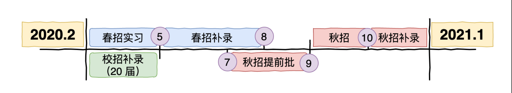
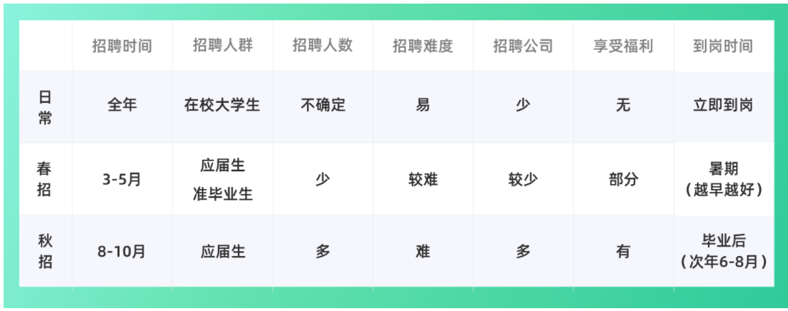

春招（暑期实习）一般是春节后开始招聘，招聘时间较晚，

==最佳时间为3月（一般是提前批），其次是4月（开始集中爆发、正常批），进入5月基本就结束了。一般要求暑期到岗，越早越好。== 

春招招收人数较少，主要的对象是少部门应届生（对秋招的补录）和准应届生（大三、研二学生）。面试难度每个公司都不一样，相对于日常实习难度比较大，但次之秋招。一般面试轮数是三到四轮，留用机会较大（但并不是一定都能留下来，要看部门有没有hc和以及你实习期间的表现情况，经过考核后达到标准才能录用转正），实习期间能享受部分公司福利。

秋招（校招应届正式员工）一般是在8月份开始会持续到10月底，时间相对较长，招聘时间较早，尤其是互联网行业，一些企业也会提前在7月份提前开始秋招提前批。一般是毕业后到岗，每个公司有不同的到岗时间要求，不过一般会在6-8月份，各别公司会有要求要过去实习。秋招招聘人数也会相对于春招多很多，主要对象就是应届生了，面试难度是最大的，面试轮数每个公司都不一样，正常情况下面试轮数是三到四轮，也会根据你的能力有减轮数或者加轮数的情况。待遇就是正式员工的待遇，一般该有的都有。

