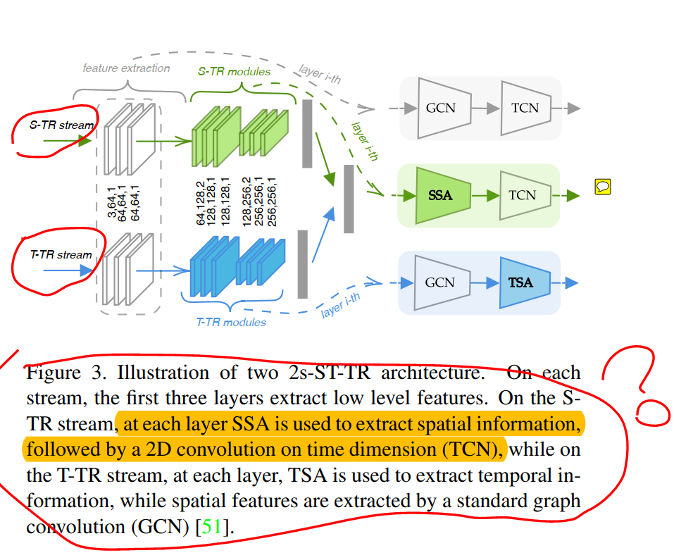
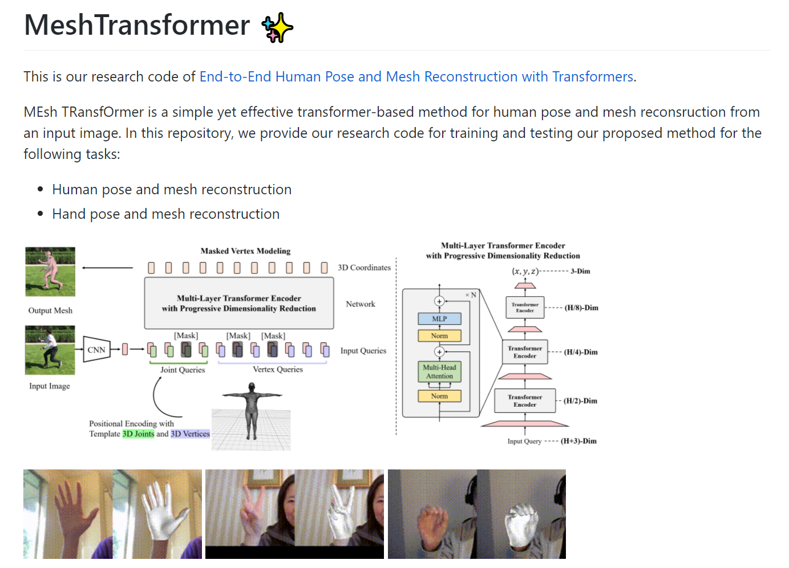
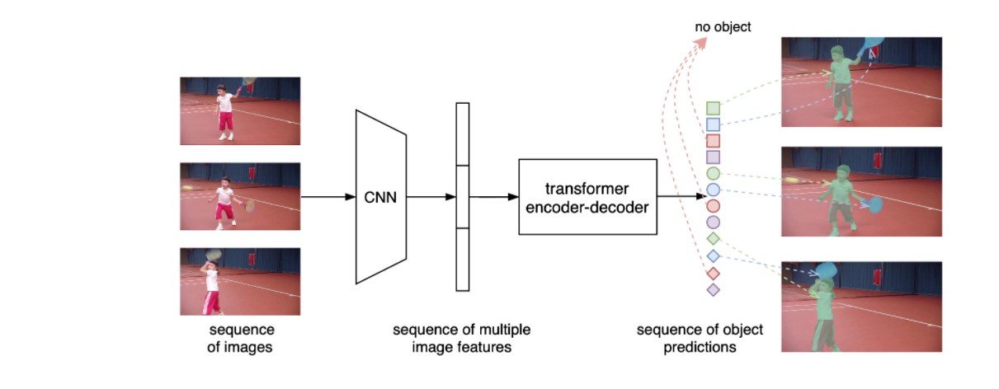
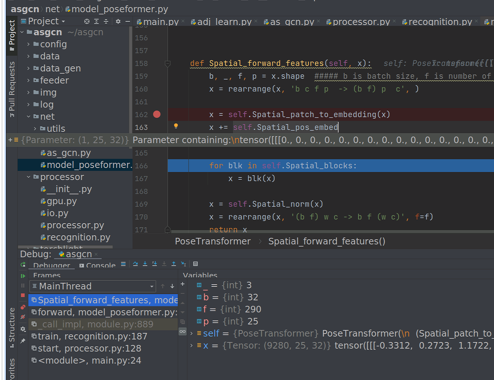

# Skeleton Based Action Recognition

参考网址

https://paperswithcode.com/sota/skeleton-based-action-recognition-on-ntu-rgbd


## CNN 

用CNN的方法做基于skeleton的动作识别，常出现的一个思路是


==skeleton转化成特殊的image==


例如：

- (cpvr 2017) A New Representation of Skeleton Sequences for 3D Action Recognition


- SkeleMotion: A New Representation of Skeleton Joint Sequences Based on
  Motion Information for 3D Action Recognition  


## 最优模型PoseC3D

目前的最优的Skeleton Based Action Recognition on NTU RGB+D 就是用的这种CNN的方法。


## GCN

其次大部分用的基于stgcn那种GCN的方法。

## Transformer
transformer在之前的研究中比较少见，可能是那时候还不火？目前近期的准确率还不错的，就这一篇老师之前发给我的




## CNN & Transformer

### paper1 CVPR 2021

https://github.com/microsoft/MeshTransformer

[End-to-End Human Pose and Mesh Reconstruction with Transformers](https://arxiv.org/abs/2012.09760)




###  paper2 CVPR 2021

https://github.com/Epiphqny/VisTR
VisTR: End-to-End Video Instance Segmentation with Transformers




## CNN GCN Transformer diff


### Poseformer



```
>>> import numpy as np
>>> np1 = np.random.rand(3,2,2)
>>> np1
array([[[0.73163525, 0.4348926 ],
        [0.76485837, 0.02958507]],

       [[0.06754732, 0.83966785],
        [0.39061076, 0.63925219]],

       [[0.61948841, 0.38727051],
        [0.92400231, 0.81739076]]])
>>> np2 = np.random.rand(1,2,2)
>>> np2
array([[[0.31678909, 0.49565866],
        [0.4318909 , 0.75027962]]])
>>> np3 = np1 + np2
>>> np3
array([[[1.04842435, 0.93055126],
        [1.19674926, 0.77986469]],

       [[0.38433642, 1.33532651],
        [0.82250166, 1.38953181]],

       [[0.93627751, 0.88292916],
        [1.35589321, 1.56767038]]])
>>>
```


局部特征和全局特征结合

如何提取局部特征，局部空间特征（GCN），局部时间特征

时间特征，两个分支如何实现？