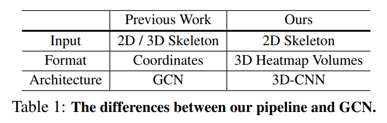

# Skeleton Based Action Recognition

参考网址

https://paperswithcode.com/sota/skeleton-based-action-recognition-on-ntu-rgbd

## CNN 

用CNN的方法做基于skeleton的动作识别，常出现的一个思路是

==skeleton转化成特殊的image==

例如：

- (cpvr 2017) A New Representation of Skeleton Sequences for 3D Action Recognition

- SkeleMotion: A New Representation of Skeleton Joint Sequences Based on
  Motion Information for 3D Action Recognition  

## 最优模型PoseC3D

目前的最优的Skeleton Based Action Recognition on NTU RGB+D 就是用的这种CNN的方法。

## GCN

其次大部分用的基于stgcn那种GCN的方法。

## Transformer
transformer在之前的研究中比较少见，可能是那时候还不火？目前近期的准确率还不错的，就这一篇老师之前发给我的

