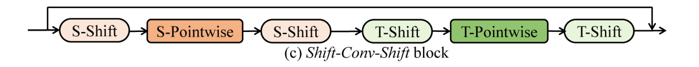
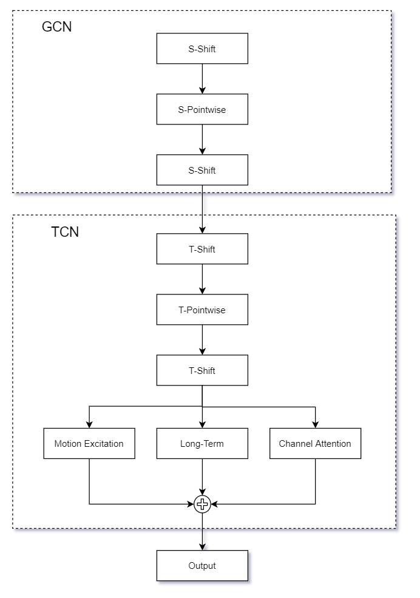
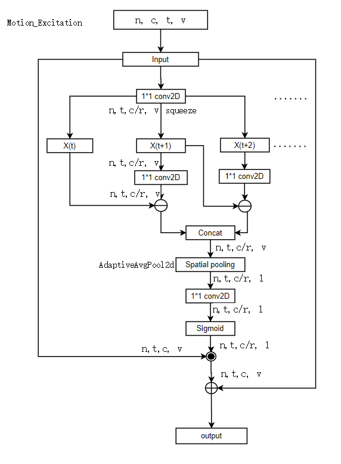
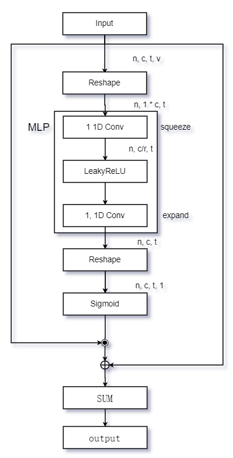
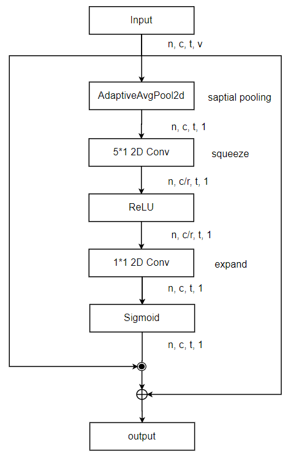
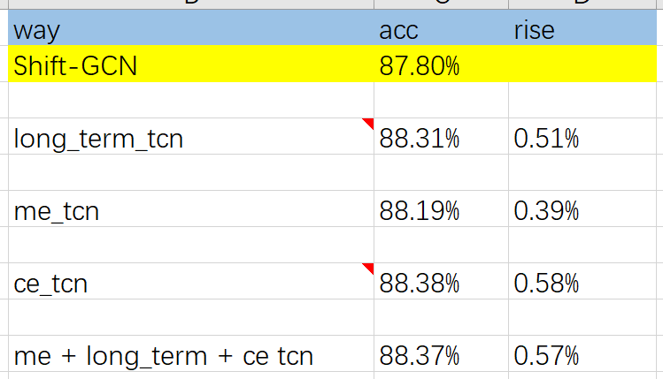
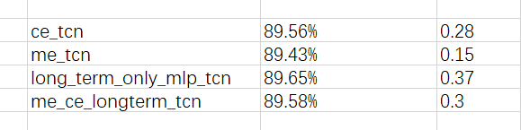
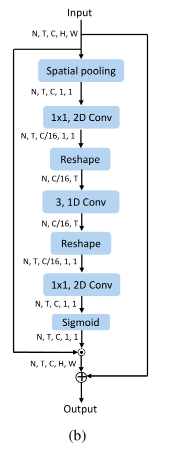

## Shift-GCN 原始网络



## 改造TCN




## Motion Excitation


## Long-term Excitation




## Channel Excitation




##  实验结果











## short long term

```
short term
n, h*c, t
torch.Size([16, 3200, 60])

ModuleList(
  (0): Sequential(
    (0): Conv1d(3200, 3200, kernel_size=(3,), stride=(1,), padding=(1,), groups=25, bias=False)
    (1): BatchNorm1d(3200, eps=1e-05, momentum=0.1, affine=True, track_running_stats=True)
  )
  (1): Sequential(
    (0): Conv1d(3200, 3200, kernel_size=(3,), stride=(1,), padding=(1,), groups=25, bias=False)
    (1): BatchNorm1d(3200, eps=1e-05, momentum=0.1, affine=True, track_running_stats=True)
  )
)
```


```
long term
n, h*c, t
torch.Size([16, 3200, 60])

mlp_sigmoid
Sequential(
  (0): Conv1d(3200, 200, kernel_size=(1,), stride=(1,), groups=25, bias=False)
  (1): BatchNorm1d(200, eps=1e-05, momentum=0.1, affine=True, track_running_stats=True)
  (2): LeakyReLU(negative_slope=0.01, inplace=True)
  (3): Conv1d(200, 3200, kernel_size=(1,), stride=(1,), groups=25, bias=False)
  (4): Sigmoid()
)
```


## TAM
```
"""
input:
torch.Size([600, 64, 8])
n_batch, c, t

local
Sequential(
  (0): Conv1d(64, 16, kernel_size=(3,), stride=(1,), padding=(1,), bias=False)
  (1): BatchNorm1d(16, eps=1e-05, momentum=0.1, affine=True, track_running_stats=True)
  (2): ReLU(inplace=True)
  (3): Conv1d(16, 64, kernel_size=(1,), stride=(1,), bias=False)
  (4): Sigmoid()
)
"""
```


```
TAM Global branch

n_batch * c, t
view(-1, t)


Sequential(
  (0): Linear(in_features=8, out_features=16, bias=False)
  (1): BatchNorm1d(16, eps=1e-05, momentum=0.1, affine=True, track_running_stats=True)
  (2): ReLU(inplace=True)
  (3): Linear(in_features=16, out_features=3, bias=False)
  (4): Softmax(dim=-1)
)
```