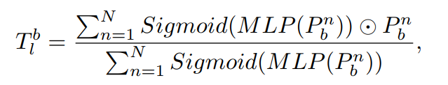
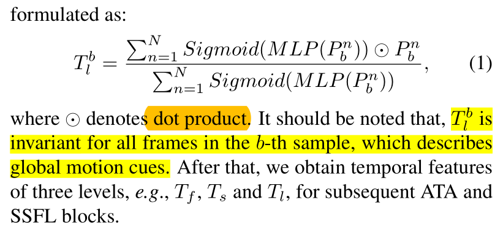

Sequential(
  (0): Linear(in_features=15, out_features=30, bias=False)
  (1): BatchNorm1d(30, eps=1e-05, momentum=0.1, affine=True, track_running_stats=True)
  (2): ReLU(inplace)
  (3): Linear(in_features=30, out_features=3, bias=False)
  (4): Softmax()
)


long-term
x.view(n, h * c, s)
torch.Size([30, 64, 300])
```
Sequential(
  (0): Conv1d(64, 4, kernel_size=(1,), stride=(1,))
  (1): BatchNorm1d(4, eps=1e-05, momentum=0.1, affine=True, track_running_stats=True)
  (2): LeakyReLU(negative_slope=0.01, inplace)
  (3): Conv1d(4, 64, kernel_size=(1,), stride=(1,))
  (4): Sigmoid()
)
```




torch.Size([30, 25, 64, 300])

torch.Size([30, 25*64, 300])

```
Sequential(
  (0): Conv1d(1600, 100, kernel_size=(1,), stride=(1,))
  (1): BatchNorm1d(100, eps=1e-05, momentum=0.1, affine=True, track_running_stats=True)
  (2): LeakyReLU(negative_slope=0.01, inplace)
  (3): Conv1d(100, 1600, kernel_size=(1,), stride=(1,))
  (4): Sigmoid()
)
```


torch.Size([30, 25, 64, 300])


long_term_feature.shape
Out[14]: torch.Size([128, 256, 25])
long_term_feature[0,0,:]
tensor([1.1654, 1.9226, 2.6405, 2.3651, 2.4046, 2.2827, 2.3068, 2.3626, 1.3591,
        2.0621, 2.2866, 1.8151, 1.4592, 2.7330, 2.7245, 3.1954, 1.1907, 2.8334,
        1.6417, 1.7968, 2.8260, 2.1588, 1.8653, 2.1686, 2.1355],
       device='cuda:0', grad_fn=<SliceBackward>)


x_pred_score[0,0,:,:3]

tensor([[ 0.3283,  0.5122, -0.1407],
        [ 0.1897,  0.3854,  0.7367],
        [ 0.3033,  0.3637,  0.4673],
        [ 0.2593,  0.7452,  0.3744],
        [ 0.2714,  1.0442,  0.7980],
        [ 0.2750,  0.4846,  0.2167],
        [ 0.4673,  0.3226, -0.2388],
        [ 0.4663,  0.1730, -0.4121],
        [ 0.1808,  0.4911,  0.1288],
        [-0.1372,  0.0075, -0.0477],
        [ 0.2294,  0.2754,  0.1490],
        [ 0.3396,  0.4300, -0.0218],
        [ 0.5766,  0.3348, -0.1062],
        [ 0.5126,  1.0889,  0.8225],
        [ 0.5973,  0.4099,  0.8224],
        [ 0.6207,  0.8299,  1.3326],
        [ 0.2137,  0.7053,  0.0094],
        [ 1.2245,  1.0719,  0.6735],
        [ 0.4188,  0.1426,  0.4520],
        [ 0.2011,  0.2889,  0.0223],
        [ 0.2236,  0.3955,  0.4709],
        [ 0.4806,  0.1812, -0.3525],
        [ 0.3981,  0.2017,  0.1344],
        [ 0.5664,  0.5407, -0.1632],
        [ 0.2812,  0.3817, -0.2139]], device='cuda:0', grad_fn=<SliceBackward>)
        
        
x_pred_score[:,:,:,0] = x_pred_score[:,:,:,0] + long_term_feature

tensor([[ 1.4937,  0.5122, -0.1407],
        [ 2.1123,  0.3854,  0.7367],
        [ 2.9439,  0.3637,  0.4673],
        [ 2.6243,  0.7452,  0.3744],
        [ 2.6760,  1.0442,  0.7980],
        [ 2.5577,  0.4846,  0.2167],
        [ 2.7741,  0.3226, -0.2388],
        [ 2.8289,  0.1730, -0.4121],
        [ 1.5399,  0.4911,  0.1288],
        [ 1.9250,  0.0075, -0.0477],
        [ 2.5161,  0.2754,  0.1490],
        [ 2.1547,  0.4300, -0.0218],
        [ 2.0359,  0.3348, -0.1062],
        [ 3.2455,  1.0889,  0.8225],
        [ 3.3218,  0.4099,  0.8224],
        [ 3.8161,  0.8299,  1.3326],
        [ 1.4044,  0.7053,  0.0094],
        [ 4.0580,  1.0719,  0.6735],
        [ 2.0605,  0.1426,  0.4520],
        [ 1.9979,  0.2889,  0.0223],
        [ 3.0495,  0.3955,  0.4709],
        [ 2.6394,  0.1812, -0.3525],
        [ 2.2634,  0.2017,  0.1344],
        [ 2.7350,  0.5407, -0.1632],
        [ 2.4168,  0.3817, -0.2139]], device='cuda:0', grad_fn=<SliceBackward>)
        
        


torch.Size([5120, 60])

Sequential(
  (0): Linear(in_features=60, out_features=120, bias=False)
  (1): BatchNorm1d(120, eps=1e-05, momentum=0.1, affine=True, track_running_stats=True)
  (2): ReLU(inplace=True)
  (3): Linear(in_features=120, out_features=3, bias=False)
  (4): Softmax(dim=-1)
)


long-term模块

原论文做法：
用全部帧代替当前一帧的信息，然后全部帧信息都是相同的。Tb对全部帧不变。




我的做法：
只用第一帧描述全局信息，将Tb的值赋给第一帧。

想法：
保留经过MLP后不同帧之间的差异性，同时获取全局信息。


2s-AGCN
效果提升了0.07

shift-gcn
正在跑


