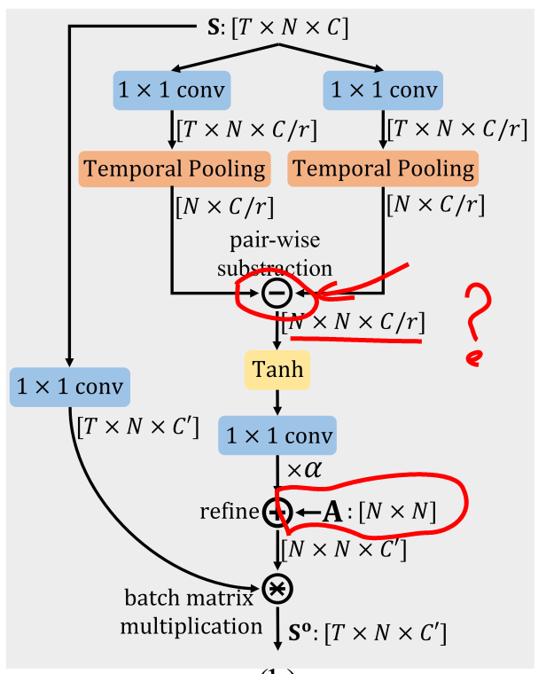
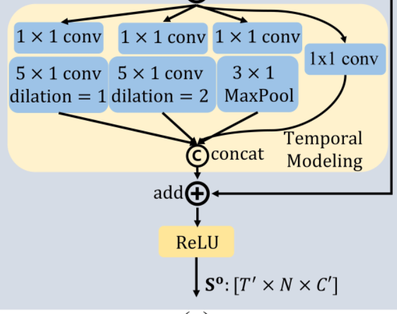
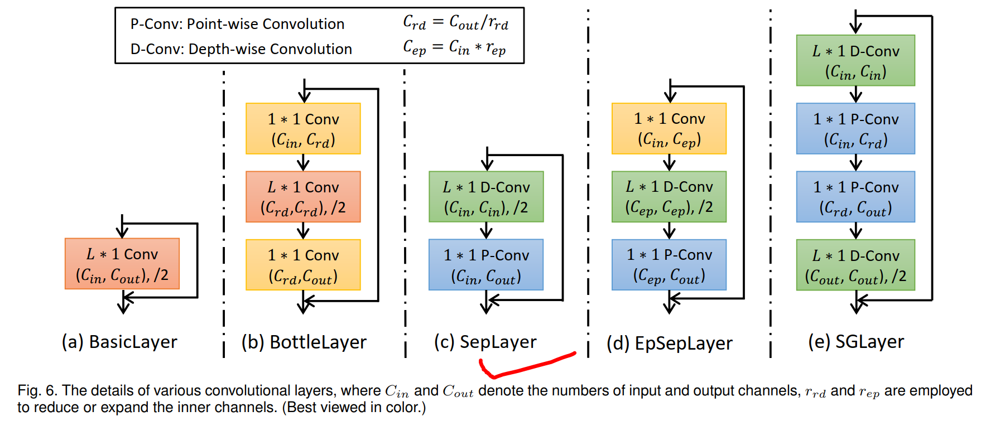
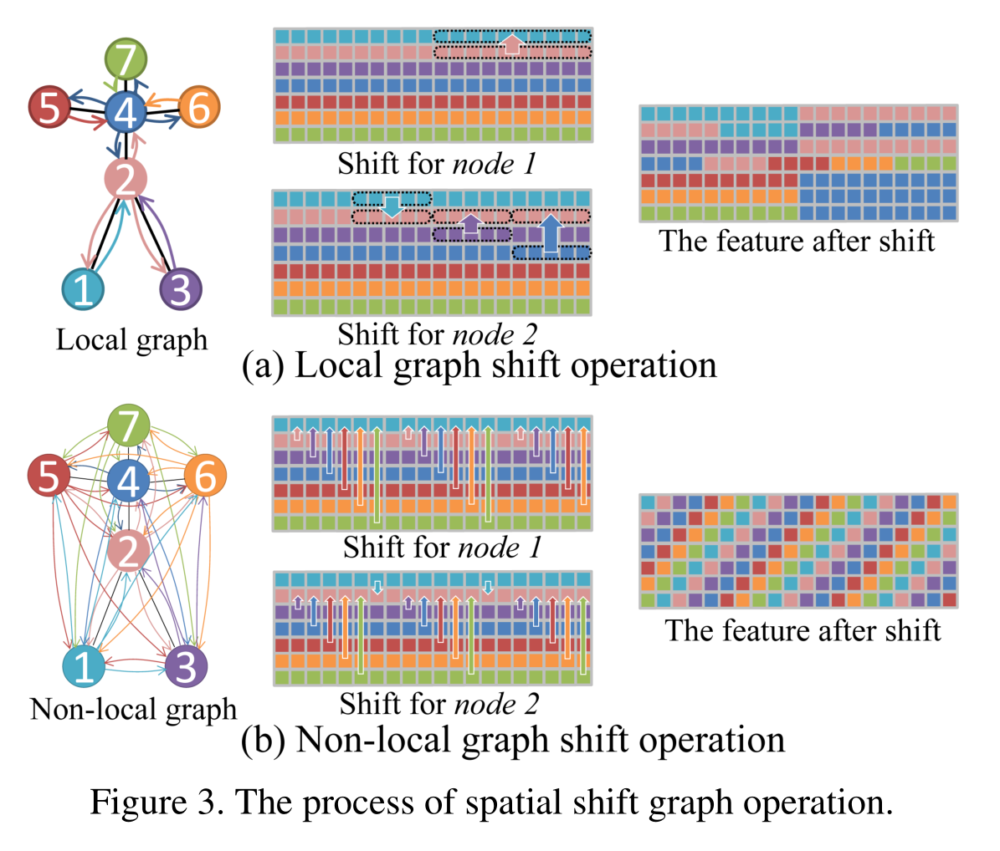
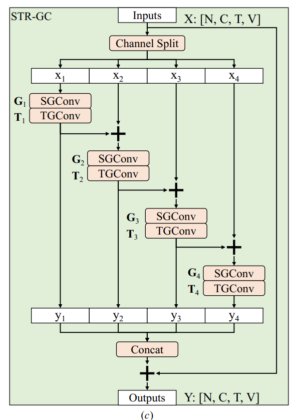
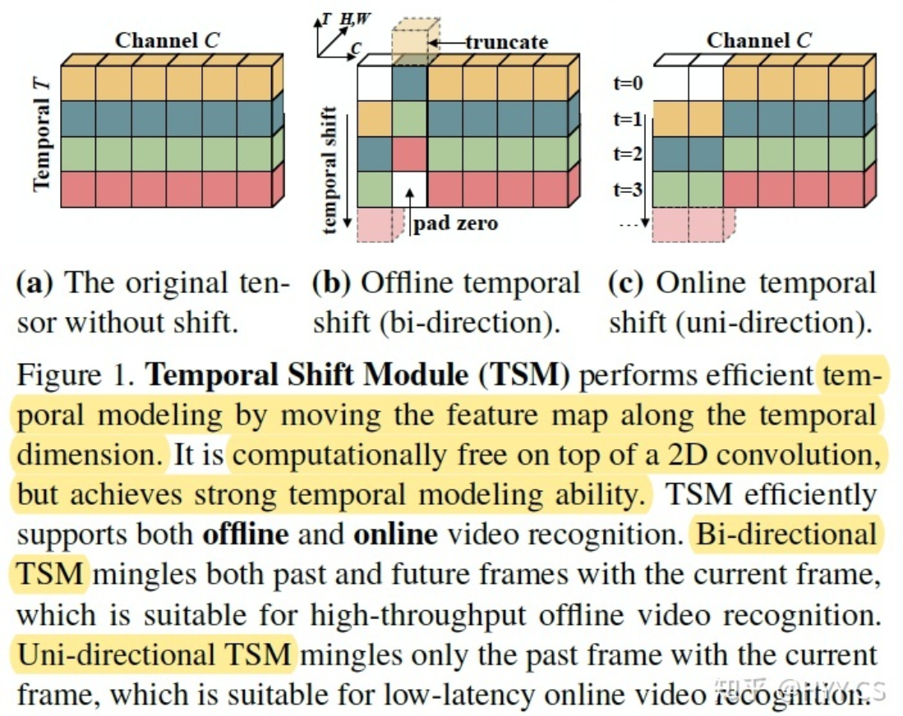

# spatical temporal channel contrast

## spatical


### ctrgcn

不太能看出来

应该是x1 = torch.einsum('ncuv,nctv->nctu', x1, x3) 实现图卷积

```
        x1, x2, x3 = self.conv1(x).mean(-2), self.conv2(x).mean(-2), self.conv3(x)
        x1 = self.tanh(x1.unsqueeze(-1) - x2.unsqueeze(-2))
        x1 = self.conv4(x1) * alpha + (A.unsqueeze(0).unsqueeze(0) if A is not None else 0)      # N,C,V,V  torch.Size([128, 64, 25, 25]) R = A + a*Q
        x1 = torch.einsum('ncuv,nctv->nctu', x1, x3) # ??? wsx torch.Size([128, 64, 64, 25])
```




### efficientgcn

class Spatial_Graph_Layer
class SpatialGraphConv
self.A = nn.Parameter(A[:self.s_kernel_size], requires_grad=False)
```
# Thanks to YAN Sijie for the released code on Github (https://github.com/yysijie/st-gcn)
class SpatialGraphConv(nn.Module):
    def __init__(self, in_channel, out_channel, max_graph_distance, bias, edge, A, **kwargs):
        super(SpatialGraphConv, self).__init__()

        self.s_kernel_size = max_graph_distance + 1
        self.gcn = nn.Conv2d(in_channel, out_channel*self.s_kernel_size, 1, bias=bias)
        self.A = nn.Parameter(A[:self.s_kernel_size], requires_grad=False)
        if edge:
            self.edge = nn.Parameter(torch.ones_like(self.A))
        else:
            self.edge = 1

    def forward(self, x):
        x = self.gcn(x)
        n, kc, t, v = x.size()
        x = x.view(n, self.s_kernel_size, kc//self.s_kernel_size, t, v)
        x = torch.einsum('nkctv,kvw->nctw', (x, self.A * self.edge)).contiguous()
        return x
```


### shift_gcn

class Shift_gcn(nn.Module):

https://github.com/1suancaiyu/Shift-GCN/blob/master/model/shift_gcn.py


## temporal
### ctrgcn
class MultiScale_TemporalConv（）




### efficientgcn

tcn + separable conv
class Temporal_Sep_Layer()

```
        res = self.residual(x)
        if self.expand_conv is not None:
            x = self.act(self.expand_conv(x))
        x = self.act(self.depth_conv(x))
        x = self.point_conv(x)
        return x + res
```




### shift_gcn

class Shift_tcn(nn.Module):


## channel

### ctrgcn

```
x1 = self.tanh(x1.unsqueeze(-1) - x2.unsqueeze(-2))
```


```
        x1, x2, x3 = self.conv1(x).mean(-2), self.conv2(x).mean(-2), self.conv3(x)
        x1 = self.tanh(x1.unsqueeze(-1) - x2.unsqueeze(-2))
        x1 = self.conv4(x1) * alpha + (A.unsqueeze(0).unsqueeze(0) if A is not None else 0)  # N,C,V,V  torch.Size([128, 64, 25, 25]) R = A + a*Q
        x1 = torch.einsum('ncuv,nctv->nctu', x1, x3) # ??? wsx torch.Size([128, 64, 64, 25]) # x3 = x横？
        # 'x1: torch.Size([128, 64, 25, 25]) , x3: torch.Size([128, 64, 64, 25])' -> x1: torch.Size([128, 64, 64, 25])
        return x1
```


### efficientgcn

```
        self.depth_conv = nn.Sequential(
            nn.Conv2d(inner_channel, inner_channel, (temporal_window_size,1), (stride,1), (padding,0), groups=inner_channel, bias=bias),
            nn.BatchNorm2d(inner_channel),
        )
```


### shift_gcn




```
class ShiftFunction(Function):
    
    @staticmethod
    def forward(ctx, input,xpos,ypos,stride=1):
        if stride==1:
            xpos = xpos
            ypos = ypos
        else:
            ypos = ypos + 0.5
            # ypos = ypos + 0.5
        output = shift_cuda.forward(input,xpos,ypos,stride)
        ctx.save_for_backward(input, output, xpos, ypos)
        ctx.stride = stride
        return output

    @staticmethod
    def backward(ctx, grad_output): 
        grad_output = grad_output.contiguous()
        input, output, xpos, ypos = ctx.saved_variables
        grad_input,grad_xpos,grad_ypos = shift_cuda.backward(grad_output, input, output, xpos, ypos, ctx.stride)
        return grad_input, grad_xpos, grad_ypos, None
```


### Multi-Scale  



### TSM




