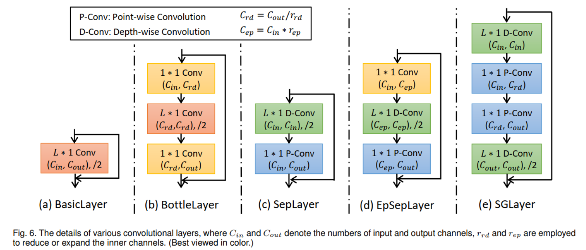
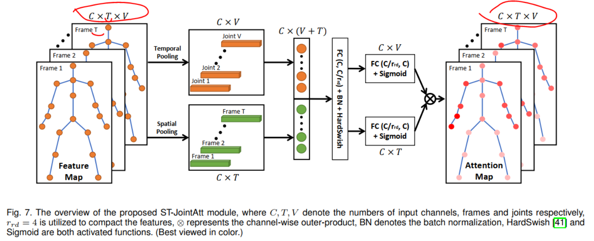

## 问题
参数过多，模型过于复杂

## 提出
### MIB  （Multiple Input Branches）
capture rich structure features from joints’ spatial configurations and temporal dynamics in skeleton sequences

- joint positions (relative and absolute)  
- motion velocities (one or two temporal steps)  
- bone features (lengths and angles)  

### separable convolutional layers

extracting temporal dynamics and compressing the model size

- Bottleneck Layer 
- Expanded Separable Layer
- Sandglass Layer

### scaling strategy 

### Spatial Temporal Joint Attention	

inspired by coordinate attention  

CVPR2021 即插即用   Coordinate Attention

> Mobile Network设计的最新研究成果表明，**通道注意力**（例如，SE注意力）对于提升模型性能具有显著效果，但它们通常会 ==忽略位置信息==，而位置信息对于生成空间选择性attention maps是非常重要。
>
> 因此在本文中，作者通过将位置信息嵌入到通道注意力中提出了一种新颖的移动网络注意力机制，将其称为“**Coordinate Attention**”。
>
> 与通过2维全局池化将特征张量转换为单个特征向量的通道注意力不同，coordinate注意力将通道注意力分解为两个1维特征编码过程，分别沿2个空间方向聚合特征。这样可以
>
> - 沿一个空间方向捕获远程依赖关系，
>
> - 同时可以沿另一空间方向保留精确的位置信息。
>
> 然后将生成的特征图分别编码为一对方向感知和位置敏感的attention map，可以将其互补地应用于输入特征图，以增强关注对象的表示。

https://cloud.tencent.com/developer/article/1829677

## 启发
多种数据模态可以借鉴，拿来就用

# project

## arg

python main.py -c 2001 --dataset ntu-xsub -g 0

## error
RuntimeError: CUDA error: no kernel image is available for execution on the device CUDA kernel error
