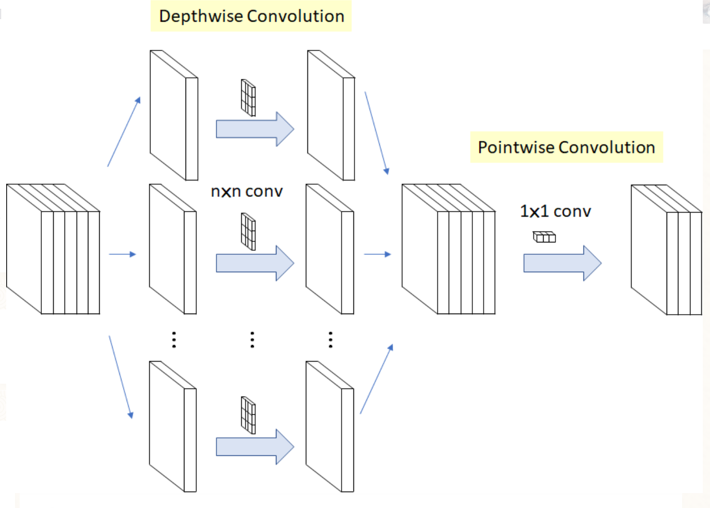

# Shift-GCN


# Paper


## 引入

### CNN shfit conv

https://zhuanlan.zhihu.com/p/183183514

https://zhuanlan.zhihu.com/p/279617431


移位之后就是进行逐点卷积的操作，因为在每个方向上进行了移位操作，通道与通道之间的特征进行了交换，位移能起到 ==交换通道间的信息== 的作用，

而点卷积可以起到 ==降低计算量== 的作用。


## 空间域  gcn shfit conv
> 介绍图像上的移位卷积其实就是为了类比GCN，对于图像卷积，可以看做 ![[公式]](https://www.zhihu.com/equation?tex=3%5Ctimes+3) 的 ![[公式]](https://www.zhihu.com/equation?tex=9) 个点卷积的融合，而对于GCN，相当于 ![[公式]](https://www.zhihu.com/equation?tex=3) 个点卷积的融合，分别为：向心点、根节点和离心点。之前我们提到，这种卷积方式只能提取到局部特征，所以作者提出局部移位图卷积和非局部移位图卷积两种。
>


### 局部移位图卷积
这里的移位是根据人体的物理结构定义的，也就是说只会在相邻节点之间进行移位操作。跟CNN不同的是，不同节点的邻居是不同的。对于节点 ![[公式]](https://www.zhihu.com/equation?tex=v) ，假设有 ![[公式]](https://www.zhihu.com/equation?tex=n) 个相邻节点，我们将节点 ![[公式]](https://www.zhihu.com/equation?tex=v) 的通道 ==均匀分成 ![[公式]](https://www.zhihu.com/equation?tex=n%2B1) 个分区== ，第一个分区保留节点 ![[公式]](https://www.zhihu.com/equation?tex=v) 的特征，剩下 ![[公式]](https://www.zhihu.com/equation?tex=n) 个分区分别来自相邻 ![[公式]](https://www.zhihu.com/equation?tex=n) 个节点的移位。如果用公式来表示就是下面的公式（3）。


这里 ![[公式]](https://www.zhihu.com/equation?tex=F) 表示单个帧的特征， ![[公式]](https://www.zhihu.com/equation?tex=%5Ctilde%7BF%7D) 代表相应的移位后的特征， ![[公式]](https://www.zhihu.com/equation?tex=%7C%7C) 代表按通道连接。

为了直观的说明整个步骤，这里假设了一个只有 ![[公式]](https://www.zhihu.com/equation?tex=7) 个关节 ![[公式]](https://www.zhihu.com/equation?tex=20) 个通道的小图，如下图（a）。对于节点 ![[公式]](https://www.zhihu.com/equation?tex=1) ，它只有一个邻居节点，所以他的通道被分成了两个分区，第一个分区用来存放节点 ![[公式]](https://www.zhihu.com/equation?tex=1) 的特征，第二个分区是从节点 ![[公式]](https://www.zhihu.com/equation?tex=2) 移动过来的特征。移位之后节点 ![[公式]](https://www.zhihu.com/equation?tex=1) 的特征就是右边第一行，一半蓝色（节点 ![[公式]](https://www.zhihu.com/equation?tex=1) 自身特征），一半粉色（节点 ![[公式]](https://www.zhihu.com/equation?tex=2) 的特征）。对于节点 ![[公式]](https://www.zhihu.com/equation?tex=2) ，它有三个相邻节点，所以节点 ![[公式]](https://www.zhihu.com/equation?tex=2) 的通道被分成四个分区，==第一个分区保留节点 ![[公式]](https://www.zhihu.com/equation?tex=2) 的特征，其他三个分区分别从节点 ![[公式]](https://www.zhihu.com/equation?tex=1) 、节点 ![[公式]](https://www.zhihu.com/equation?tex=3) 、节点 ![[公式]](https://www.zhihu.com/equation?tex=4) 移位过来的==，最后移位后的特征图就是图（a）右边部分，其他节点的通道也是类似移位过来的。


局部移位的方式缺点很多，主要就是 ==不能整体的利用所有关节的信息== ，这在很多论文中已经提到过了。


### 非局部移位图卷积
这种方式就是抛弃人体本身的物理连接，假设所有节点都是有连接的。非局部移位方式如下图（b），通道数还是 ![[公式]](https://www.zhihu.com/equation?tex=20) ，区别于局部移位，==这里将每个通道都划分为一个分区，从自身节点开始，其他节点相继移位到该节点通道上，并以此循环，直至最后一个通道==。对于节点 ![[公式]](https://www.zhihu.com/equation?tex=1) ，自身节点和其他节点以此占用 ![[公式]](https://www.zhihu.com/equation?tex=7) 个通道，最后一个通道是第三次循环的第 ![[公式]](https://www.zhihu.com/equation?tex=6) 个节点（ ![[公式]](https://www.zhihu.com/equation?tex=20%3D3%5Ctimes+7-1) ）。节点 ![[公式]](https://www.zhihu.com/equation?tex=2) 类似，总的移位之后的特征图就有点像一个螺旋，这是循环移位导致的。


## 时间域移位卷积

### 简单的时间移位图卷积

文章直接介绍将信道划分为 ![[公式]](https://www.zhihu.com/equation?tex=2u%2B1) 个分区，也没说明 ![[公式]](https://www.zhihu.com/equation?tex=u) 是什么，我个人理解：一个帧相邻的有前后两帧，如果设置 ![[公式]](https://www.zhihu.com/equation?tex=u%3D1) ，那么就是只相邻的前后两帧进行移位，如果 ![[公式]](https://www.zhihu.com/equation?tex=u%3D2) 就是前后四帧。一般如ST-GCN使用TCN就是长度为 ![[公式]](https://www.zhihu.com/equation?tex=9) 的卷积核，相当于时间移位卷积 ![[公式]](https://www.zhihu.com/equation?tex=u%3D4) 的本身帧加前后各四帧。


### 自适应时间移位图卷积

因为上面的 ![[公式]](https://www.zhihu.com/equation?tex=u) 是手动设置的，缺乏灵活性，最近一些研究说明不同的层可能需要不同的感受野，还有就是不同的数据集需要不同的感受野。这两个方面我没怎么了解，要恶补几篇论文了。

自适应时间移位图卷积就是设置一个可学习的时移参数 ![[公式]](https://www.zhihu.com/equation?tex=S_%7Bi%7D%2Ci%3D1%2C2%2C...%2CC) ，这里的时移参数就是每次时移的距离。将时间移位的参数由整数放宽到实数，也就是分区不再按整数划分。最后的计算如公式（5）所示。


## 对比


## 补充


> 移位的作用是交换通道信息，真正减少计算量是因为用的是点卷积，移位+点卷积取代了固定卷积核的卷积。


什么是点卷积？



> 逐点卷积就是1x1的普通卷积。因为深度卷积没有融合通道间信息，所以需要配合逐点卷积使用。


### TSM
Temporal shift module for efficient video understanding.

https://zhuanlan.zhihu.com/p/84868486


- **Shift：**对tensor(T*C*H*W)，TSM沿着temporal维度移动部分channels，比如bi-direction TSM进行了时间维度shift +/-1，使得每个时间维度t上的tensor(C*H*W)获得了相邻帧的feature，在时间维度T上感受野达到了3.
- **Multiply-accumulate(卷积):** 通过对tensor(T*C*H*W)在时间维度T上进行shift操作后，每个时间t上的tensor(C*H*W)在channel C维度上涵盖了相邻帧的feature，对每个时间t上的tensor(C*H*W)用权重共享Conv-2D处理，类似于在时间t维度上进行了一个卷积核为3的Conv-2D.


### 关系

https://zhuanlan.zhihu.com/p/80041030

**深度可分离卷积**(Depthwise Separable Convolution) = **深度卷积**(Depthwise Convolution) + 逐点卷积(Pointwise Convolution)。


1. Depthwise Convolution不同于常规卷积操作，Depthwise Convolution的一个卷积核负责一个通道，一个通道只被一个卷积核卷积。

2. Pointwise Convolution的运算与常规卷积运算非常相似，它的卷积核的尺寸为 1×1×M，M为上一层的通道数。所以这里的卷积运算会将上一步的map在深度方向上进行加权组合，生成新的Feature map。


## 总结

> Shift-GCN是对ST-GCN的改进，其启发自Shift卷积算子[1]，主要想法是利用1x1卷积算子结合空间shift操作，使得1x1卷积同时可 ==融合空间域和通道域的信息==，采用shift卷积可以 ==大幅度地减少参数量和计算量==。对于单帧而言，类似于传统的Shift操作：可以分为Graph Shift和1x1 conv两个阶段。然而，和传统Shift操作不同的是，之前Shift应用在图片数据上，这种数据是典型的欧几里德结构数据[7]，数据节点的邻居节点可以很容易定义出来，因此卷积操作也很容易定义。而图数据的特点决定了其某个数据节点的邻居数量（也即是“度”）都可能不同，因此传统的卷积在图数据上并不管用，传统的shift卷积操作也同样并不能直接在骨骼点数据上应用。那么就需要重新在骨骼点数据上定义shift卷积操作。
>


## 参考文献
https://zhuanlan.zhihu.com/p/183183514

https://zhuanlan.zhihu.com/p/279617431


# Experiment

## env

https://github.com/kchengiva/Shift-GCN/issues/1


it can be run in the docker image "pytorch/pytorch:1.1.0-cuda10.0-cudnn7.5-devel"

https://hub.docker.com/layers/pytorch/pytorch/1.1.0-cuda10.0-cudnn7.5-devel/images/sha256-1be771bff6d18ede7d98c171c577ae8fcbaf6f53b59a3e5fe5cee9e36e188fbc?context=explore


pytorch/pytorch:0.4.1-cuda9-cudnn7-devel

https://hub.docker.com/layers/pytorch/pytorch/0.4.1-cuda9-cudnn7-devel/images/sha256-3febd5b72fb0b90d646060b64cf2063ea9fe2a2f4b17e06cba675a611adfbaea


python36/pytorch11/cuda10/g++5.5

```
# CUDA 10.0
conda install pytorch==1.1.0 torchvision==0.3.0 cudatoolkit=10.0 -c pytorch
```


RuntimeError: CuDNN error: CUDNN_STATUS_EXECUTION_FAILED


### solution
https://www.matpool.com/
NVIDIA Tesla K80
pytorch=1.1.0=py3.6_cuda10.0.130_cudnn7.5.1_0


sed -i 's/\r$//' filename


## data_gen

ntu120
python ntu120_gendata.py --data_path '/wsx/repo/dataset/nturgbd_skeletons_s018_to_s032' --ignored_sample_path 'NTU_RGBD120_samples_with_missing_skeletons.txt' --out_folder '/wsx/repo/dataset/shiftgcn_data/ntu120'

ntu


## arg
python main.py --config ./config/nturgbd-cross-subject/train_joint.yaml


--config ./config/nturgbd-cross-subject/train_joint.yaml --test-batch-size 1 --batch-size 1 --device 0


python main.py --config ./config/nturgbd-cross-subject/train_joint.yaml --test-batch-size 42 --batch-size 42 --device 0 1


python main.py --config ./config/nturgbd-cross-subject/train_joint.yaml --test-batch-size 22 --batch-size 22 --device 0


## train result
ntu60 xsub

[ Mon Oct 18 22:59:28 2021 ] Eval epoch: 77
[ Mon Oct 18 23:00:18 2021 ]    Mean test loss of 393 batches: 0.46687665581703186.
[ Mon Oct 18 23:00:18 2021 ]    Top1: 87.84%
[ Mon Oct 18 23:00:18 2021 ]    Top5: 97.74%


ntu120 xsub

[ Tue Oct 19 11:03:24 2021 ] Eval epoch: 90
[ Tue Oct 19 11:05:08 2021 ]    Mean test loss of 820 batches: 0.9155967235565186.
[ Tue Oct 19 11:05:09 2021 ]    Top1: 78.05%
[ Tue Oct 19 11:05:09 2021 ]    Top5: 94.98%


## motion excitation


add ME block


### round 1
ME_TCN_GCN_unit

```
self.l1 = TCN_GCN_unit(3, 64, A, residual=False)
self.l2 = ME_TCN_GCN_unit(64, 64, A)
self.l3 = ME_TCN_GCN_unit(64, 64, A)
self.l4 = ME_TCN_GCN_unit(64, 64, A)
self.l5 = ME_TCN_GCN_unit(64, 128, A, stride=2)
self.l6 = ME_TCN_GCN_unit(128, 128, A)
self.l7 = ME_TCN_GCN_unit(128, 128, A)
self.l8 = ME_TCN_GCN_unit(128, 256, A, stride=2)
self.l9 = ME_TCN_GCN_unit(256, 256, A)
self.l10 = ME_TCN_GCN_unit(256, 256, A)
```


result

```
[ Sat Oct 23 23:31:16 2021 ] 	Top1: 87.89%
[ Sat Oct 23 23:31:16 2021 ] 	Top5: 97.88%
[ Sat Oct 23 23:31:16 2021 ] Training epoch: 69
[ Sat Oct 23 23:32:10 2021 ] 	Batch(75/668) done. Loss: 0.0391  lr:0.010000  network_time: 0.0702
[ Sat Oct 23 23:33:20 2021 ] 	Batch(175/668) done. Loss: 0.0207  lr:0.010000  network_time: 0.0695
[ Sat Oct 23 23:34:29 2021 ] 	Batch(275/668) done. Loss: 0.0503  lr:0.010000  network_time: 0.0707
[ Sat Oct 23 23:35:39 2021 ] 	Batch(375/668) done. Loss: 0.0316  lr:0.010000  network_time: 0.0705
[ Sat Oct 23 23:36:48 2021 ] 	Batch(475/668) done. Loss: 0.0502  lr:0.010000  network_time: 0.0704
[ Sat Oct 23 23:37:58 2021 ] 	Batch(575/668) done. Loss: 0.0726  lr:0.010000  network_time: 0.0705
```


### round2


### round3

```
[ Tue Oct 26 07:16:42 2021 ] Eval epoch: 100
[ Tue Oct 26 07:17:37 2021 ] 	Mean test loss of 516 batches: 0.48539814352989197.
[ Tue Oct 26 07:17:37 2021 ] 	Top1: 87.22%
[ Tue Oct 26 07:17:37 2021 ] 	Top5: 97.65%
[ Tue Oct 26 07:17:37 2021 ] Training epoch: 101
[ Tue Oct 26 07:18:23 2021 ] 	Batch(99/1252) done. Loss: 0.0558  lr:0.000100  network_time: 0.0784
[ Tue Oct 26 07:19:06 2021 ] 	Batch(199/1252) done. Loss: 0.0215  lr:0.000100  network_time: 0.0802
[ Tue Oct 26 07:19:49 2021 ] 	Batch(299/1252) done. Loss: 0.0533  lr:0.000100  network_time: 0.0787
[ Tue Oct 26 07:20:32 2021 ] 	Batch(399/1252) done. Loss: 0.0207  lr:0.000100  network_time: 0.0784
[ Tue Oct 26 07:21:15 2021 ] 	Batch(499/1252) done. Loss: 0.0356  lr:0.000100  network_time: 0.0789
[ Tue Oct 26 07:21:58 2021 ] 	Batch(599/1252) done. Loss: 0.0206  lr:0.000100  network_time: 0.0799
[ Tue Oct 26 07:22:41 2021 ] 	Batch(699/1252) done. Loss: 0.0477  lr:0.000100  network_time: 0.0796
[ Tue Oct 26 07:23:24 2021 ] 	Batch(799/1252) done. Loss: 0.0322  lr:0.000100  network_time: 0.0791
[ Tue Oct 26 07:24:07 2021 ] 	Batch(899/1252) done. Loss: 0.0212  lr:0.000100  network_time: 0.0792
[ Tue Oct 26 07:24:50 2021 ] 	Batch(999/1252) done. Loss: 0.0607  lr:0.000100  network_time: 0.0798
[ Tue Oct 26 07:25:33 2021 ] 	Batch(1099/1252) done. Loss: 0.0991  lr:0.000100  network_time: 0.0768
[ Tue Oct 26 07:26:16 2021 ] 	Batch(1199/1252) done. Loss: 0.0112  lr:0.000100  network_time: 0.0779
```


[ Wed Oct 27 11:09:00 2021 ] Training epoch: 134
[ Wed Oct 27 11:09:11 2021 ]    Batch(13/742) done. Loss: 0.0137  lr:0.000100  network_time: 0.0786
[ Wed Oct 27 11:10:19 2021 ]    Batch(113/742) done. Loss: 0.0240  lr:0.000100  network_time: 0.0788
[ Wed Oct 27 11:11:27 2021 ]    Batch(213/742) done. Loss: 0.0137  lr:0.000100  network_time: 0.0755
[ Wed Oct 27 11:12:35 2021 ]    Batch(313/742) done. Loss: 0.0112  lr:0.000100  network_time: 0.0788
[ Wed Oct 27 11:13:42 2021 ]    Batch(413/742) done. Loss: 0.0256  lr:0.000100  network_time: 0.0784
[ Wed Oct 27 11:14:50 2021 ]    Batch(513/742) done. Loss: 0.0095  lr:0.000100  network_time: 0.0909
[ Wed Oct 27 11:15:57 2021 ]    Batch(613/742) done. Loss: 0.0158  lr:0.000100  network_time: 0.0765
[ Wed Oct 27 11:17:05 2021 ]    Batch(713/742) done. Loss: 0.0192  lr:0.000100  network_time: 0.0770
[ Wed Oct 27 11:17:24 2021 ] Eval epoch: 134
[ Wed Oct 27 11:18:10 2021 ]    Mean test loss of 306 batches: 0.4667157828807831.
[ Wed Oct 27 11:18:10 2021 ]    Top1: 87.77%
[ Wed Oct 27 11:18:10 2021 ]    Top5: 97.87%


```
def reduce_frame(x, sgement_num):
    output = []
    n,c,t,v = x.size()
    for frame in range(0,t,sgement_num):
        tmp = x[:,:,frame,:].view(n,c,1,v)
        output.append(tmp)
    result = torch.cat(output, dim=2)
    return result
```


```
class depthwise_separable_conv(nn.Module):
    def __init__(self, nin, nout):
        super(depthwise_separable_conv, self).__init__()
        self.depthwise = nn.Conv2d(nin, nin, kernel_size=3, padding=1, groups=nin)
        self.pointwise = nn.Conv2d(nin, nout, kernel_size=1)

    def forward(self, x):
        out = self.depthwise(x)
        out = self.pointwise(out)
        return out
```


Motion_Excitation_CONV2D


==87.8% ----> 88.2%     0.4 up==


## CE Block


## 20211113

1.  Shift + ME 串行 各种无效果

2. Shift-GCN  + tcn(ME) ，并行 ，效果提升0.4%

3. Shirft-GCN + tcn（CE）， 并行 ，无效果

4. Shirft-GCN +  CE 并行，无tcn ， 效果提升0.7 %
5. 将2，4两个有效的方法，串行，Shirft-GCN + ME + CE 像ActionNet一样，无效果
6. 尝试MTA模型


