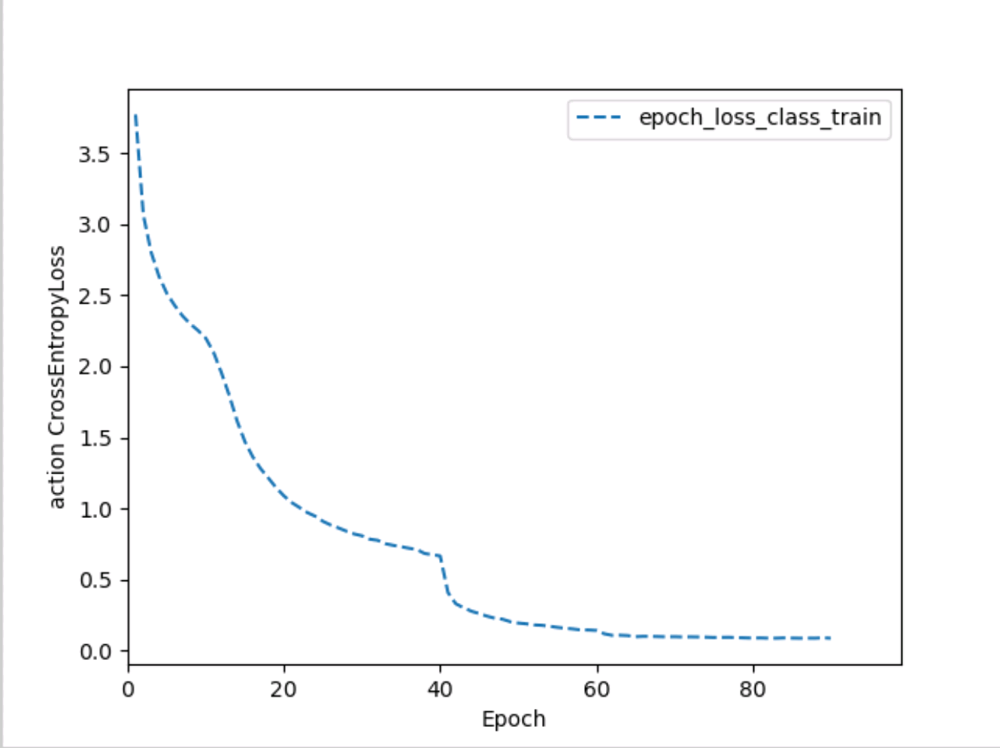
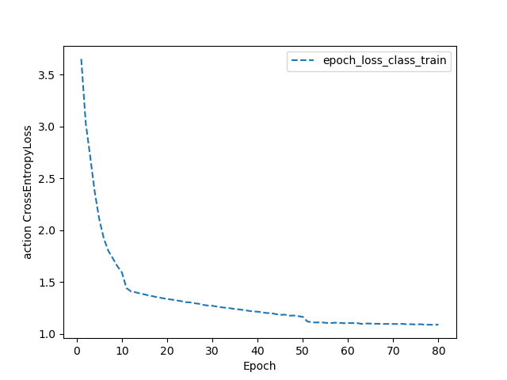
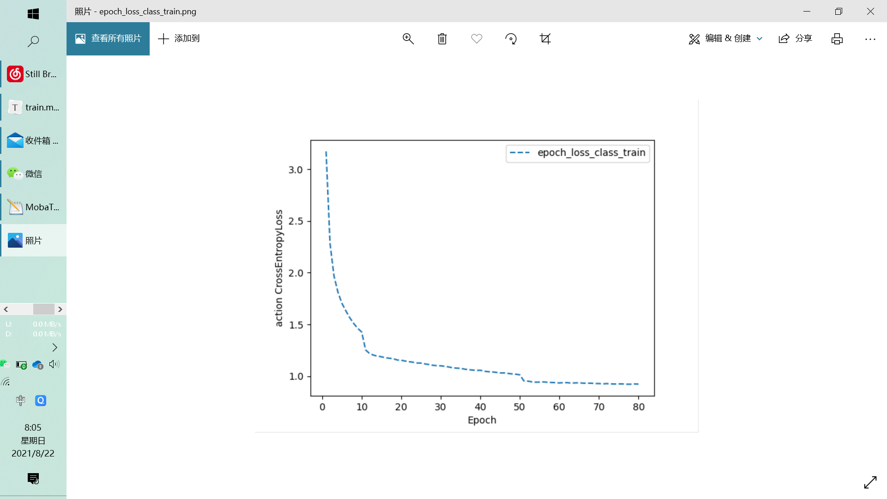
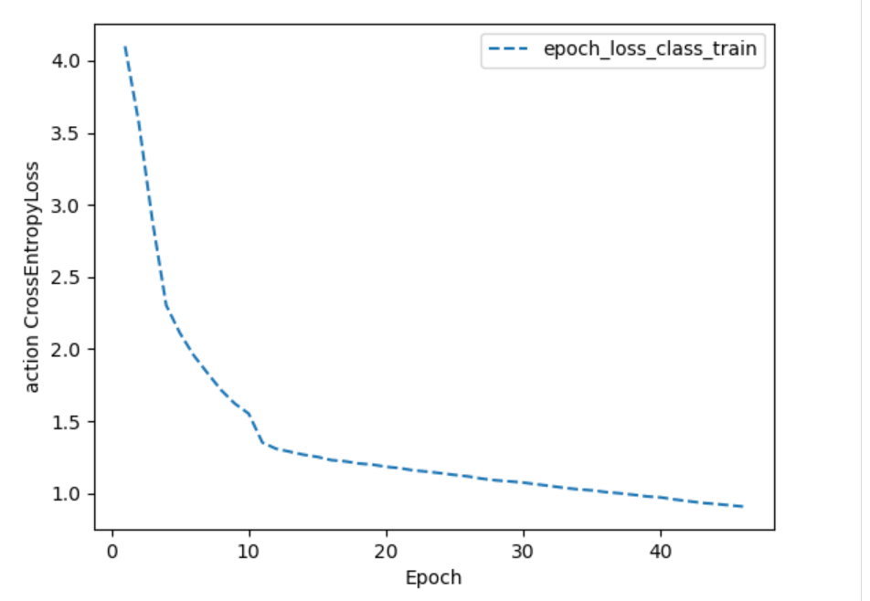
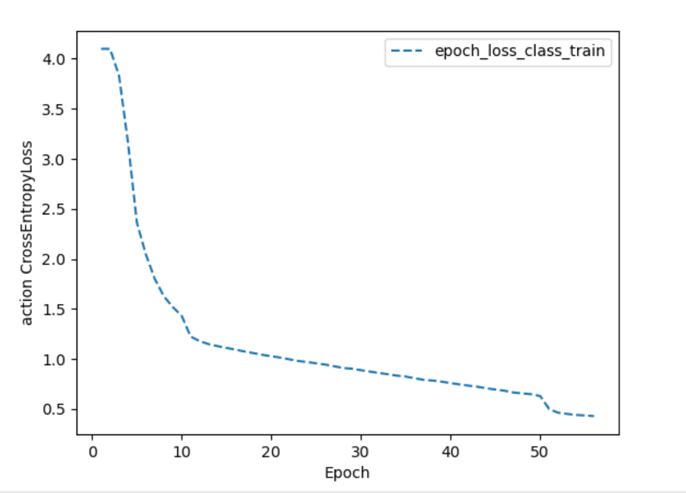

## s t poseformer

best epoch
[06.21.21|00:02:58] Eval epoch: 54
[06.21.21|00:04:43] 	mean_loss_class: 1.0486512068052625
[06.21.21|00:04:43] 	Top1: 73.49%
[06.21.21|00:04:43] 	Top5: 92.97%

## s: trans + gcn t: tcn
lr: 0.01

[08.21.21|08:26:37] Eval epoch: 59
[08.21.21|08:26:38]     mean_loss: 1.1853450536727905
[08.21.21|08:26:38]     Top1: 68.75%
[08.21.21|08:26:38]     Top5: 90.62%

lr: 0.05

[08.21.21|20:42:37] Eval epoch: 54
[08.21.21|20:42:37] 	mean_loss: 1.1559197902679443
[08.21.21|20:42:37] 	Top1: 70.31%
[08.21.21|20:42:37] 	Top5: 90.62%
[08.21.21|20:42:37] Done.

## s: gcn trans t:trans

lr: 0.075

batch size 32

64%

lr: 0.05

batch_size 30

64% 震荡

 