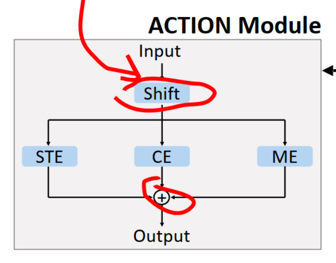

#  term 2

## week3
```
两个数据格式不同的数据集，是如何区分处理的
数据集的实际运动类型
```

## week4
```
找预测最后预测最后一帧的项目代码去借鉴
https://github.com/1suancaiyu/Locality-Awareness-SGE

###3
今日任务：
看懂那个预测下一帧的代码思想，并借鉴构造基于st-gcn 的 auto-encoder

完成情况：
查明是代码如何完成预测下一帧这个任务
单从auto-encoder的构造来看，是没有对这三个pre_task有区分的
初步猜想应该是loss约束来区分不同
这里是用
train_loss = tf.reduce_mean(tf.nn.l2_loss(training_decoder_output - targets))
然后这里的targets 应该就是装的下一帧的数据
具体还需要再细看，必要时需要运行代码
```

## week 5
```
read self-supervised paper another two tasks
figure out self-supervised learning based on auto-encoder
run the STEP code using the ST-GCN dataset 
```

## week 8
```
搭建基于transformer的框架
```

## week 9
```
PoseFormer ST transformer的输出其实也是一个步态序列
然后将head换掉，用AS-GCN的分类器，用NTU-RGB-D数据集，将2D数据表征变成3D,实现任务1，动作识别
设计多任务训练，实现任务2，增加鲁棒性
重建步态序列，用Spatio-temporal的方法，实现任务3，重建步态序列
```

## week 12

zhou:
1. 训练曲线问题，检查是否有问题，训练和测试方法是否一致？
2. 多任务学习early stop
3. 序列预测的head，换成非decoder的方法
4. poseformer的代码分两份，一份用重建的方法，一份用还原3D的方法，对比效果。

计划：
5.22
调整训练参数，是否过拟合
参考asgcn，他的多任务训练是如何设计的，用哪个loss进行方向传播？early stop问题如何解决，两个任务的训练曲线观察。画出预测数据分布图


## week 18

用CNN的方法做基于skeleton的动作识别，常出现的一个思路是讲skeleton转化成特殊的image

例如：(cpvr 2017) A New Representation of Skeleton Sequences for 3D Action Recognition


# summur holiday
## week 1
- AAAI2021_MS_TGN

  一种提取局部和全局特征的思路

  

  

- x_multi_scale = torch.cat((x_transformer, x_gcn), 0)


## 20210803

读一篇文章，要考虑他的motivation，解决了什么问题，解决这个问题，有没有其他的解决方法


下周任务：

1. 对坐标数据做norm

   D:\workspace\blog\paper\ICCV2019_AMAL.md

2. 网络结构设计，局部和全局，空域时域（gcn 和 transformer如何cat）

3. 多头注意力机制

4. stgcn 的edge importance 是什么？

5. 了解Res2Net 类似的思想论文，对channel 做 split


## 20210817

1. 训练gcn + transformer提取空间特征，分析结果并改进。
2. 采用其他非坐标数据，例如角度等信息，进行特征提取。
3. 思考如何减少类类差，例如对坐标进行尺度缩放。

## 20210817
思考如何改进transformer

如果只是加网络模块会造成参数量大的问题

## 20210829
> 我打算从上面几篇论文里整合一下我们下一步的试验，我大概看了论文，你也看看。
>
> 然后还有个问题就是这几篇论文之间的关系我还没太搞明白，你看的时候帮我梳理一下哈。
>
> 顺便了解一下比如shift convolution、separable convolution 这些网络的关系


CTR-GCN

https://medium.com/%E4%BA%BA%E5%B7%A5%E6%99%BA%E6%85%A7-%E5%80%92%E5%BA%95%E6%9C%89%E5%A4%9A%E6%99%BA%E6%85%A7/%E8%AB%96%E6%96%87%E9%96%B1%E8%AE%80-iccv-2021-channel-wise-topology-refinement-graph-convolution-for-skeleton-based-action-2e3d85efe1b5


STTR

https://zhuanlan.zhihu.com/p/188488639

> 这篇文章提出一个Spatial-Temporal Transformer network (ST-TR)模型，我翻译为时空转换网络。文章提到了ST-GCN的一些弊端，比如只能捕捉空间维度和时间维度的局部特征，使得效果并不好。鉴于此，文章将最初应用于NLP任务的转换器自我注意算法应用到骨骼行为识别中，由于其在处理长依赖关系时的灵活性，能够解决ST-GCN的很多弊端。文章也是将空间信息和时间信息分开做处理，对于空间维度，提出空间自我注意模块（SSA）来捕捉同一帧下不同关节的空间特征；时间自我注意模块（TSA）用来捕捉同一关节不同帧的时间特征。
>
> 我描述下SSA的大致过程。对于输入数据先通过可学习的线性变换计算一个查询 ![[公式]](https://www.zhihu.com/equation?tex=q) 、键 ![[公式]](https://www.zhihu.com/equation?tex=k) 和一个值向量 ![[公式]](https://www.zhihu.com/equation?tex=v) ，具体计算方法我不是很懂，但是注意这一步已经带了可学习的参数，后面步骤都是单纯的计算。接下来是将 ![[公式]](https://www.zhihu.com/equation?tex=q) 和 ![[公式]](https://www.zhihu.com/equation?tex=k%5E%7BT%7D) 进行点积，得到的结果是一个加权值，与 ![[公式]](https://www.zhihu.com/equation?tex=v) 加权的结果就是最后的加权节点。对于每一个节点，都要计算 ![[公式]](https://www.zhihu.com/equation?tex=q) 、 ![[公式]](https://www.zhihu.com/equation?tex=k) 和 ![[公式]](https://www.zhihu.com/equation?tex=v) 的值。针对于要计算加权结果的节点，为了方便我叫它源节点。源节点要计算加权结果时，需要其他每个节点参与计算，这是他能捕捉全局特征的体现。计算时需要源节点的 ![[公式]](https://www.zhihu.com/equation?tex=q) 和参与计算节点的 ![[公式]](https://www.zhihu.com/equation?tex=k) 和 ![[公式]](https://www.zhihu.com/equation?tex=v) ，把需要的 ![[公式]](https://www.zhihu.com/equation?tex=q) 、 ![[公式]](https://www.zhihu.com/equation?tex=k) 和 ![[公式]](https://www.zhihu.com/equation?tex=v) 带入我上面所说的公式计算出一个加权结果，再将每个节点参与计算的加权结果求和就是源节点的加权节点，也就是说输入的每一个节点都生成对应的加权节点，而这个加权节点可作为下一层的输入。借助矩阵计算的优势，可以将一帧所有节点的计算放在一个矩阵计算中。对于TSA，大致过程和SSA相同，只不过参与的节点是来自相同的空间位置不同的帧。整个网络的框架设计的很巧妙。文章采用一种双流网络，分为空间流和时间流，每一流前三层是GCN+TCN的组合，用于提取底层特征。空间流后面几层是SSA+TCN的组合，文章称这种组合为S-TR。也就是说空间流是用SSA提取空间特征，再用TCN处理时间特征。时间流后几层是GCN+TSA组合，文章称为T-TR。时间流是用GCN提取空间特征，用TSA提取时间特征。最后将空间流和时间流的结果融合再进行分类。
>
> 其实看到空间维度的SSA和时间维度的TSA，我想到的就是SSA+TSA的组合，但文章并没有这么做，而是分别结合GCN和TCN做了一个双流网路。文章最后也用实验证明了双流网络相比于SSA+TSA的优越性，这也是一个值得学习的思路。文章还提到一种多头注意机制，可能这不是这篇文章第一次提出来的，也没有太多解释，我没怎么看懂，我的感觉就是：注意力机制水很深！之前很多文章提到的骨骼的长度和方向文章也考虑到了，并且在其他方面也做了大量的实验，感觉工作量大也是顶会的特点吧。


shift-conv

https://blog.csdn.net/hahameier/article/details/109657562


# term 3

## 20210910

5篇论文的方法分析比较

channel 联系方法的比较和总结

joints之间的关系( frame 内 , frame之间，channel 之间)

跑代码


how about to try some other datasets besides NTU-RGB-D and Kinects?


DPRL+GCNN

> 这是 CVPR 2018 中的一篇论文，作者提出了一种取关键帧的方法，类似于视频压缩中的取关键帧。因为在骨架序列中前后帧的信息可能会比较冗余，所以只需要选取序列中比较有代表性的关键帧，就可以进行动作的分类识别。所以在 GCNN 之前，作者加入了一个 FDNe t用来提取关键帧。作者实验证明，运用了取关键帧的方法，能够增加识别的准确率。

- 取关键帧和transformer做融合


## 20210918
lr 改变记录
构思实验改进思路


## 20210924

融合不同通道之间信息的做法？

比较5篇文章，从三个角度（空间，时间，通道，横向对比），进行优化组合


其他的可以用的创新点：

减少frame的数量

> Sampling. As PoseC3D is built upon 3D convolutional lay-
> ers, the 3D heatmap volume can be reduced along the tem-
> poral dimension by sampling a subset of frames. However,
> researchers tend to sample frames in a short temporal win-
> dow for 3D-CNNs, such as sampling frames in a 64-frame
> temporal window as in SlowFast [11].

对数据做一个归一化


## 20211011

把新论文的观点和模块，加到shift_gcn或者ctrgcn里面




