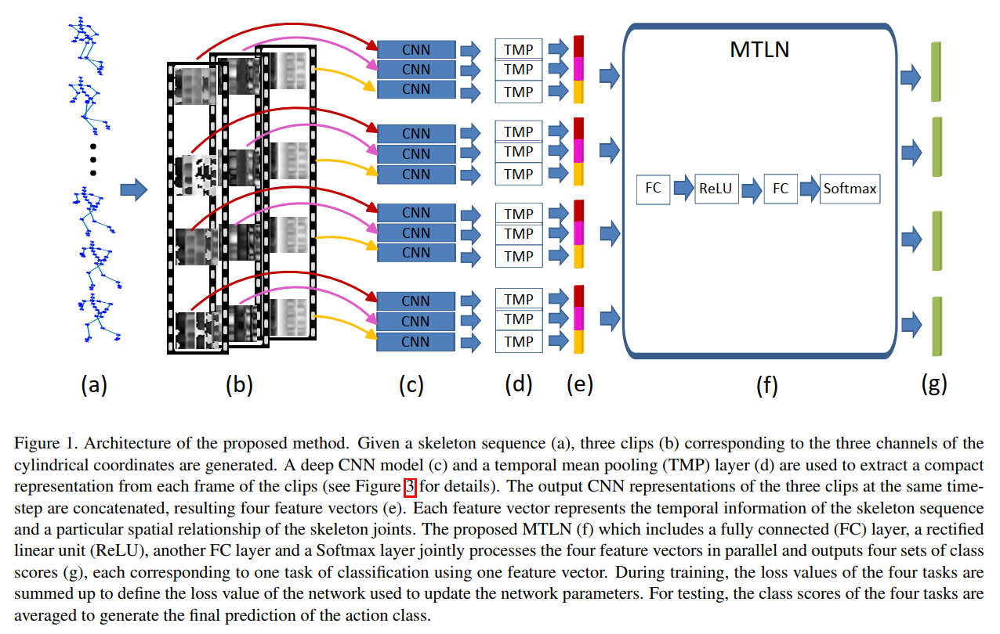

#  zhou:

## week3
```
两个数据格式不同的数据集，是如何区分处理的
数据集的实际运动类型
```

## week4
```
找预测最后预测最后一帧的项目代码去借鉴
https://github.com/1suancaiyu/Locality-Awareness-SGE

###3
今日任务：
看懂那个预测下一帧的代码思想，并借鉴构造基于st-gcn 的 auto-encoder

完成情况：
查明是代码如何完成预测下一帧这个任务
单从auto-encoder的构造来看，是没有对这三个pre_task有区分的
初步猜想应该是loss约束来区分不同
这里是用
train_loss = tf.reduce_mean(tf.nn.l2_loss(training_decoder_output - targets))
然后这里的targets 应该就是装的下一帧的数据
具体还需要再细看，必要时需要运行代码
```

## week 5
```
read self-supervised paper another two tasks
figure out self-supervised learning based on auto-encoder
run the STEP code using the ST-GCN dataset 
```

## week 8
```
搭建基于transformer的框架
```

## week 9
```
PoseFormer ST transformer的输出其实也是一个步态序列
然后将head换掉，用AS-GCN的分类器，用NTU-RGB-D数据集，将2D数据表征变成3D,实现任务1，动作识别
设计多任务训练，实现任务2，增加鲁棒性
重建步态序列，用Spatio-temporal的方法，实现任务3，重建步态序列
```

## week 12

zhou:
1. 训练曲线问题，检查是否有问题，训练和测试方法是否一致？
2. 多任务学习early stop
3. 序列预测的head，换成非decoder的方法
4. poseformer的代码分两份，一份用重建的方法，一份用还原3D的方法，对比效果。

计划：
5.22
调整训练参数，是否过拟合
参考asgcn，他的多任务训练是如何设计的，用哪个loss进行方向传播？early stop问题如何解决，两个任务的训练曲线观察。画出预测数据分布图


## week 18

用CNN的方法做基于skeleton的动作识别，常出现的一个思路是讲skeleton转化成特殊的image

例如：(cpvr 2017) A New Representation of Skeleton Sequences for 3D Action Recognition




# summur holiday
## week 1

### 本周所做
- AAAI2021_MS_TGN

  一种提取局部和全局特征的思路

  

  

- x_multi_scale = torch.cat((x_transformer, x_gcn), 0)


### 周老师建议

读一篇文章，要考虑他的motivation，解决了什么问题，解决这个问题，有没有其他的解决方法


下周任务：

1. 对坐标数据做norm

2. 网络结构设计，局部和全局，空域时域（gcn 和 transformer如何cat）

3. 多头注意力机制
4. stgcn 的edge importance 是什么？
5. 了解Res2Net 类似的思想论文，对channel 做 split


